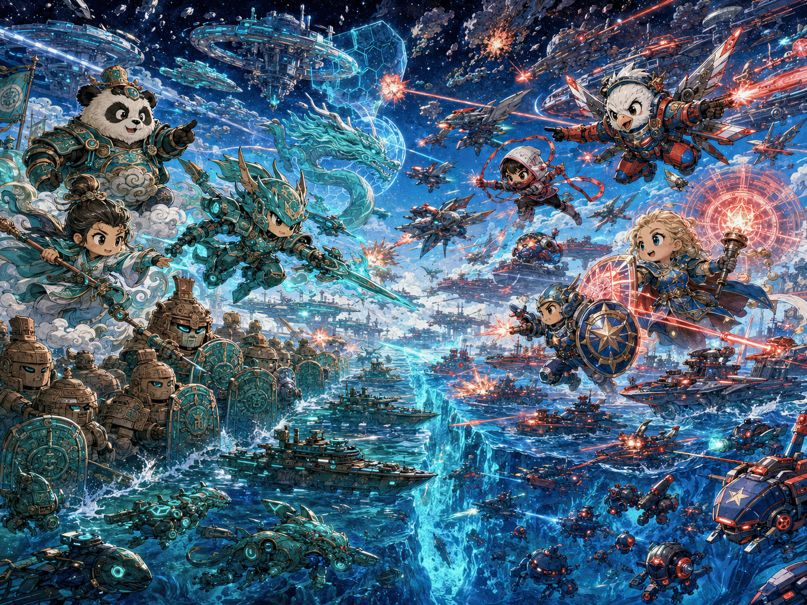

# 后记

这是今年 03 月开始动手写的第四篇互动教程，另外三篇是：

* [Terraform 互动教程](https://lonegunmanb.github.io/terraform-tutorial)
* [Rego 互动教程](https://lonegunmanb.github.io/rego-tutorial)
* [Vault 互动教程](https://lonegunmanb.github.io/vault-tutorial)

在过去我可能每年只会写一篇，但今年发生了三件事，促使我决心全力以赴，尽可能为中文 Infrastructure as Code 社区多贡献一些内容：

1. AI 目前在写代码和写文章两方面都已经突破了一个临界点，使得在人类的监督下进行优质内容创作已成事实，个人生产力提升了不少
2. 在为微软服务了将近五年以后，我的岗位被终结了。由于 [EO 14117](https://www.federalregister.gov/documents/2024/03/01/2024-04573/preventing-access-to-americans-bulk-sensitive-personal-data-and-united-states-government-related)，微软多批次裁撤了大量中国的技术岗位，微软曾经多次询问我是否愿意转移到澳大利亚办公室继续工作，我都拒绝了，因为正如每一个美国人都要宣誓效忠和热爱美国一样，我也宣誓效忠和热爱中国，经过评估，我认为离开祖国，我一无是处，所以我明知最后我们会以此收场，但仍然毫不犹豫。在离开微软后，微软为员工提供的不限量 GitHub Copilot 也将被终结，所以我就抓紧最后的时间使用 Copilot 的配额，尽可能多地为中文互联网贡献一些优秀（我自己觉得）的内容
3. 世界的局势波谲云诡，冲突不断，人类这个物种似乎再一次走到了命运的十字路口。

我最担忧的事情是整个美国科技界整体呈现出一种越来越好战的风格；现在的美国科技界有人把中华人民共和国公民视作贱民，宁可强迫所有用户对着摄像头拿出护照自证身份也不愿意自家产品被一个中国贱民触碰的人工智能头部企业 CEO（很有趣，这个人认为自己代表了人类道德的最好水准的同时坚定认为只要中华人民共和国公民可以使用他的 AI 模型就会立刻拿去开发生物武器或是建立一个反乌托邦社会，与此同时他自己还积极地把自己的产品推荐给某国军队，鼓励它们基于 AI 通过概率计算得出的一组字符排序序列扣动扳机朝各种坐标倾泻重火力，丝毫不考虑模型出现幻觉或者数据错误的可能性）；有人鼓吹要大规模建造全自主控制的，由 AI 模型决策对目标倾泻致命火力，人为制造全自动地狱景观；微软说，你们的岗位被终结了，我们不能继续在敌对国家维持这么大的研发团队。

我本人是历史爱好者，我阅读了中国历史和世界历史，一个有趣的地方是，这不是中国第一次遇到强大的敌人；中国在历史上曾经多次被打败，遇到的凶残暴虐的敌人不知道有多少了，匈奴人、蒙古人、女真人，历史上五胡乱华，安史之乱，内战，饥荒，虫灾，瘟疫，中国历史上人口减少一半以上的事件也是发生过多次的。

但是中国挺过来了，历史上那些凶残的外敌早就在历史的长河中和中国原生的住民融为了一体，共同组成了中华民族这个叙事。我认为作为中华民族的一份子，我有义务，在历史走到今天这个十字路口，在我可以使用 AI 这么好的生产力工具的时候，把经过我筛选认为优秀的英语世界的技术、内容，翻译成中文，并在这个过程中予以增强，做到源自英语，但更胜于英语信息源。

有人会说，在 AI 时代，这种翻译工作还有价值吗？我说，纯粹的翻译可能价值被 AI 削弱了很多，但是你可以不止是纯粹的翻译啊！比如这几个动手实验教程，我找来了 [LocalStack](https://www.localstack.cloud/)、[MiniStack](https://ministack.org/)、[MiniBlue](https://miniblue.io/) 和 [Killercoda](https://killercoda.com/) 为学员提供了免费安全的动手实验环境；AI 是写不出这种动手实验课程的，我很清楚因为我自己知道在这个过程中我在 AI 一开始写的实验课内容上踩了多少坑，解决了多少问题；有些功能 MiniStack 和 MiniBlue 实现的和 AWS Azure 有偏差，都是需要我建立 Fork 以后去修复的（虽然修复也是 AI 来修复）；AI 也很难客观评估实验课内容本身设计的是否合理，遇到其他一些客观限制（比如 Killercoda 环境资源非常有限，无法运行编译怎么办）时怎么处理，都是需要人类决策的。

另外我发现和 AI 合作写书本身对你自己来说也是一种学习过程（这将成为我未来一段时间里主要的学习方法），简单来讲这是一种增强版费曼学习法（Feynman Technique）。当我想学习一个技能时（比如 Pulumi），最好的方法就是把 Pulumi 的文档丢给 AI，告诉它我准备写一个 Pulumi 的教程，并且和官方资料相比要更加简单易懂，更加生动，可以配上动画、插画和动手实验课。AI 每写出一章，我在校对稿件或是检查动手实验课代码是否可以运行，实验步骤设计是否合理时就是我在学习 Pulumi 的过程，更妙的是，如果我发现某一段内容我读不懂，或者不确定意思，那就代表我的读者也可能会有同样的疑惑，我可以让 AI 写的更容易理解，或是设计拟物的插画，用类比的方式帮助我理解；我理解了，我的读者也就可以理解。我学会了一门技术的同时，我也积累下了一本书我自己的教材，我可以分享给社区，也可以拿来培训我认识的其他对这个技术感兴趣的人。我们中国人是特别重视教育的，我们把教学活动看作是一种美德，在我们漫长的历史记录中反复赞颂，这种学习同时可以用来教育其他人的实践在我看完全是一石二鸟之效。

我希望世界能够和平，我们彼此之间是继续协作而不是彼此冲突斗争，但如果说斗争是无法逃避的命运，我会在这片土地上和这里的人共命运。祈愿世界和平！祈愿 AI 是你我手中用来建设美好世界的工具，而不是朝向对方扣动扳机的全自动屠戮机器。

