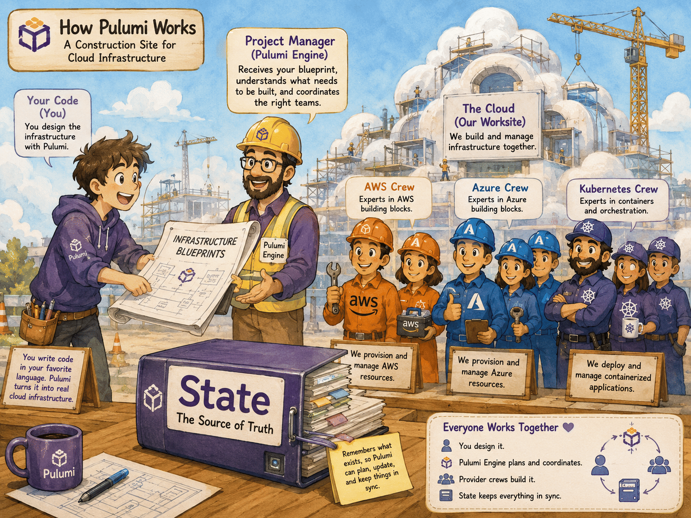
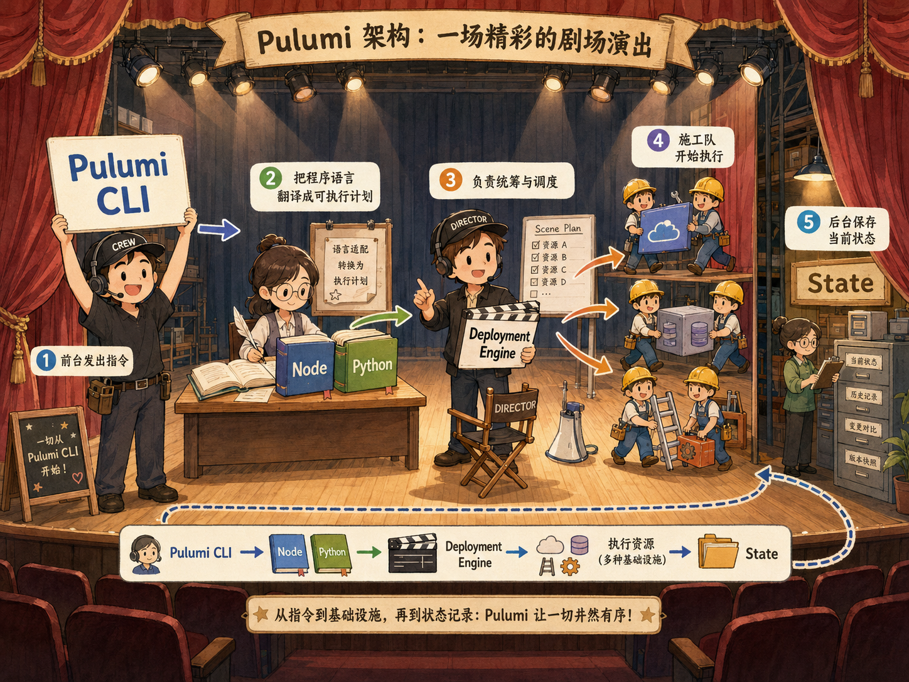
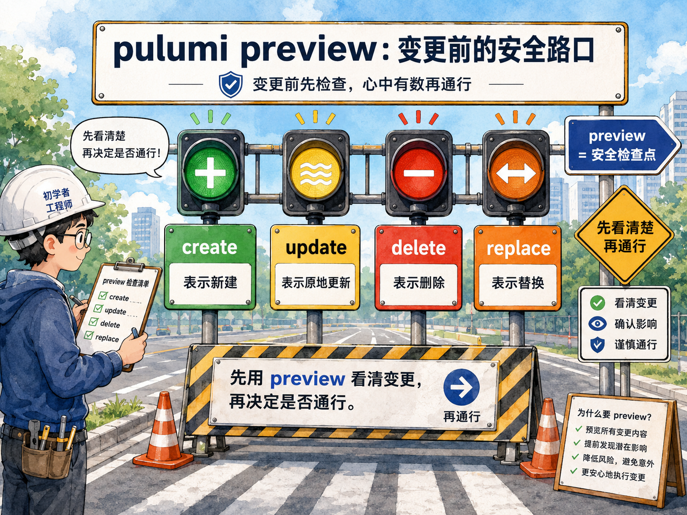

# IaC 范式转移与 Pulumi 架构解析

> 官方参照：Pulumi Docs / IaC / Guides / Basics / How Pulumi IaC Works / Architecture。本文用更适合初学者的方式重讲同一套机制。

## 本章定位

本章建立全书的架构心智模型：Pulumi 不是“用编程语言包一层云 API”，而是一个由 **CLI、Language Host、Deployment Engine、Resource Provider、State Backend** 共同协作的基础设施调和系统。

如果只记住一句话，请记住：**Pulumi 程序负责描述“我想要什么”，Pulumi 引擎负责比较“现在有什么”，Provider 负责把差异真正落到云平台。**

## 官方映射

本章主体内容对标官方的 **How Pulumi IaC Works** 页面，并在涉及具体机制时关联到对应的 Concepts 文档：

- 主参照：[How Pulumi IaC Works](https://www.pulumi.com/docs/iac/guides/basics/how-pulumi-works/)（源码路径 `content/docs/iac/guides/basics/how-pulumi-works.md`）
  - [Running a Pulumi program](https://www.pulumi.com/docs/iac/guides/basics/how-pulumi-works/#running-a-pulumi-program)：对应本章 1.2。
  - [Resource operations](https://www.pulumi.com/docs/iac/guides/basics/how-pulumi-works/#resource-operations)：对应本章 1.5 的操作符表。
  - [Creation and deletion order](https://www.pulumi.com/docs/iac/guides/basics/how-pulumi-works/#creation-and-deletion-order)：对应本章 1.4 的并行与依赖。
  - [Architecture](https://www.pulumi.com/docs/iac/guides/basics/how-pulumi-works/#architecture)（Language hosts / Deployment engine / Resource providers / Pulumi Cloud architecture）：对应本章 1.3 与 1.8。
- 延伸概念文档：
  - [Inputs and Outputs](https://www.pulumi.com/docs/iac/concepts/inputs-outputs/)：对应本章 1.4 的 `Output<T>` 依赖线索。
  - [State and Backends](https://www.pulumi.com/docs/iac/concepts/state-and-backends/)：对应本章 1.7 的 State 与后端。
  - [Resource names / Auto-naming](https://www.pulumi.com/docs/iac/concepts/resources/names/#autonaming)：对应本章 1.6 的逻辑名称、物理名称与自动命名。
  - [`deleteBeforeReplace` 选项](https://www.pulumi.com/docs/iac/concepts/resources/options/deletebeforereplace/)：对应本章 1.5 的替换顺序控制。
  - [`dependsOn` 选项](https://www.pulumi.com/docs/iac/concepts/resources/options/dependson/)：对应本章 1.4 的显式依赖。
  - [Providers](https://www.pulumi.com/docs/iac/concepts/providers/) 与 [Plugins](https://www.pulumi.com/docs/iac/concepts/plugins/)：对应本章 1.3 与 1.5 的 Provider/插件机制。

## 1.1 从“手工搭房子”到“拿图纸找施工队”

初学 IaC 时，最容易把 Pulumi 程序误解成“会一步一步调用云 API 的脚本”。这个理解只对了一半。

更准确的比喻是：

- 你的 Pulumi 程序像一张建筑图纸：它描述想要几间房、门窗在哪里、材料是什么。
- Pulumi Engine 像总包项目经理：它拿新图纸和旧验收单对比，决定哪些地方要新建、改造、拆除。
- Resource Provider 像专业施工队：AWS 施工队负责 AWS，Azure 施工队负责 Azure，Kubernetes 施工队负责 Kubernetes。
- State 像工程档案：记录上一次已经验收过的房子长什么样。

所以，执行 `pulumi up` 不是“从第一行代码开始直接改云资源”，而是一次完整的**声明、对比、排程、执行、归档**过程。



> 绘图提示词：淡水彩阴影漫画插画风格，一位新手建筑师把“基础设施图纸”交给戴安全帽的 Pulumi 项目经理；项目经理左手连着 Language Host 翻译员，右手把任务分派给 AWS、Azure、Kubernetes 三支拟人化施工队；旁边有一本写着 State Backend 的工程档案夹，箭头表现 CLI、Engine、Provider、Cloud/模拟器之间的协作；真实世界工地比喻，色彩柔和，初学者一眼能看懂。

## 1.2 `pulumi up` 背后发生了什么

以 TypeScript 程序为例。假设程序中写了两个桶：

```ts
import * as aws from "@pulumi/aws";

const mediaBucket = new aws.s3.Bucket("media-bucket");
const contentBucket = new aws.s3.Bucket("content-bucket");
```

当你运行 `pulumi up` 时，大致发生六件事。

### 第一步：CLI 读取项目、堆栈和上次状态

Pulumi CLI 会先确认当前目录里的 `Pulumi.yaml`，知道这是哪个 Project；再确认当前 Stack，例如 `dev`；最后读取这个 Stack 的上次部署状态。

如果这是新 Stack，状态里只有一个空舞台；如果已经部署过，状态里会有之前创建过的资源记录。

### 第二步：CLI 启动语言宿主

TypeScript 程序不会由 Pulumi Engine 直接解释。CLI 会启动 Node.js 对应的 Language Host，让它去运行你的 `index.ts`。

Language Host 可以理解为“翻译员”：它懂你的编程语言，也懂 Pulumi Engine 需要听到什么格式的资源注册消息。更细一点说，Language Host 包含语言执行器和语言 SDK 两层：执行器负责启动 Node.js、Python、Go 等运行时；语言 SDK 则在资源对象被构造时观察并发送注册请求。协议细节对初学者不是重点，但可以先知道：Language Host 与 Engine 之间通过 Pulumi 的插件协议通信，资源注册不是“直接打云 API”。

### 第三步：构造资源对象并不等于云上已经创建资源

这是本章最关键的一点：当程序执行到 `new aws.s3.Bucket("media-bucket")` 时，并不代表 AWS 里已经出现了一个 S3 Bucket。

更准确地说，它代表：

> Language SDK 捕获到“我要一个名叫 `media-bucket` 的桶”这个意图，然后把资源注册请求发送给 Engine。

也就是说，`new Bucket()` 更像是把“建一个桶”的申请单放进项目经理的待办篮，而不是施工队已经把桶建好了。

### 第四步：Engine 对比新图纸和旧档案

Engine 收到资源注册请求后，会拿它和 State 中的旧资源记录对比：

- 旧状态里没有这个资源：需要 `create`。
- 旧状态里有这个资源，但属性不同：可能 `update`，也可能 `replace`。
- 旧状态里有资源，但这次程序没有再注册它：需要 `delete`。
- 新旧完全一致：`same`，什么都不做。

Engine 自己不懂每一种云资源的所有细节。比如“给桶加标签能不能原地更新”“换虚拟机镜像是不是必须重建”，这些问题要问 Provider。

### 第五步：Provider Plugin 真正调用云平台或模拟器

Resource Provider 是真正懂云平台 API 的部分。AWS Provider 知道怎么调用 S3 API；Azure Provider 知道怎么调用 ARM API；Kubernetes Provider 知道怎么向 Kubernetes API Server 提交对象。

Engine 不直接找云平台，它会让 Provider 去完成 `create`、`update`、`delete`、`diff` 等操作。这就是 Pulumi 能不断支持新云服务的原因：很多能力通过升级 Provider 获得，而不必升级 Pulumi CLI 本体。

### 第六步：操作完成后更新 State

当 Provider 完成创建或更新后，Engine 会把最新结果写入 State。State 中会记录资源的 URN、类型、输入、输出、依赖关系、Secret 标记等信息。

下一次 `pulumi preview` 或 `pulumi up` 时，Engine 就会再拿这份 State 与新程序表达的期望状态做比较。

## 1.3 五个核心角色：像一个小剧场

| 角色 | 在现实世界里的比喻 | Pulumi 中的职责 | 初学者要记住 |
|------|------------------|----------------|--------------|
| Pulumi CLI | 剧场前台兼调度员 | 读取项目、选择 Stack、启动 Engine 与语言宿主 | 你日常执行的 `pulumi up`、`preview`、`destroy` 都从这里开始 |
| Language Host | 同声传译员 | 运行 TypeScript/Python/Go/C# 等程序，并把资源构造翻译成注册请求 | 程序语言不同，语言宿主不同 |
| Deployment Engine | 总导演/项目经理 | 对比期望状态与当前状态，计算最小变更集，安排执行顺序 | Engine 负责“调和”，不是云 API 客户端 |
| Resource Provider | 专业施工队 | 调用 AWS、Azure、Kubernetes 或模拟器 API 完成资源操作 | Provider 决定某个字段能否原地更新、是否必须替换 |
| State Backend | 工程档案室 | 保存每个 Stack 上一次部署后的状态快照 | 没有 State，Pulumi 就不知道“以前已经建过什么” |



> 绘图提示词：淡水彩阴影漫画插画风格，一个小剧场舞台上，前台调度员举着 Pulumi CLI 牌子，翻译员坐在 Node/Python 字典旁边，导演拿着 Deployment Engine 分镜表，三支施工队从侧幕进入，后台档案管理员守着 State 档案柜；用真实剧场拟物比喻 Pulumi 架构，画面明亮、线条柔和、适合初学者。

## 1.4 为什么 Pulumi 可以并行创建资源

Pulumi 程序是顺序执行的，但资源操作不一定顺序执行。

如果两个资源没有依赖关系，例如两个彼此独立的 S3 Bucket，Language Host 会先后发出两个资源注册请求，Engine 可以并行安排 Provider 创建它们。

如果一个资源的输入使用了另一个资源的输出，例如把 Bucket 名传给 Lambda 环境变量，那么 Pulumi 会记录依赖边。Engine 会像安排施工顺序一样，先等上游资源完成，再执行下游资源。

这也是 `Output<T>` 的重要性：它不只是“未来才知道的值”，还是一条告诉 Engine “这里存在依赖关系”的线索。

## 1.5 资源操作符：看懂 `preview` 的交通信号灯

`pulumi preview` 和 `pulumi up` 输出中会显示资源操作。初学者可以先记住这些符号：

| 操作 | 符号 | 含义 | 类比 |
|------|------|------|------|
| same | 无 | 当前状态已经符合期望 | 房间不用动 |
| create | `+` | 创建新资源 | 新建一间房 |
| update | `~` | 原地修改资源 | 给墙重新刷漆 |
| delete | `-` | 删除旧资源 | 拆掉一间房 |
| replace | `+-` | 替换资源 | 先建新房，再拆旧房 |

替换操作在详细输出中还会拆成两个阶段：

| 操作 | 符号 | 含义 | 类比 |
|------|------|------|------|
| create-replacement | `++` | 替换过程中先创建新资源 | 先在旁边盖新房 |
| delete-replaced | `--` | 新资源创建完成后删除旧资源 | 新房验收后拆旧房 |

还有几类不一定每次出现、但在生产环境很常见的操作：

| 操作 | 常见场景 | 含义 |
|------|----------|------|
| read | 读取或导入已有资源 | 把外部已有资源读入 Pulumi 视野 |
| refresh | `pulumi refresh` 或 `--refresh` | 用云平台当前状态同步 Pulumi State |
| import | `pulumi import` 或资源选项 `import` | 把已有资源纳入 Pulumi 管理 |

替换尤其值得警惕。默认情况下，Pulumi 倾向于“先创建新资源，再删除旧资源”，以降低停机风险。但如果资源物理名称固定且不能重复，或者设置了 `deleteBeforeReplace`，顺序可能会变成先删后建。

```ts
new aws.s3.Bucket("fixed-name-bucket", {
  bucket: "company-prod-assets",
}, {
  deleteBeforeReplace: true,
});
```

上面这个选项就像告诉施工队：“这个门牌号不能同时存在两间房，如果必须重建，就先拆旧的再建新的。”它能解决名称冲突，但也可能带来短暂停机风险。



## 1.6 逻辑名称、物理名称与自动命名

Pulumi 代码里的 `"media-bucket"` 是逻辑名称。它用于组成 URN，帮助 Pulumi 在 State 中识别资源身份。

云平台中真正看到的名称可能不同。Pulumi 默认会为很多资源追加随机后缀，叫作 auto-naming。这样做的好处是可以避免多个 Stack、多个开发者、多个环境之间发生物理名称冲突。

初学者可以这样理解：

- 逻辑名称像“施工图纸上的房间编号”。
- 物理名称像“楼宇系统里最终登记的门牌号”。
- URN 像“工程档案中唯一定位这个房间的档案编号”。

生产环境中不要随意修改逻辑名称。对 Pulumi 来说，逻辑名称变化可能意味着“旧资源消失，新资源出现”。后续资源章节会用 `aliases` 解决安全重命名问题。

## 1.7 State：Pulumi 的记忆

Pulumi 的每次调和都依赖 State。State 不是可有可无的缓存，而是 Pulumi 认领资源、计算差异、维护依赖关系的核心依据。

State 中通常包含：

- Stack 中有哪些资源。
- 每个资源的 URN 和 Provider 类型。
- 上一次部署后的输入与输出。
- 资源之间的依赖关系。
- Secret 的加密值和保密标记。

使用默认 Pulumi Cloud 后端时，State 存在 Pulumi Cloud；使用本地或对象存储后端时，State 存在你指定的位置。无论后端在哪里，Pulumi 的核心思想都一样：用新程序表达的期望状态去调和旧 State 中记录的现实状态。

## 1.8 Pulumi Cloud 不会替你拿云账号钥匙

Pulumi 官方架构中特别强调：Language Host、Engine、Provider 都运行在执行 Pulumi CLI 的地方，也就是你的电脑、CI Runner 或平台后端。

当你使用 Pulumi Cloud 作为状态后端时，CLI 会和 Pulumi Cloud API 通信，保存状态、历史、审计信息；但实际创建 AWS、Azure、Kubernetes 资源的动作，仍然由本地或 CI 环境中的 Provider 使用你配置的凭据完成。

这意味着：

- Pulumi Cloud 不需要直接持有你的云账号密钥。
- 企业可以继续使用已有的 OIDC、IAM Role、Managed Identity、Key Vault 等凭据体系。
- CI/CD 的安全边界主要由运行 Pulumi CLI 的环境决定。

## 1.9 新手最容易踩的三个坑

### 坑一：以为 `new Resource()` 立刻创建云资源

它只是注册期望状态。真正创建由 Engine 排程、Provider 执行。

### 坑二：忽略 `preview`

`preview` 是安全网。生产环境中应该先看清楚 `+`、`~`、`-`、`+-`，再决定是否 `up`。

### 坑三：随便改逻辑名称

逻辑名称参与 URN。修改逻辑名称可能导致 Pulumi 认为旧资源要删、新资源要建。生产重构要配合 `aliases`。

## 1.10 本章小结

本章要建立的核心心智模型如下：

1. Pulumi 程序表达期望状态，不直接等价于云资源已经创建。
2. Language Host 负责运行你的语言程序，并把资源构造翻译成注册请求。
3. Deployment Engine 负责读取 State、计算差异、安排顺序。
4. Resource Provider 负责调用真实云平台或本地模拟器。
5. State 是 Pulumi 的记忆，丢失或误改 State 会影响资源认领。
6. `preview` 是每次变更前必须阅读的安全报告。

## 动手实验

本章实验分为 AWS 与 Azure 两个版本。它们都不需要真实云账号：AWS 版使用 MiniStack 模拟 AWS，Azure 版使用 miniblue 模拟 Azure。

<KillercodaEmbed src="https://killercoda.com/pulumi-tutorial/course/pulumi-tutorial/pulumi-architecture-aws" title="实验环境（AWS / MiniStack 版）" desc="使用 MiniStack 在本地模拟 AWS S3，观察 Pulumi CLI、Engine、AWS Provider 与 State 如何协作。" />

<KillercodaEmbed src="https://killercoda.com/pulumi-tutorial/course/pulumi-tutorial/pulumi-architecture-azure" title="实验环境（Azure / miniblue 版）" desc="使用 ghcr.io/lonegunmanb/miniblue:sha-11ef0e8 模拟 Azure，并通过 Pulumi Dynamic Provider 观察 Azure 风格资源的注册、创建和删除。" />

## 本章交付物

- Pulumi Engine 与 Language Host 通信图。
- Terraform 与 Pulumi 思维模型对照表。
- 第一个 Pulumi 项目实战。
- Preview、Update、Destroy 安全清单。