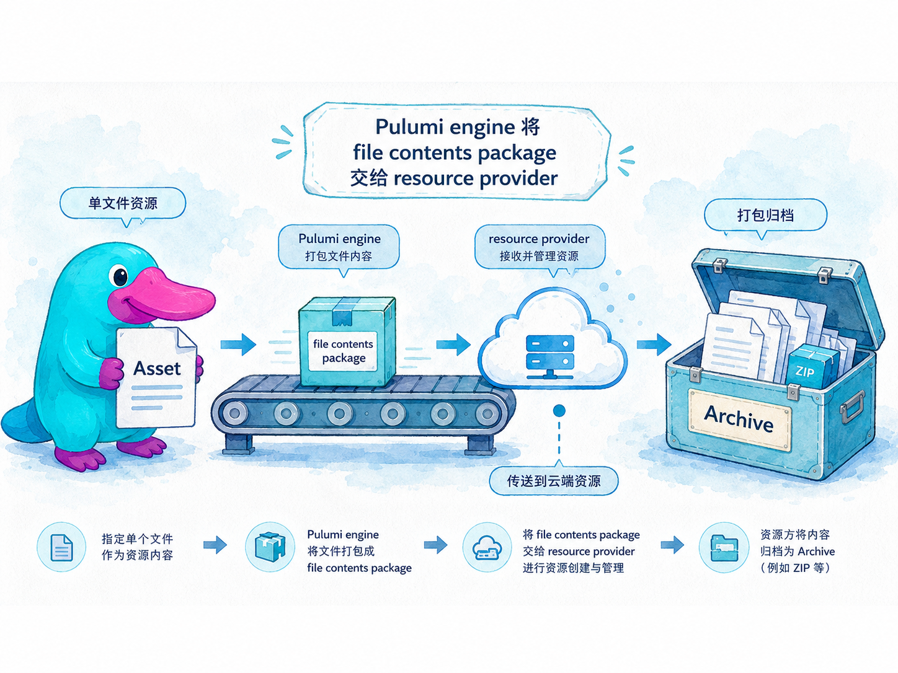

# Assets 与 Archives

## 本章定位

::: tip 导言
很多云资源并不只接收普通字符串、数字或对象，它们还需要一段真实内容：上传到对象存储的文件、Lambda 函数的代码包、容器任务的配置片段、静态站点的一组文件。Pulumi 用 **Asset** 和 **Archive** 表达这些「要交给 provider 的文件内容」：Asset 表示单个文件，Archive 表示一组文件或一个归档包。理解它们，就能把本地文件、内存字符串、远程 URI、目录和 ZIP 包自然地接进资源输入，而不是在 Pulumi 程序外另写一套打包上传脚本。
:::

本章回答以下问题：

- Asset 和 Archive 分别表示什么？它们和普通字符串路径有什么区别？
- `FileAsset`、`StringAsset`、`RemoteAsset` 分别适合什么来源？
- `FileArchive`、`RemoteArchive`、`AssetArchive` 如何表达目录、压缩包和组合包？
- 为什么这些对象通常只出现在「某个资源输入」里，而不是单独创建成资源？
- 在生产项目里，怎样组织 Lambda 代码包、静态站点文件和配置片段，避免隐式依赖与泄密风险？

## 官方映射

- [Assets & archives](https://www.pulumi.com/docs/iac/concepts/assets-archives/)：Asset / Archive 的定义，三类 Asset、三类 Archive，以及 S3 Object 与 Lambda Function 示例。

## 9.1 先分清：值、文件与归档包

在前面几章里，我们传给资源的大多是普通输入：字符串、数字、布尔值、对象、数组，或其他资源的 Output。文件内容则稍有不同。以 S3 Object 和 Lambda 为例：

- S3 Object 的 `source` 需要的是「要上传的对象内容」，不是一个普通的文件路径字符串。
- Lambda Function 的 `code` 需要的是「函数代码包」，不是一段配置文本。

如果只传普通字符串，provider 无法判断你想表达的是「字符串本身」还是「这个路径指向的文件」。所以 Pulumi 提供了两个明确的包装类型：

| 类型 | 表示 | 典型资源输入 |
| --- | --- | --- |
| **Asset** | 一个文件的内容 | S3 Object 的 `source`、配置文件对象 |
| **Archive** | 一组文件或一个归档包 | Lambda Function 的 `code`、静态站点包 |

你可以把 Asset 理解成「单张纸」，Archive 理解成「装着多张纸的文件夹或压缩包」。Pulumi 引擎看到它们后，会按 provider 需要的格式读取、打包并传递给对应资源。



> 绘图提示词：淡水彩阴影漫画插画风格（light watercolor shaded comic illustration），青色（cyan）主色调，拟物质感。画面左侧是一只 Pulumi 吉祥物鸭嘴兽（the Pulumi mascot platypus），青色身体，嘴巴颜色是 #F361D6，圆圆的眼睛，短短的四肢，憨态可掬，手里拿着一张写有 Asset 的单页文件；右侧是一个打开的文件箱，里面有多份文件、一个小 ZIP 包和一个写着 Archive 的标签。中间用一条传送带连接到云端资源图标，表示 Pulumi engine 会把 file contents package 交给 resource provider。professional / technical terms（Asset、Archive、Pulumi engine、resource provider、file contents package）用英语，其余说明文字用中文。

## 9.2 Asset：单个文件的三种来源

官方定义了三类 Asset，它们的差别只在于内容从哪里来。

| 类型 | 内容来源 | 适合场景 |
| --- | --- | --- |
| `FileAsset` | 本地磁盘上的文件 | 已经存在的配置文件、HTML、脚本 |
| `StringAsset` | 程序内存里的字符串 | 少量动态生成的文本、配置片段 |
| `RemoteAsset` | `http`、`https` 或 `file` URI | 已发布的远程文件、以 URI 形式定位的本地文件 |

TypeScript 写法如下：

```ts
import * as pulumi from "@pulumi/pulumi";

const fileAsset = new pulumi.asset.FileAsset("./file.txt");
const stringAsset = new pulumi.asset.StringAsset("Hello, world!\n");
const remoteAsset = new pulumi.asset.RemoteAsset("https://example.com/data.json");
```

它们本身通常不会单独出现在 `new` 资源语句里，而是作为某个资源的输入。例如把一个本地文件上传成 S3 Object：

```ts
const object = new aws.s3.BucketObject("obj", {
  bucket: bucket.id,
  key: "file.txt",
  source: new pulumi.asset.FileAsset("./file.txt"),
});
```

### 三个常见判断

**内容已经是文件**：用 `FileAsset`。路径按 Pulumi 程序运行时的工作目录解析，所以 CI/CD 里要确保文件随源码一起存在，或在部署前由构建步骤生成。

**内容由程序拼出来**：用 `StringAsset`。它适合很小、结构稳定的文本，例如生成一份 `robots.txt` 或初始化配置。不要把大型制品塞进字符串里；那会让程序、预览输出和 state 都变得沉重。

**内容由 URI 定位**：用 `RemoteAsset`。如果用 `https`，部署机器必须能访问该地址，例如从一个内部制品仓库读取 `https://artifacts.example.com/config.json`；如果用 `file` URI，本质上仍然依赖本地文件，只是以 URI 形式表达。

## 9.3 Archive：一组文件的三种来源

Archive 表示多文件内容。官方同样定义了三类：

| 类型 | 内容来源 | 适合场景 |
| --- | --- | --- |
| `FileArchive` | 本地目录，或本地归档文件 | Lambda 代码目录、静态站点目录、已有 ZIP 包 |
| `RemoteArchive` | `http`、`https` 或 `file` URI | 已发布的 ZIP 包、构建系统产出的归档 URI |
| `AssetArchive` | 一个 map，值可以是 Asset 或 Archive | 在 Pulumi 程序里组合一个小型代码包 |

`FileArchive` 可以直接指向一个目录，也可以指向 `.tar`、`.tgz`、`.tar.gz`、`.zip` 或 `.jar` 文件。目录写法最常见：

```ts
const code = new pulumi.asset.FileArchive("./lambda");
```

`RemoteArchive` 和 `RemoteAsset` 一样，用 URI 定位内容，但 URI 返回的必须是支持格式的归档文件：

```ts
const release = new pulumi.asset.RemoteArchive("https://example.com/function.zip");
```

同样地，使用远程归档时，部署机器必须能访问这个 URI。生产环境里通常会把 ZIP 放在制品仓库或对象存储，并使用带版本号或摘要的稳定地址。

`AssetArchive` 更像一个内联打包清单。map 的 key 是包里的文件或目录名，value 可以是单个 Asset，也可以是另一个 Archive：

```ts
const archive = new pulumi.asset.AssetArchive({
  "index.js": new pulumi.asset.StringAsset("exports.handler = async () => 'ok';"),
  "config.json": new pulumi.asset.FileAsset("./config.json"),
  "public": new pulumi.asset.FileArchive("./public"),
});
```

这段代码表达的是：最终包里有一个由字符串生成的 `index.js`，一个来自本地文件的 `config.json`，以及一个来自本地目录的 `public` 文件夹。

## 9.4 它们是资源输入，不是资源本身

Asset 与 Archive 最容易被误解的一点是：它们不是独立资源，不会拥有 URN，也不会出现在 `pulumi up` 的资源树里。它们只是某个资源输入的一种特殊值。

这带来几个后果：

- 文件内容变化时，真正发生变化的是引用它的资源输入。例如 Lambda 的 `code` 变化，会触发 Lambda Function 更新。
- Pulumi 会把必要的资产信息记录进 state，以便后续 diff 和更新。不同 provider 对输入的保存形态可能不同，但你应当默认认为这些内容会进入部署链路。
- Asset 和 Archive 不能替代制品仓库。大型发布包、可复用前端构建产物、跨团队共享的二进制文件，最好先进入对象存储、包仓库或制品系统，再用 `RemoteAsset` / `RemoteArchive` 引用稳定地址。

安全上也要保守：不要把密码、私钥或 token 当作普通 `StringAsset` 写进资源输入。即便 Pulumi 的 secret 机制能保护某些 state 字段，目标云服务仍会收到这份内容；如果它本质上是机密，应优先使用该平台的机密服务、只写字段或 secret 配置。

## 9.5 两个高频模式

### 上传一个对象

对象存储里的单个对象通常接收 Asset。下面三个对象分别来自字符串、本地文件和远程 URI：

```ts
new aws.s3.BucketObject("from-string", {
  bucket: bucket.id,
  key: "notes/string.txt",
  source: new pulumi.asset.StringAsset("created by Pulumi\n"),
});

new aws.s3.BucketObject("from-file", {
  bucket: bucket.id,
  key: "notes/file.txt",
  source: new pulumi.asset.FileAsset("./notes/file.txt"),
});

new aws.s3.BucketObject("from-uri", {
  bucket: bucket.id,
  key: "notes/remote.txt",
  source: new pulumi.asset.RemoteAsset("file:///workspace/notes/remote.txt"),
});
```

如果对象内容由别的资源输出决定，仍然遵循 Input/Output 规则：要么直接把 Output 传给资源输入，要么用 `apply` / helper 生成内容后再包成合适的 Asset。内容较复杂时，通常先生成文件，再用 `FileAsset` 引用，比把所有逻辑塞进 `StringAsset` 更清晰。

### 部署一个代码包

函数、静态站点和初始化脚本常接收 Archive。最朴素的 Lambda 示例是把一个目录作为代码包：

```ts
const fn = new aws.lambda.Function("handler", {
  role: role.arn,
  runtime: "nodejs20.x",
  handler: "index.handler",
  code: new pulumi.asset.FileArchive("./lambda"),
});
```

当代码包很小、主要为了演示或生成配置时，可以用 `AssetArchive`：

```ts
const fn = new aws.lambda.Function("handler", {
  role: role.arn,
  runtime: "nodejs20.x",
  handler: "index.handler",
  code: new pulumi.asset.AssetArchive({
    "index.js": new pulumi.asset.StringAsset("exports.handler = async () => 'ok';"),
    "message.txt": new pulumi.asset.FileAsset("./message.txt"),
  }),
});
```

生产项目里，建议把真正的应用构建交给语言生态自己的构建工具：例如先运行 `npm run build`、`go build` 或打包脚本，产出一个目录或 ZIP，再由 Pulumi 用 `FileArchive` 或 `RemoteArchive` 交给 provider。Pulumi 程序负责声明基础设施和指向制品，不宜承担过重的编译打包职责。

## 9.6 生产检查清单

- [ ] 单个文件用 Asset，一组文件或代码包用 Archive。
- [ ] 本地路径要随源码或构建产物一起进入 CI 工作目录。
- [ ] 远程 URI 要稳定、可审计、可由部署机器访问。
- [ ] 大型制品优先放入制品仓库或对象存储，再用远程引用。
- [ ] 不把密码、私钥、token 当普通文件内容打进 Asset / Archive。
- [ ] 对 Lambda 这类代码包，把应用构建与 Pulumi 部署分清：先构建，后引用。

## 动手实验

本章实验提供一个 **AWS 版**场景，用 `pulumi/pulumi-aws` 对接本地 **MiniStack** 模拟器，全程无需真实 AWS 账号。你会依次完成：

- 用三种 Asset 创建 S3 Object，并读取对象内容。
- 用 `FileArchive` 把本地目录部署成 Lambda 代码包。
- 用 `AssetArchive` 在 Pulumi 程序里组合一个小型代码包。
- 用 `RemoteArchive` 从本地 `file` URI 引用一个 ZIP 包，并观察 state 中的资产形态。

<KillercodaEmbed src="https://killercoda.com/pulumi-tutorial/course/pulumi-tutorial/pulumi-assets-archives" title="实验：Assets 与 Archives（AWS / MiniStack）" desc="用 @pulumi/aws 对接 MiniStack，练习 StringAsset、FileAsset、RemoteAsset 上传 S3 Object，再用 FileArchive、AssetArchive 与 RemoteArchive 更新 Lambda 代码包并观察 state。" />

## 本章交付物

- 能准确区分 Asset（单文件）与 Archive（多文件或归档包）。
- 熟悉 `FileAsset`、`StringAsset`、`RemoteAsset` 的来源差异与适用场景。
- 熟悉 `FileArchive`、`RemoteArchive`、`AssetArchive` 的来源差异与适用场景。
- 知道它们作为资源输入参与 diff 和更新，而不是独立资源。
- 能为 S3 Object、Lambda 代码包、静态站点等场景选择合适的文件表达方式。