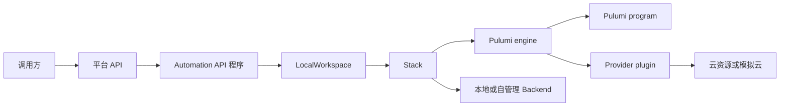
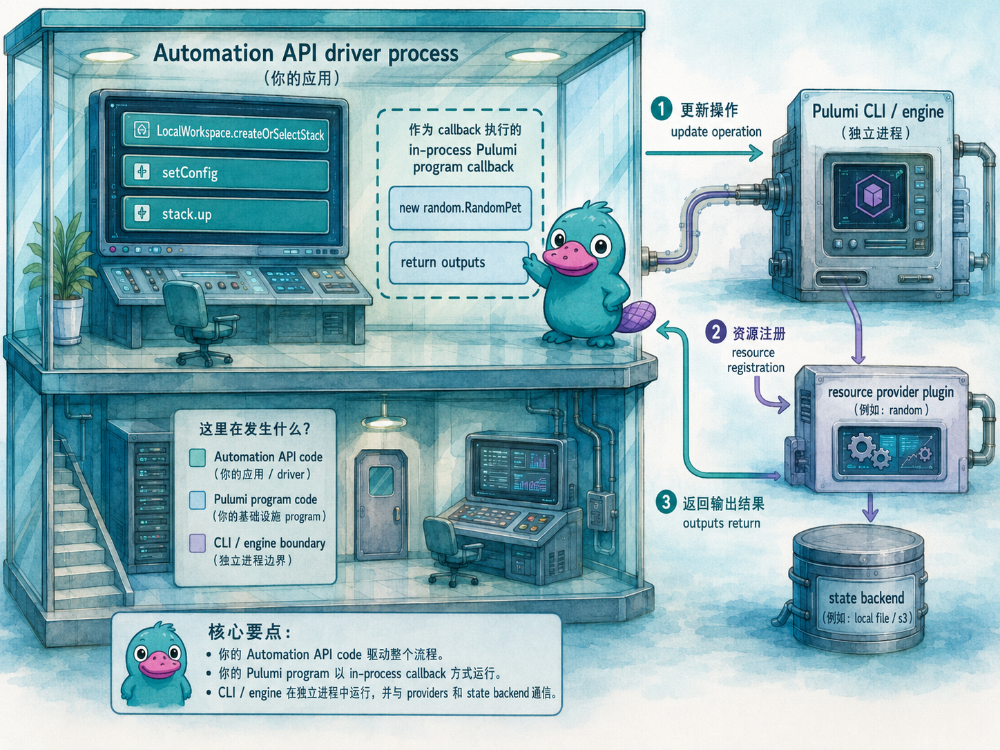

# Automation API

## 本章定位

前面的章节一直以 CLI 为主线：写 Pulumi 程序，选择 Stack，设置配置，执行 `pulumi preview`、`pulumi up`、`pulumi refresh` 和 `pulumi destroy`。这套方式适合工程师在终端里工作，也适合普通 CI 任务。但当基础设施操作需要成为一个平台后端、测试框架或自助式环境申请系统的一部分时，单纯拼接 shell 命令就会逐渐变得难以维护。

Automation API 解决的问题是：把 Pulumi CLI 的核心能力包装成强类型 SDK，让你的应用程序直接管理 Workspace、Stack、配置、预览、更新、刷新、销毁、事件流和输出。它仍然运行 Pulumi 引擎，也仍然执行 Pulumi 程序；不同之处在于，调用入口从终端命令变成了普通应用代码。

本章只讨论 Pulumi OSS 工具链可以独立完成的部分：`LocalWorkspace`、本地程序、Inline Program、本地或自管理 Backend、本地 secrets provider、通用 HTTP 服务和 CI 调用方式。官方文档中的 `RemoteWorkspace` 对应 Pulumi Deployments，属于 Pulumi Cloud 相关能力，本教程不展开。

## 官方映射

- [Automation API concepts](https://www.pulumi.com/docs/iac/concepts/automation-api/)：Automation API 的定位、Workspace、Stack、Local Program、Inline Program 与语言支持。
- [Using Automation API](https://www.pulumi.com/docs/iac/guides/building-extending/automation-api/)：以 Node.js 示例演示创建 Stack、安装 Provider 插件、设置配置、执行更新并读取结果。
- [Projects](https://www.pulumi.com/docs/iac/concepts/projects/)：`Pulumi.yaml`、项目根目录、运行时入口和 Stack 配置文件。
- [Stacks](https://www.pulumi.com/docs/iac/concepts/stacks/)：Stack 的隔离语义、生命周期、输出、刷新、销毁和删除。
- [State and backends](https://www.pulumi.com/docs/iac/concepts/state/)：状态文件、Backend、刷新、状态导出和自管理 Backend 的职责。
- [Secrets](https://www.pulumi.com/docs/iac/concepts/secrets/)：配置机密、程序内机密值、加密 provider 与机密传播。
- [Node.js Automation API reference](https://www.pulumi.com/docs/reference/pkg/nodejs/pulumi/pulumi/automation/)：`LocalWorkspace`、`Stack`、`ConfigValue`、`EngineEvent`、`UpResult` 等 API 类型。

## 7.1 从 CLI 到 SDK：把部署流程变成应用逻辑

Automation API 并不是另一套 IaC 语言。它把你已经熟悉的 Pulumi 操作搬进普通程序里：

| CLI 操作 | Automation API 中的对象或方法 | 典型用途 |
|---|---|---|
| `pulumi stack init` | `LocalWorkspace.createStack` | 为新环境创建 Stack |
| `pulumi stack select` | `LocalWorkspace.selectStack` | 接管已有 Stack |
| `pulumi preview` | `stack.preview()` | 在审批前生成变更计划 |
| `pulumi up` | `stack.up()` | 执行实际更新 |
| `pulumi refresh` | `stack.refresh()` | 把状态与真实资源重新对齐 |
| `pulumi destroy` | `stack.destroy()` | 删除 Stack 里的资源 |
| `pulumi config set` | `stack.setConfig()` | 从平台参数写入 Stack 配置 |
| `pulumi stack output` | `stack.outputs()` 或 `upResult.outputs` | 把部署结果返回给调用方 |

官方文档强调，Automation API 会在底层驱动 Pulumi CLI，因此运行 Automation API 的机器必须能找到 Pulumi CLI。你可以提前把 CLI 安装到 `PATH`，也可以在程序中用 `PulumiCommand.install()` 下载与 SDK 匹配的 CLI 版本。Killercoda 实验为了减少等待时间，会预装 CLI；生产平台中则可以选择在镜像里固定 CLI 版本，或由程序在启动时安装。

这也解释了 Automation API 的价值：它不是让 Pulumi 脱离 CLI 和 engine，而是把“从应用代码里正确调用 Pulumi”这层工作交给官方 SDK。如果没有 Automation API，平台后端仍然可以用代码调用 Pulumi，但通常要自己写一层命令封装：用类似 `exec.run`、`child_process.spawn` 或 CI 系统提供的 run API 拼接 `pulumi up --yes --stack dev` 这样的参数，设置 `cwd`、`PATH`、`PULUMI_HOME`、`PULUMI_CONFIG_PASSPHRASE` 和云凭据，处理交互式输入，实时转发 stdout/stderr，解析 JSON 或普通文本输出，再根据退出码、超时、取消信号和错误消息决定下一步。

两种方式的差异可以这样看：

| 需要处理的事情 | 手写 CLI 封装 | Automation API |
|---|---|---|
| 命令参数 | 自己拼接字符串或参数数组，并处理转义 | 调用 `stack.up()`、`stack.preview()` 等方法 |
| 工作目录与环境变量 | 每次运行命令时显式设置 | 通过 `LocalWorkspaceOptions` 统一管理 |
| Stack 配置 | 调用 `pulumi config set` 并解析结果 | 调用 `stack.setConfig()` 或 `setAllConfig()` |
| 进度输出 | 自己读取 stdout/stderr，并区分普通日志和错误 | 使用 `onOutput` 与 `onEvent` 回调 |
| 部署结果 | 解析命令输出或额外调用 `pulumi stack output --json` | 直接读取 `UpResult` 和 `OutputMap` |
| 错误与取消 | 自己处理退出码、超时和进程信号 | 使用 SDK 的错误类型、操作选项和取消信号 |

因此，Automation API 可以理解为一层受支持的“Pulumi 进程编排 SDK”。它仍然尊重 CLI 的语义，却把容易出错的命令调用、配置写入、事件流和结果解析整理成了应用程序更容易组合的对象与方法。

一个典型调用链如下：



这张图里最重要的是边界：平台 API 负责认证、授权、参数校验和业务流程；Automation API 负责把这些参数变成 Pulumi Stack 操作；Pulumi 程序仍然只负责声明资源。不要把 HTTP 请求、审批流或数据库访问写进 Pulumi 程序本身，那些都应放在 Automation API 外层。

## 7.2 Workspace：执行 Pulumi 程序的工作目录

官方文档把 Workspace 定义为一个执行上下文。它包含一个 Pulumi Project、一个程序和多个 Stack，并负责插件安装、环境变量、`PULUMI_HOME`、Stack 创建与列表等工作。

在 OSS 范围内，最常用的是 `LocalWorkspace`。它依赖磁盘上的 `Pulumi.yaml` 和 `Pulumi.<stack>.yaml` 文件，行为与 CLI 工作区一致：修改 Project settings 会改写 `Pulumi.yaml`，修改 Stack 配置会改写对应的 Stack 配置文件。

```ts
import * as automation from "@pulumi/pulumi/automation";

const stack = await automation.LocalWorkspace.createOrSelectStack(
  {
    stackName: "dev",
    workDir: "/srv/platform/pulumi-program",
  },
  {
    envVars: {
      PULUMI_CONFIG_PASSPHRASE: process.env.PULUMI_CONFIG_PASSPHRASE ?? "",
    },
  },
);
```

上面这段代码接管了一个本地 Pulumi 程序。`workDir` 指向包含 `Pulumi.yaml` 的目录；`createOrSelectStack` 会在 Stack 不存在时创建它，存在时直接选择它。这很适合临时环境、功能分支环境和集成测试环境，因为调用方无需先手动创建 Stack。

Workspace 还负责 Provider 插件。官方示例里使用 `installPlugin` 显式安装 AWS 插件：

```ts
await stack.workspace.installPlugin("aws", "v7.0.0");
```

在真实项目里建议固定 SDK、CLI 和 Provider 版本。Automation API 程序往往运行在服务端，如果它每次启动都拉取不同版本的 CLI 或插件，预览结果就可能随时间变化。更稳妥的方式是把版本写入镜像、锁文件和平台发布流程。

## 7.3 Stack：一个可编程的环境实例

`Stack` 是 Automation API 编排的核心对象。它对应某个 Project 的一个隔离实例，有自己的配置、状态、输出和更新历史。Automation API 中的 Stack 与 CLI 中的 Stack 是同一件事，只是调用方式不同。

一个最小的生命周期编排如下：

```ts
const stack = await automation.LocalWorkspace.createOrSelectStack({
  stackName: "review-123",
  workDir: process.cwd(),
});

await stack.setConfig("aws:region", { value: "us-east-1" });
await stack.setConfig("platform:settings", {
  value: JSON.stringify({ size: "small", owner: "team-a" }),
});

const preview = await stack.preview({ onOutput: console.info });
const update = await stack.up({ onOutput: console.info });
const outputs = await stack.outputs();
await stack.destroy({ onOutput: console.info });
```

这段代码做了四件事：创建或选择 Stack，写入配置，执行预览和更新，读取输出并销毁资源。对于平台后端来说，关键价值在于结果可以被程序直接使用。`up()` 返回的结果包含输出和变更摘要；`preview()` 返回的结果可以用于审批页面；`outputs()` 可以把资源 ID、访问地址或连接信息传回调用方。

### create、select 与 createOrSelect 的选择

Automation API 提供了多个 Stack 入口，含义并不相同：

| 方法 | 适用场景 | Stack 已存在时 |
|---|---|---|
| `createStack` | 必须创建新环境 | 报错 |
| `selectStack` | 必须接管已有环境 | 成功 |
| `createOrSelectStack` | 临时环境或幂等入口 | 直接选择 |

平台接口通常会使用 `createOrSelectStack`，这样同一个请求重试时不会因为 Stack 已经存在而失败。但删除接口应当更谨慎：`destroy()` 只是删除资源，并不会自动删除 Stack 记录。如果还要删除 Stack 本身，需要再调用 Workspace 的移除能力，并确保状态和配置已经按团队要求备份。

## 7.4 Local Program 与 Inline Program

Automation API 可以驱动两类 Pulumi 程序。

Local Program 是普通 Pulumi 项目：目录中有 `Pulumi.yaml`、语言项目文件和入口代码。Automation API 指向它的 `workDir`，然后像 CLI 一样执行。这种方式适合团队已有的 Pulumi 程序，也适合代码评审、单元测试和 CI 共用同一份基础设施代码。

Inline Program 则把 Pulumi 程序写成一个函数，直接传给 Automation API：

```ts
import * as pulumi from "@pulumi/pulumi";
import * as random from "@pulumi/random";
import * as automation from "@pulumi/pulumi/automation";

const program = async () => {
  const name = new random.RandomPet("env-name", { length: 2 });
  return {
    generatedName: name.id,
  };
};

const stack = await automation.LocalWorkspace.createOrSelectStack({
  projectName: "inline-env-service",
  stackName: "dev",
  program,
});

const result = await stack.up({ onOutput: console.info });
console.log(result.outputs.generatedName.value);
```

这段代码容易让初学者混在一起看：`program` 函数内部是 Pulumi program，负责声明资源；`createOrSelectStack`、`setConfig`、`up` 这些调用是 Automation API driver，负责选择 Stack、写配置和发起更新。Node.js SDK 的 Inline Program 是 in-process callback，但它仍会通过 Pulumi CLI 驱动 engine，并让 engine 与 provider plugin 协作。因此，学习时要同时区分“代码职责边界”和“运行时进程边界”。



Inline Program 的好处是入口简单，适合测试、演示和非常轻量的临时环境。官方文档同时提醒：Inline Program 的生命周期必须完整包含在传入的函数、回调或闭包中。不要在函数外提前创建资源，也不要让资源创建逻辑散落在其他异步流程里，否则可能出现不可预测的行为。

下面是一个典型反例。资源在 Inline Program 函数外创建，Pulumi 运行时还没有进入正确的部署上下文：

```ts
const name = new random.RandomPet("env-name", { length: 2 });

const program = async () => {
  return {
    generatedName: name.id,
  };
};
```

推荐写法是把资源创建完整放进函数内部：

```ts
const program = async () => {
  const name = new random.RandomPet("env-name", { length: 2 });
  return {
    generatedName: name.id,
  };
};
```

本书实验采用 Local Program，因为它更贴近团队项目：同一份 `index.ts` 既能被 CLI 运行，也能被 Automation API 运行。这样学习者可以清楚比较两种入口的差异。

## 7.5 配置与机密：平台参数怎样进入 Pulumi 程序

Automation API 程序通常接收来自表单、工单、HTTP 请求或 CI 变量的参数。不要把这些参数直接拼进资源名称和属性，而是先写入 Stack 配置，再由 Pulumi 程序用 `pulumi.Config` 读取。

```ts
const settings = {
  namePrefix: "review",
  region: "us-east-1",
  owner: "payments-team",
};

await stack.setConfig("aws:region", { value: settings.region });
await stack.setConfig("platform:settings", {
  value: JSON.stringify(settings),
});
await stack.setConfig("platform:releaseToken", {
  value: process.env.RELEASE_TOKEN ?? "",
  secret: true,
});
```

Pulumi 程序读取这些值：

```ts
import * as pulumi from "@pulumi/pulumi";

interface Settings {
  namePrefix: string;
  region: string;
  owner: string;
}

const config = new pulumi.Config();
const settings = config.requireObject<Settings>("settings");
const releaseToken = config.requireSecret("releaseToken");
```

这里有一个清晰分工：Automation API 可以写配置，Pulumi 程序只读配置。这样做有三个好处：

- 配置会进入 `Pulumi.<stack>.yaml`，可以按 Stack 隔离并接受审查。
- 机密配置使用 `secret: true` 写入后，会按 Stack 的 secrets provider 加密。
- `pulumi preview`、CLI 和 Automation API 使用的是同一套配置语义。

`setConfig` 的第二个参数遵循 `ConfigValue` 结构，核心字段是 `value` 和可选的 `secret`。省略 `secret` 时按普通明文配置处理；设置为 `true` 时，效果等价于 CLI 的 `pulumi config set --secret`，写入 Stack 配置文件的是加密值。程序读取这类值时应使用 `requireSecret` 或 `getSecret`，不要用普通 getter 读取机密配置。

在 OSS 场景中，如果使用本地 Backend，团队需要自己管理状态目录、备份、并发控制和 secrets provider 的口令。实验里使用空口令的本地 provider 只是为了教学便利；真实平台中应使用受管密钥、对象存储 Backend 或具备访问控制的自管理存储。

## 7.6 事件流：把 Pulumi 输出接入平台界面

CLI 会把进度输出到终端。Automation API 则允许程序通过回调接收标准输出和引擎事件：

```ts
const result = await stack.up({
  onOutput: (line) => console.log(line),
  onEvent: (event) => {
    if (event.resourcePreEvent) {
      const metadata = event.resourcePreEvent.metadata;
      console.log(`${metadata.op} ${metadata.type} ${metadata.name}`);
    }
  },
});
```

`onOutput` 适合把原始日志写到文件、终端或任务记录里。`onEvent` 更适合平台界面，因为事件是结构化的，可以从中提取资源操作、诊断、摘要和错误信息。

更新完成后还要处理输出。`stack.outputs()` 与 `stack.up()` 返回结果中的 `outputs` 都是 `OutputMap`，可以理解为一个从输出名到输出值对象的映射。每个输出值对象包含 `value`，并可能带有 `secret` 标记。平台后端把这些结果返回给调用方时，应当像 CLI 一样对 secret 输出做遮蔽或权限控制，而不是直接序列化明文。

一个实际平台通常会把事件流拆成三类数据：

- 面向用户的进度：正在创建哪些资源，哪些资源已经完成。
- 面向审计的记录：谁发起了哪个 Stack 的哪个操作，输入参数是什么，结果是什么。
- 面向排障的细节：Provider 诊断、错误消息、命令退出码和对应的 Stack 状态。

不要只保存最终成功或失败。基础设施更新可能在中途失败，完整事件流往往是定位问题的关键材料。

## 7.7 平台后端：把 Stack 操作包成服务接口

Automation API 的常见用法是把 Pulumi 封装在一个后端服务中。例如团队需要一个“临时测试环境”接口：调用方提交环境名、区域、大小和有效期，平台后端负责创建 Stack、写配置、预览、更新、返回输出，并在到期后销毁。

一个极简 HTTP 接口可以设计成这样：

| HTTP 操作 | Automation API 操作 | 说明 |
|---|---|---|
| `POST /environments/dev/preview` | `stack.preview()` | 返回变更摘要，用于审批或确认 |
| `POST /environments/dev` | `stack.up()` | 创建或更新环境 |
| `GET /environments/dev/outputs` | `stack.outputs()` | 返回资源输出 |
| `POST /environments/dev/refresh` | `stack.refresh()` | 同步状态并识别漂移 |
| `DELETE /environments/dev` | `stack.destroy()` | 删除环境资源 |

这个接口看起来很简单，但生产平台必须补上治理能力：

- 调用者身份：确认谁可以创建、更新或删除某个环境。
- 参数校验：限制 Stack 名、区域、资源规格、标签和有效期。
- 并发控制：同一个 Stack 同时只能有一个更新操作。
- 超时与取消：长时间卡住的更新需要可观察、可取消、可恢复。
- 状态管理：本地 Backend 需要备份；对象存储 Backend 需要访问控制、版本管理和锁策略。
- 审计记录：记录请求、参数、预览结果、执行人、时间和最终状态。

Automation API 只负责“怎样运行 Pulumi”。至于“谁可以运行、何时运行、运行什么参数、失败后谁处理”，这些属于平台工程职责。

## 7.8 并发、锁与失败恢复

Pulumi Stack 更新不是普通函数调用。一次更新会读取状态、计算差异、调用 Provider、写回状态。两个更新同时操作同一个 Stack，可能相互覆盖或制造不可恢复的中间状态。因此平台后端必须把 Stack 视为互斥资源。

本章两个实验使用的是本地 Backend，状态保存在运行实验的机器上。这个选择适合教学和单机开发，但不适合多个平台服务实例共享同一组 Stack。生产平台通常应改用 S3、Azure Blob、S3 兼容对象存储、PostgreSQL 等自管理 Backend，并在平台应用层实现同一 Stack 的串行化。

在 Pulumi Cloud 之外使用本地或自管理 Backend 时，要额外关注以下问题：

- 本地文件 Backend 适合单机实验和个人开发，不适合多实例平台服务共享。
- 对象存储 Backend 要考虑状态文件版本、访问控制、加密和并发写入行为。
- 平台服务应当在应用层对同一 Stack 加锁，例如数据库锁、队列串行化或分布式锁。
- `preview` 与 `up` 之间可能发生代码或配置变化，审批系统需要保存当时的输入和代码版本。
- `destroy` 前应再次读取当前输出和状态，确认删除对象仍然是请求者拥有的环境。

失败恢复也需要分层处理。Provider 调用失败时，先保留事件流和当前状态，再决定是重试、刷新、回滚配置还是手工修正真实资源。不要在失败后立即删除状态文件；状态文件是 Pulumi 继续管理资源的依据。

## 7.9 在 CI 中使用 Automation API

Automation API 也可以用于 CI。和直接运行 CLI 相比，它适合下面几类任务：

- 在测试代码中创建临时基础设施，测试结束后自动销毁。
- 根据变更文件决定运行哪些 Stack 的 preview。
- 把 preview 结果解析成 JSON，并写入代码评审评论。
- 在部署前执行数据库脚本、应用健康检查或跨系统审批。
- 将多个 Pulumi 程序串联，例如先创建网络，再把网络输出传给服务 Stack。

CI 中要特别注意退出路径。测试失败、部署失败或任务取消时，都应尽可能执行清理逻辑。如果资源可能保留用于排障，也要明确标记有效期、负责人和清理任务。

## 7.10 OSS 范围内的边界清单

为了保持本教程可以在 Pulumi OSS 工具链下独立实践，本章采用以下边界：

| 纳入本章 | 不纳入本章 |
|---|---|
| `LocalWorkspace` | `RemoteWorkspace` |
| 本地程序与 Inline Program | Pulumi Deployments |
| 本地或自管理 Backend | Pulumi Cloud 控制台能力 |
| 本地 secrets provider 或自管理密钥 | Pulumi ESC |
| 普通 HTTP 服务包装 Automation API | Pulumi Cloud REST API 自动化 |
| 通用 CI 调用 Automation API | 云端策略托管和云端审计 |

这个边界并不表示右侧能力没有价值，而是本书的目标不同：让读者在没有 Pulumi Cloud 账号的情况下，仍然能掌握 Automation API 的核心编排方式。

## 7.11 本章实验：临时环境服务的两个云版本

本章实验会用 Node.js Automation API 包装同一个 Pulumi 程序，让它既能通过 CLI 运行，也能通过 SDK 和 HTTP 接口运行。为了避免真实云账号依赖，AWS 版对接 MiniStack，Azure 版对接 miniblue。

<KillercodaEmbed src="https://killercoda.com/pulumi-tutorial/course/pulumi-tutorial/pulumi-automation-api" title="实验：Automation API（AWS / MiniStack）" desc="使用 LocalWorkspace 驱动一个 S3 Artifact 环境，练习 preview、up、refresh、outputs、destroy 与 HTTP 包装。" />

<KillercodaEmbed src="https://killercoda.com/pulumi-tutorial/course/pulumi-tutorial/pulumi-automation-api-azure" title="实验：Automation API（Azure / miniblue）" desc="使用 LocalWorkspace 驱动 Resource Group 与 VNet 环境，练习配置注入、事件流、输出读取和服务化调用。" />

## 本章小结

Automation API 把 Pulumi 的部署生命周期交给应用代码管理。它适合构建平台后端、自助式环境、集成测试、复杂 CI 和多阶段流程。真正的关键不是“用 SDK 替代 CLI”，而是把职责分清楚：平台层管理请求、权限、参数、并发和审计；Pulumi 程序声明资源；Automation API 在两者之间提供强类型的编排入口。

在 Pulumi OSS 范围内，优先选择 `LocalWorkspace`、本地程序、本地或自管理 Backend，并自行设计状态备份、加锁和密钥管理机制。只要这些工程边界清晰，Automation API 就能把基础设施操作自然地嵌入你自己的平台和流水线。