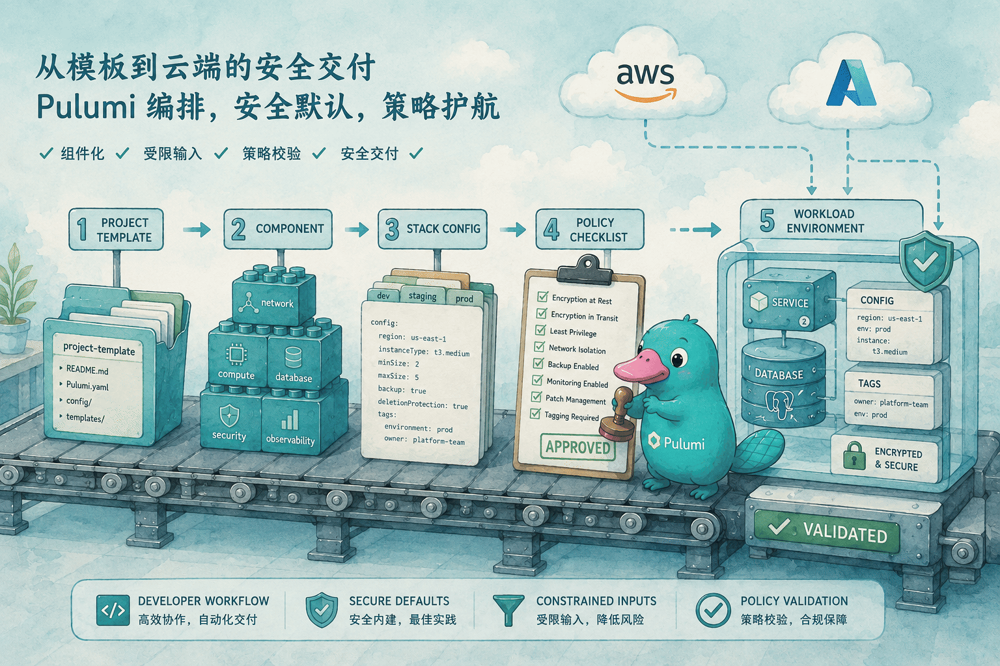
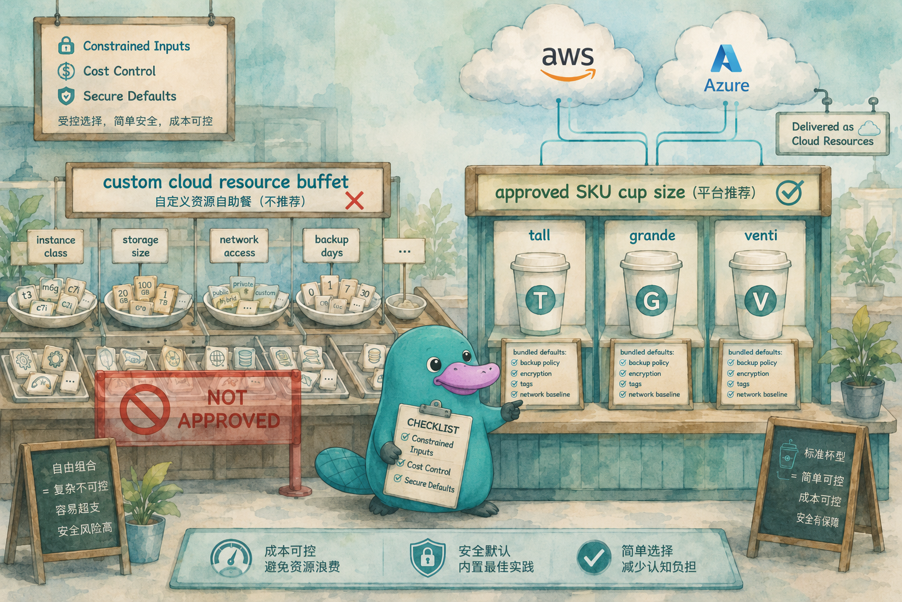

# 最佳实践

<TutorialAcknowledgement />

## 本章定位

前面的章节已经分别讲过 Component、Stack、Config、Secret、Policy Pack、Automation API、测试与 CI/CD。真实团队采用 Pulumi 时，难点通常不在“会不会写一个资源”，而在“如何让许多团队长期、稳定、可审查地使用同一套基础设施标准”。

本章把 Pulumi 官方总结的一些最佳实践常用模式收束到 Pulumi OSS 能独立完成的工作流里：用组件封装基础设施默认值，用 Stack 和配置区分环境，用 StackReference 传递共享基础设施输出，用本地 Policy Pack 做部署前校验，用受限输入减少昂贵或危险配置进入代码的机会。

这里刻意不把 Pulumi Cloud 的私有注册表、云端 Policy Groups、ESC Environments、Deployments、Review Stacks、Insights 等能力作为前提。它们在组织治理里有价值，但本章实验只依赖 Pulumi CLI、本地 backend、语言包、ComponentResource、Config/Secret、StackReference、本地 Policy Pack 和本地云模拟器。

## 官方映射

- [Four Factors: Templates, Components, Environments, and Policies](https://www.pulumi.com/docs/idp/guides/best-practices/four-factors/)：官方把开发者入口、可复用组件、环境配置和策略校验放在同一条工作流里。本章用 OSS 方式对应为项目模板约定、ComponentResource、Stack Config 与本地 Policy Pack。
- [Multiple workloads on shared infrastructure](https://www.pulumi.com/docs/idp/guides/best-practices/patterns/multiple-workloads-shared-infrastructure/)：平台团队管理共享基础设施，应用团队只消费输出并部署自己的工作负载。本章实验用 platform Project 输出共享数据库基线，workload Project 通过 StackReference 读取。
- [Composable environments](https://www.pulumi.com/docs/idp/guides/best-practices/patterns/composable-environments/)：官方示例使用可组合 ESC environment。为了保持 OSS 边界，本章把同一思想落在项目级默认配置、Stack 级覆盖和普通 TypeScript 配置对象上。
- [Security Updates using Components](https://www.pulumi.com/docs/idp/guides/best-practices/patterns/security-updates-using-components/)：平台团队把安全配置集中在组件里，通过组件版本推动调用方接受新的安全默认值。本章用本地组件和 componentVersion 标签演示。
- [Cost control using Components, Policies, and constrained inputs](https://www.pulumi.com/docs/idp/guides/best-practices/patterns/cost-control-using-components-policies-constrained-inputs/)：用受限输入和策略共同限制昂贵配置。本章用数据库规格枚举、组件内校验和本地 Policy Pack 组合完成。
- [Policies](https://www.pulumi.com/docs/insights/policy/)：官方说明开源 Pulumi CLI 支持通过 `--policy-pack` 在本地执行策略包，这正是本章实验采用的方式。

## 12.1 四个因素在 OSS 工程里的对应关系

官方“四个因素”是 Templates、Components、Environments、Policies。把它们放到只依赖 Pulumi OSS 的工程里，可以这样理解：

| 官方因素 | 本章 OSS 对应 | 主要职责 |
|----------|--------------|----------|
| Templates | 代码仓库模板、脚手架目录、项目约定 | 给新服务一个一致的起点 |
| Components | 本地 ComponentResource 或普通语言包 | 封装默认值、受限输入和资源组合 |
| Environments | Project 默认配置、Stack Config、Secret、StackReference | 按环境注入参数、凭据和上游输出 |
| Policies | 本地 Policy Pack | 在 preview 或 up 前校验资源属性 |



这四个因素不是四套彼此隔离的工具。它们的边界可以很清楚：模板负责起点，组件负责“可以怎样创建”，环境配置负责“这一次创建用哪些参数”，策略负责“即使绕开组件也不能越过底线”。

## 12.2 共享基础设施：平台 Stack 与工作负载 Stack 分离

多个工作负载共享基础设施时，最重要的边界是生命周期。平台团队维护的网络、数据库基线、镜像仓库、日志系统或消息队列，不应该被每个应用 Stack 重复创建；应用团队只应读取必要输出，然后创建自己的工作负载资源。

Pulumi 里常见做法是拆成两个 Project：

```text
platform Project
  dev Stack
    输出 sharedParameterGroupName、sharedResourceGroupName、location 等

workload Project
  orders-dev Stack
    通过 StackReference 读取 platform 的 dev 输出
  billing-dev Stack
    通过 StackReference 读取 platform 的 dev 输出
```

这个结构有三个好处：

- 生命周期清晰：平台 Stack 可以独立更新共享基线，应用 Stack 不接管平台资源。
- 依赖是只读的：StackReference 读取 Output，不会修改上游资源。
- 审查边界清楚：平台变更和应用变更可以在不同 Pull Request 中审查。

本章实验会让 platform Project 创建 RDS Parameter Group，workload Project 创建多个 PostgreSQL 实例并引用同一个共享参数组。

在本地 backend 中，StackReference 里的 `organization` 是本教程使用的本地后端组织名前缀；如果使用 Pulumi Cloud，这一段对应真实 Organization 名称。无论后端是哪一种，引用格式都要能唯一指向上游 Project 与 Stack。

## 12.3 用组件集中安全默认值

组件不是简单的“少写几行代码”。在团队实践里，组件的职责是把容易遗漏的默认值固化下来，并把调用方真正需要决定的内容缩小到少数参数。

下面是一个简化后的数据库组件接口：

```ts
type DatabaseSize = "dev" | "standard";
type Environment = "dev" | "prod";

interface SecurePostgresArgs {
  service: string;
  environment: Environment;
  size: DatabaseSize;
  password: pulumi.Input<string>;
  platformParameterGroupName: pulumi.Input<string>;
  componentVersion: string;
}
```

调用方只能选择 dev 或 standard，不能直接传任意实例规格；必须传入环境和服务名，组件会统一打标签；数据库密码使用 Pulumi Secret 进入组件；共享参数组来自平台 Stack 输出。

组件内部再把安全默认值统一写入资源：

```ts
const db = new rds.Instance(name, {
  engine: "postgres",
  engineVersion: "15",
  instanceClass: sizeConfig.instanceClass,
  allocatedStorage: sizeConfig.storage,
  storageEncrypted: true,
  publiclyAccessible: false,
  backupRetentionPeriod: 1,
  parameterGroupName: args.platformParameterGroupName,
  password: args.password,
  tags: {
    service: args.service,
    environment: args.environment,
    componentName: "SecurePostgresDatabase",
    componentVersion: args.componentVersion,
    costControlled: "true",
  },
}, { parent: this, ignoreChanges: ["maxAllocatedStorage"] });
```

如果组件内部的子资源要继承显式 provider，调用组件时应传 `providers`。`provider` 是给 CustomResource 使用的单一 provider 选项，对 ComponentResource 本身不会像对子资源那样生效。

安全更新的关键是“改组件，而不是催每个应用逐项改资源”。例如平台团队把组件从 1.0.0 升到 1.1.0，增加新的标签、备份窗口或审计参数；应用团队更新组件版本后重新 preview，就能看到这些变化。

如果组件要在多个语言或多个仓库中复用，可以用普通语言包、monorepo 内部包，或 Pulumi Package。仅用 OSS 时，也可以从 Git 仓库或本地路径消费组件包；本章实验为了降低学习成本，把组件直接放在 workload Project 里。

## 12.4 可组合环境：用配置分层而不是复制程序

官方 composable environments 页面用 ESC environment 展示配置继承。本教程不把 ESC 作为前提，但同样的设计原则可以用 Stack Config 表达：把稳定默认值放在 Project，把环境差异放在 Stack，把敏感值放进 Secret。

一个常见分层如下：

| 层级 | 示例 | 说明 |
|------|------|------|
| Project 默认值 | owner、componentVersion | 所有 Stack 默认继承 |
| Stack 普通配置 | service、environment、size、platformStack | 每个工作负载自己覆盖 |
| Stack Secret | dbPassword | 加密保存，程序读取为 secret Output |
| 上游 Output | parameterGroupName、resourceGroupName | 通过 StackReference 只读引用 |

这样的好处是同一份 Pulumi 程序可以部署 orders-dev、billing-dev 或 orders-prod，而不需要复制三份 `index.ts`。差异体现在配置文件和上游 Stack 名称上，审查时也更容易看出“这次变的是参数还是结构”。

## 12.5 受限输入：把选择题交给应用团队

成本控制最容易失效的地方，是把底层云厂商的全部规格原样暴露给应用团队。数据库组件如果允许调用方直接传 `db.r6g.16xlarge`、任意存储大小、任意备份天数，就很难保证 dev 环境只使用小规格。



更稳妥的方式是给应用团队少量语义化选择：

```ts
const SIZE_CONFIGS = {
  dev: { instanceClass: "db.t3.micro", storage: 20 },
  standard: { instanceClass: "db.t3.small", storage: 40 },
} as const;

function validateCost(size: DatabaseSize, environment: Environment): void {
  if (environment === "dev" && size !== "dev") {
    throw new Error("dev environment only allows the dev database size");
  }
}
```

这不是替代策略，而是把错误尽早挡在组件构造阶段。组件内校验适合处理调用方输入；Policy Pack 适合处理最终资源属性，尤其是有人绕开组件直接创建资源时。

官方示例把校验逻辑拆成可复用函数，本章实验为了便于观察，把 dev 环境限制直接写在组件构造函数里。生产代码可以把这类规则整理成独立模块，让组件、测试和策略包共享同一份规则定义。

## 12.6 策略：防止绕开组件

组件能让正确路径变短，但不能保证所有人都走这条路径。Policy Pack 的价值在于检查最终资源图。即使有人绕开组件直接创建数据库，策略仍然可以发现缺失标签、公开访问、未加密存储或过高规格。

本地策略包可以直接跟随 preview 运行：

```bash
pulumi preview --policy-pack ../policy-pack
```

策略规则通常分成三类：

- 安全规则：数据库不得公开访问，存储必须加密，必须有 componentName 和 componentVersion 标签。
- 成本规则：dev 环境只能使用预先批准的小规格，存储不得超过上限。
- 版本规则：安全组件版本不能低于平台要求的最低版本。

这三类策略与组件互补：组件给出默认值，策略做独立检查。把两者都放进版本控制后，Pull Request 能同时展示资源变更和规则变更。

## 12.7 模板与项目约定：让正确路径成为默认路径

模板不一定要依赖某个云端服务。对小团队或教学仓库而言，一个标准目录就能发挥模板作用：

```text
service-infra/
  Pulumi.yaml
  package.json
  src/components/
  policy-pack/
  README.md
```

模板应当预置这些内容：

- provider 配置的最小安全样例。
- 必需配置键和 Secret 键的说明。
- 组件调用样例，而不是直接资源样例。
- 本地 preview、policy、test 命令。
- 清理命令和常见失败原因。

模板的目标不是包办所有场景，而是让新服务从一个已审查的起点开始。随着组件和策略演进，模板也应同步更新，避免新项目从过时示例开始。

## 12.8 一个可执行的 Pulumi OSS 最佳实践清单

将本章内容整理成日常检查，可以得到下面这份清单：

| 检查项 | 推荐做法 |
|--------|----------|
| 项目边界 | 平台 Project 管共享基础设施，工作负载 Project 管应用资源 |
| 跨 Stack 依赖 | 使用 StackReference 读取输出，不复制上游资源定义 |
| 环境差异 | 用 Stack Config 表达，不复制程序 |
| 机密值 | 用 `pulumi config set --secret` 写入，程序用 `requireSecret` 读取 |
| 组件接口 | 暴露语义化小集合，不暴露任意云规格 |
| 安全默认值 | 放进组件内部，并用 componentVersion 标记 |
| 成本限制 | 组件内校验输入，策略包校验最终资源 |
| 策略执行 | 在本地 preview 和 CI 中都传入 `--policy-pack` |
| 共享契约 | 上游输出要命名稳定，并在 README 中说明用途 |
| 清理路径 | 每个实验或临时 Stack 都说明手动清理或平台回收方式 |

## 12.9 本章实验

本章实验提供一个 AWS 版场景，不需要真实云账号。它使用 MiniStack 的 RDS 支持创建 PostgreSQL 数据库，并覆盖同一条主线：platform Project 输出共享基础设施，workload Project 用 StackReference 读取；组件封装数据库默认值；Stack Config 组合不同工作负载；受限输入阻止 dev 环境使用较大规格；本地 Policy Pack 阻止绕开组件的数据库资源。

<KillercodaEmbed src="https://killercoda.com/pulumi-tutorial/course/pulumi-tutorial/pulumi-best-practices-aws" title="实验：最佳实践（AWS / MiniStack RDS）" desc="用 @pulumi/aws 对接 MiniStack RDS，创建共享 PostgreSQL 基线、SecurePostgresDatabase 组件、受限输入、本地 Policy Pack，并部署 orders 与 billing 两个工作负载 Stack。" />

## 12.10 小结

Pulumi 最佳实践的核心不是某个单独 API，而是边界设计：平台资源与工作负载分开，默认值与可变参数分开，组件与策略分工，配置与代码各司其职。

只使用 Pulumi OSS，也可以建立一条完整路径：模板给出起点，组件封装标准，Stack Config 组合环境，StackReference 传递共享输出，本地 Policy Pack 在 preview 阶段检查最终资源图。等团队规模继续扩大，再考虑引入集中托管能力，也不会改变这些基础边界。
