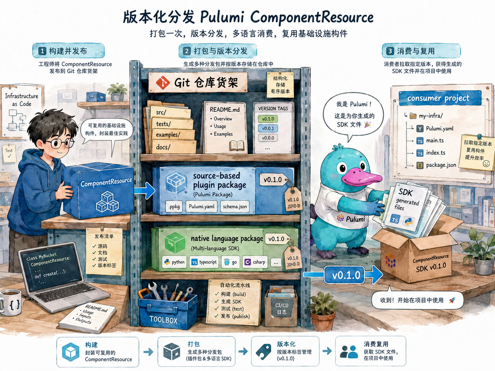
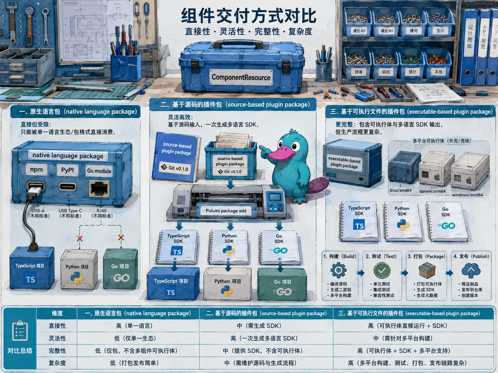

# Component 包分发与基于 Git 的版本化引用

## 本章定位

在 [Components](components.md) 一章里，我们已经会把一组资源封装成 `ComponentResource`。在 [Pulumi Packages](packages.md) 一章里，我们从概念上认识了 Package、插件和 SDK。本章把两者连起来：从一个简单组件出发，说明怎样把组件放进 Git 仓库，怎样选择 source-based plugin package 或 native language package，以及消费者怎样指定某个 Git 版本来使用这个组件。

本章聚焦 Pulumi OSS 能独立完成的能力：Git 仓库、Git tag 或 commit hash、`pulumi package add` 本地生成 SDK、语言生态包管理器，以及本地或自管理 Backend。Pulumi Cloud 的 IDP Private Registry 能提供更完整的组件目录与文档体验，但不作为本章实验前提。

## 官方映射

- [Build a Component](https://www.pulumi.com/docs/iac/guides/building-extending/components/build-a-component/)：组件类、参数、子资源、输出和 provider 继承的编写规则。
- [Packaging Components](https://www.pulumi.com/docs/iac/guides/building-extending/components/packaging-components/)：native language package、source-based plugin package 与 executable-based plugin package 的选择标准。
- [Authoring a Source-Based Plugin Package](https://www.pulumi.com/docs/iac/guides/building-extending/packages/source-based-plugin/)：source-based package 的最小目录、组件发现、Git 分发和本地生成 SDK。
- [Authoring an Executable Plugin Package](https://www.pulumi.com/docs/iac/guides/building-extending/packages/executable-plugin/)：二进制插件包的命名、跨平台归档、`pluginDownloadURL` 与发布流水线。
- [Pulumi Go Provider SDK](https://www.pulumi.com/docs/iac/guides/building-extending/packages/pulumi-go-provider-sdk/)：用 Go 和 `pulumi-go-provider` 编写可推断 schema 的组件、资源与函数。
- [pulumi package add](https://www.pulumi.com/docs/iac/cli/commands/pulumi_package_add/)：从插件、schema、本地路径或 Git 仓库添加 Pulumi Package。
- [Component resources](https://www.pulumi.com/docs/iac/concepts/components/)：消费者如何使用本地组件、native package、`pulumi package add` 生成的 SDK 和预生成 SDK。

## 8.9.1 从一个小组件开始

一个可以被分发的组件，仍然先是一个普通的 `ComponentResource`。下面用 AWS S3 版本的 `SecureBucket` 说明最小骨架；Azure 版本只需把子资源换成 Resource Group 与 Storage Account。

```ts
import * as pulumi from "@pulumi/pulumi";
import * as s3 from "@pulumi/aws/s3";

export interface SecureBucketArgs {
  team: pulumi.Input<string>;
}

export class SecureBucket extends pulumi.ComponentResource {
  public readonly bucketName: pulumi.Output<string>;
  public readonly logsBucketName: pulumi.Output<string>;

  constructor(name: string, args: SecureBucketArgs, opts?: pulumi.ComponentResourceOptions) {
    super("aws-secure-bucket:index:SecureBucket", name, args, opts);

    const tags = {
      team: args.team,
      managedBy: "platform",
    };

    const logs = new s3.Bucket(`${name}-logs`, { tags }, { parent: this });
    const bucket = new s3.Bucket(`${name}-bucket`, { tags }, { parent: this });

    this.bucketName = bucket.bucket;
    this.logsBucketName = logs.bucket;

    this.registerOutputs({
      bucketName: bucket.bucket,
      logsBucketName: logs.bucket,
    });
  }
}
```

这段代码里有四个不能随意改动的点。

| 点位 | 原因 |
|------|------|
| `args` 参数名和类型声明 | source-based package 需要据此推断 schema |
| `pulumi.Input<T>` | 让消费者可以传普通值或其他资源输出 |
| `parent: this` | 让子资源进入组件资源树，并继承传给组件的 provider |
| `registerOutputs()` | 标记组件构造完成，并把组件输出写入 state |



## 8.9.2 三种分发方式的边界

官方文档把组件分发分为三类。它们都能承载组件，但使用成本、跨语言能力和发布流程不同。



| 方式 | 是不是 Pulumi Package | 消费方式 | 跨语言 | 适合场景 |
|------|-----------------------|----------|--------|----------|
| Native language package | 否 | `npm install`、`pip install`、`go get` 等 | 否 | 团队统一使用一种 Pulumi 语言 |
| Source-based plugin package | 是 | `pulumi package add` | 是 | 平台团队向多语言项目提供组件 |
| Executable-based plugin package | 是 | 预生成 SDK 或 `pulumi package add` | 是 | 需要二进制插件、复杂 provider 或公开 Registry |

Native language package 是最轻的方式。它只是一个普通语言包，没有 `PulumiPlugin.yaml`，也不会通过 `pulumi package add` 生成 SDK。TypeScript 组件就由 TypeScript 项目安装，Python 组件就由 Python 项目安装。如果一个组织里的 Pulumi 项目都使用同一种语言，这种方式很直接。

Source-based plugin package 是本章重点。作者仍然用自己熟悉的语言写组件，但仓库里增加 `PulumiPlugin.yaml` 与语言项目清单。消费者运行 `pulumi package add` 时，Pulumi 会拉取 Git 仓库，执行源代码，推断 schema，然后在消费者项目的语言里生成本地 SDK。

Executable-based plugin package 不是 native language package。它是带有预编译插件二进制的 Pulumi Package，插件文件名遵循 `pulumi-resource-<package-name>` 规则，并通常按操作系统和 CPU 架构上传归档。它能减少消费者机器上的作者语言 runtime 依赖，但 CI、schema、SDK 与二进制分发流程明显更重。对于单纯的内部组件，通常先考虑 source-based package。

更具体地说，大多数平台团队可以把 source-based plugin package 作为默认选择。只有在需要自定义资源或函数、消费者机器不能安装作者语言 runtime，或者准备进入公开 Pulumi Registry 时，才更值得评估 executable-based plugin package。本章示例使用 TypeScript；如果用 Go 编写 source-based package，还可以通过 `pulumi-go-provider` 暴露自定义资源和函数。

## 8.9.3 Source-based package 的最小目录

TypeScript 编写的 source-based plugin package 可以从这个目录开始：

```text
aws-secure-bucket/
├── PulumiPlugin.yaml
├── package.json
├── tsconfig.json
└── index.ts
```

`PulumiPlugin.yaml` 声明插件使用的作者语言：

```yaml
runtime: nodejs
```

`package.json` 的 `name` 会影响生成后的 Node.js SDK 名称，`main` 指向导出组件的入口文件：

```json
{
  "name": "aws-secure-bucket",
  "version": "0.1.0",
  "main": "index.ts",
  "dependencies": {
    "@pulumi/aws": "^7.0.0",
    "@pulumi/pulumi": "^3.0.0"
  },
  "devDependencies": {
    "@types/node": "^20.0.0",
    "ts-node": "^10.9.2",
    "typescript": "^5.0.0"
  }
}
```

`index.ts` 需要从入口模块导出组件类。对 TypeScript 来说，Pulumi 会沿着入口模块的导出寻找继承 `ComponentResource` 的类，并通过 TypeScript 类型信息推断参数 schema。

```ts
export interface SecureBucketArgs {
  team: pulumi.Input<string>;
}

export class SecureBucket extends pulumi.ComponentResource {
  // ...
}
```

准备好之后，把仓库提交并打 tag：

```bash
git init
git add .
git commit -m "release v0.1.0"
git tag v0.1.0
git push origin main --tags
```

消费者可以指定这个 tag：

```bash
pulumi package add https://github.com/acme/aws-secure-bucket.git@v0.1.0
```

如果组件位于仓库子目录，官方 CLI 语法允许在 `.git` 后追加路径：

```bash
pulumi package add https://github.com/acme/platform-packages.git/aws-secure-bucket@v0.1.0
```

版本既可以是语义化 tag，也可以是 Git commit hash。没有显式版本时，CLI 会优先选择最新语义化 tag；没有 tag 时，使用默认分支上的最新提交。生产项目建议显式写版本，便于审计和回退。

默认情况下，消费者运行 `pulumi package add` 时会在本地生成 SDK。也可以在 CI/CD 中预生成 SDK，并把它们发布到 npm、PyPI、NuGet、Maven 或 Go module 等语言生态渠道。这样可以减少消费者机器上的生成开销，但通常也意味着团队要维护多种语言的私有包仓库，所以内部组件多数会先采用本地生成方式。

## 8.9.4 消费 source-based package

在 TypeScript 消费项目中运行 `pulumi package add` 后，Pulumi 会生成本地 SDK，更新项目依赖，并打印应使用的 import 语句。消费代码看起来和普通资源没有区别：

```ts
import * as aws from "@pulumi/aws";
import * as secure from "aws-secure-bucket";

const localAws = new aws.Provider("ministack", {
  region: "us-east-1",
  accessKey: "test",
  secretKey: "test",
  skipCredentialsValidation: true,
  skipMetadataApiCheck: true,
  skipRequestingAccountId: true,
  s3UsePathStyle: true,
  endpoints: [{ s3: "http://localhost:4566", sts: "http://localhost:4566" }],
});

const media = new secure.SecureBucket("media", {
  team: "platform",
}, { providers: [localAws] });

export const bucketName = media.bucketName;
```

同一个 source-based package 也可以被 Python、Go、.NET、Java 或 YAML 消费。差别在于消费者所在项目的语言不同，生成出来的 SDK 目录与 import 语句不同。组件作者不需要为每种语言手写 SDK，但消费者机器上需要具备组件作者语言的 runtime，例如这个例子里的 Node.js。

## 8.9.5 Native language package 的最小目录

Native language package 没有 Pulumi 插件层。仍以 TypeScript 为例，本章聚焦输出一个 `ComponentResource` 类的普通 npm 包：

```text
aws-secure-bucket-native/
├── package.json
└── dist/
    ├── index.js
    └── index.d.ts
```

`package.json` 指向已经编译好的 JavaScript 与类型声明：

```json
{
  "name": "aws-secure-bucket-native",
  "version": "0.1.0",
  "main": "dist/index.js",
  "types": "dist/index.d.ts",
  "dependencies": {
    "@pulumi/aws": "^7.0.0",
    "@pulumi/pulumi": "^3.0.0"
  }
}
```

托管到 Git 后，TypeScript 消费者可以用 npm 指定 tag：

```bash
npm install git+https://github.com/acme/aws-secure-bucket-native.git#v0.1.0
```

消费代码直接从语言包导入组件类：

```ts
import { SecureBucket } from "aws-secure-bucket-native";

const media = new SecureBucket("media", {
  team: "platform",
}, { providers: [localAws] });
```

这种方式没有 SDK 生成步骤，也没有跨语言边界，所以参数可以使用语言自身支持的复杂类型。但它只能服务同一种语言。以后如果需要让 Python 或 Go 项目也使用同一个组件，需要改造成 source-based package 或 executable-based package。

## 8.9.6 Git 版本与私有仓库

从 Git 添加包时，建议遵守三条规则。

| 规则 | 说明 |
|------|------|
| 用 tag 表达稳定版本 | 例如 `v0.1.0`、`v0.2.0`，消费者命令写清楚版本 |
| 破坏性变更提升主版本 | 改 type token、删除输入字段、改变输出语义都应视为重大变更 |
| 保留 release notes | 说明新增字段、默认值变化、需要消费者处理的事项 |

私有 GitHub 或 GitLab 仓库也可以被 `pulumi package add` 使用。官方 CLI 会读取标准环境变量，例如 `GITHUB_TOKEN` 或 `GITLAB_TOKEN`，用于访问私有仓库。实验中我们使用本地 Git 仓库模拟远端仓库，所以不需要任何 token。

## 8.9.7 本地 executable-based plugin

Executable-based plugin package 的关键制品是 provider 可执行文件。按照官方约定，二进制文件名是 `pulumi-resource-<package-name>`；面向远端发布时，还要按 OS 与 CPU 架构压缩成 `pulumi-resource-<package-name>-v<version>-<os>-<arch>.tar.gz`，并在 schema 的 `pluginDownloadURL` 中说明下载位置。

本章实验不搭建发布流水线，而是演示最小闭环：在本地用 Go 编写一个 component provider，编译出可执行插件，再让消费者从本地路径添加 package：

```bash
# 本地路径指向已编译的 provider binary，而不是源码目录。
go build -o bin/pulumi-resource-aws-secure-exec .
pulumi package add ./bin/pulumi-resource-aws-secure-exec
```

Azure 版实验使用同样流程，只是包名换成 `azure-secure-exec`，二进制文件名换成 `pulumi-resource-azure-secure-exec`。

这和远端发布使用的是同一种插件模型，只是下载环节被本地路径替代。Pulumi 会执行这个 provider，读取它暴露的 schema，并在消费者项目里生成本地 SDK。调试时也可以先读取 schema：

```bash
pulumi package get-schema ./bin/pulumi-resource-aws-secure-exec
```

实验里的 executable-based 示例刻意保持轻量：它不是前面那个 S3 组件的 Go 重写版，而是一个只输出标签字符串的本地组件。这样学习重点集中在 Go component provider、插件命名、schema 提取和本地 SDK 生成，而不是云资源本身。

## 8.9.8 对照真实仓库

Pulumi 官方维护过一些开源 component provider 示例，适合对照目录结构、schema、生成 SDK 与组件实现之间的关系。它们在本章中只作为学习参考，不作为本教程的生产项目模板。

AWS VPC 示例仓库可以按 tag 引用：

```bash
pulumi package add github.com/pulumi/pulumi-aws-quickstart-vpc@v0.0.5
```

Azure quickstart compute 仓库当前没有公开语义化 tag，也可以按 commit hash 引用：

```bash
pulumi package add github.com/pulumi/pulumi-azure-quickstart-compute@23beb79f45161d4d861f8877c5896ba63ab1dc56
```

这些仓库展示了更完整的 provider 与 SDK 生成结构。本章实验不会直接部署它们创建的真实云资源，而是用 MiniStack 与 miniblue 在本地模拟环境里完成相同的学习路径。

## 动手实验

下面两个实验使用本地 Git 仓库与 tag 模拟“托管在 Git 上”的组件包。AWS 版本创建带标签的 S3 Bucket 组件，Azure 版本创建 Resource Group 与 Storage Account 组件；两套实验都会额外编译一个本地 executable-based component provider。

<KillercodaEmbed src="https://killercoda.com/pulumi-tutorial/course/pulumi-tutorial/pulumi-component-packaging-aws" title="实验：Component 包分发与基于 Git 的版本化引用（AWS / MiniStack）" desc="编写 SecureBucket 组件，分别做成 native language package 与 source-based plugin package，通过 Git tag 指定版本消费；再编译一个本地 executable-based plugin，并用本地路径生成 SDK。" />

<KillercodaEmbed src="https://killercoda.com/pulumi-tutorial/course/pulumi-tutorial/pulumi-component-packaging-azure" title="实验：Component 包分发与基于 Git 的版本化引用（Azure / miniblue）" desc="编写 SecureStorage 组件，分别做成 native language package 与 source-based plugin package，通过 Git tag 指定版本消费；再编译一个本地 executable-based plugin，并用本地路径生成 SDK。" />

## 本章检查清单

- 组件构造函数的第二个参数命名为 `args`，并带明确类型。
- 子资源都设置 `parent: this`，消费者才能通过 `providers` 传入目标 provider。
- Source-based package 至少包含 `PulumiPlugin.yaml`、语言项目清单、入口文件和组件类。
- Native language package 不使用 `pulumi package add`，只服务同语言消费者。
- Executable-based package 的插件文件名遵循 `pulumi-resource-<package-name>`，可以通过本地路径生成 SDK。
- Git 消费命令显式写 tag 或 commit hash，不依赖默认分支的当前状态。
- 如果要服务多语言团队，优先考虑 source-based package；如果只服务一种语言，native package 可以作为更轻的起点。