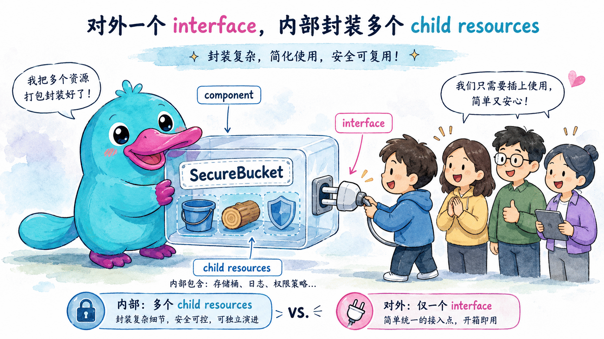

# 企业级架构：Components

## 本章定位

之前的章节里我们逐个打磨**单个**资源：命名、依赖、Resource Options。但真实项目里，一段「有意义的基础设施」往往是**一组**资源的组合——一个对外服务可能同时需要负载均衡器、目标组、安全组、日志桶、IAM 角色……如果每次都把这十几个资源平铺地抄一遍，既容易抄漏，也无法把团队的安全与合规要求固化下来。

本章介绍 Pulumi 解决这个问题的核心抽象——**Component（组件资源，`ComponentResource`）**：把若干相关资源打包成**一个**对外只暴露简单接口的逻辑单元。本章回答四个问题：

- 组件到底是什么？它和普通资源、和「写个函数封装一下」有什么区别？
- 怎么**写**一个组件：继承 `ComponentResource`、定义入参、创建子资源、注册输出。
- 组件的几个容易忽略之处：子资源命名、`parent`、`providers`、`registerOutputs()` 漏掉会怎样。
- 怎么**用**和**演进**组件：如何安全地新增字段、改名、对外发布。

## 官方映射

- [Component resources](https://www.pulumi.com/docs/iac/concepts/components/)：组件的定义、消费方式与 `pulumi up` 中的资源树。
- [Build a Component](https://www.pulumi.com/docs/iac/guides/building-extending/components/build-a-component/)：编写组件类、入参、子资源、`registerOutputs()` 的完整步骤。
- [Packaging Components](https://www.pulumi.com/docs/iac/guides/building-extending/components/packaging-components/)：把组件打包成可跨语言复用的 Pulumi Package。
- [Resource options and component resources](https://www.pulumi.com/docs/iac/concepts/resources/options/#resource-options-and-component-resources)：哪些 Resource Option 对组件有效、`providers` 与 `provider` 的区别。

## 5.1 组件是什么：把一组资源「收纳」成一个

一个 **component 是一组 Pulumi 资源的逻辑集合，对外却表现为单个 Pulumi 资源**。它把彼此相关的资源及其配置封装在一起，让使用者通过一个简单、定义良好的接口就能创建复杂的基础设施，而无需了解内部实现细节。

打个比方：购置电脑时你不会单独去买 CPU、主板、内存、电源再自己组装，而是买一台「整机」——对外它是一件商品，内部却集成了一堆零件。组件就是基础设施世界里的「整机」：使用者写一行 `new SecureBucket("media", { team: "platform" })`，背后可能创建了好几个资源，但他不需要关心。



组件可以存在于代码能到达的任何地方：直接写在 Pulumi 程序里、通过语言生态的库（npm / PyPI / NuGet…）分享，或打包成 **Pulumi Package** 跨语言复用。本章聚焦最常见的「直接写在程序里」的本地组件，发布与打包在 [Component 包分发与基于 Git 的版本化引用](component-packaging-git.md) 一章展开。

### 组件能给团队带来什么

平台团队可以用组件把基础设施的最佳实践、安全策略与合规要求**固化成可复用的积木**：

- **少写代码、不重复自己**（DRY）：把一段反复出现的资源组合定义一次，到处复用。
- **固化最佳实践与策略**：把公司标准（加密、版本控制、访问日志、强制打标签）封装进组件，使用者拿到的默认就是合规的。
- **跨语言复用**：当组件被打包成 Pulumi 插件包时，用一种语言写的组件可以通过自动生成的 SDK 被任意 Pulumi 语言消费。

官方文档给的两个典型例子很能说明问题：

- 一个 `AcmeCorpVirtualMachine` 组件，在它创建的**每一台**虚拟机上强制打上公司要求的标签。
- 一个 `SecureS3Bucket` 组件，把加密、版本控制、访问日志默认封装进去，使用者拿到的天然就是一个合规的桶。

### 组件 vs CustomResource

回顾 Resource 章节里的分类：

| | `CustomResource` | `ComponentResource` |
|---|---|---|
| 对应云上实体 | 有（一个真实云资源） | **没有**（纯逻辑分组） |
| 谁来管理 | 某个 provider（AWS/Azure…） | 你的程序 + Pulumi 引擎 |
| 典型例子 | `aws.s3.Bucket` | `awsx.ec2.Vpc`、你自己的 `SecureBucket` |
| 有无 provider 逻辑 | 有 | 无（不调云 API，只负责组织子资源） |

组件本身**不调用任何云 API**，它的职责只是「在构造函数里创建一批子资源，并把它们组织成一棵子树」。也正因如此，组件类似于 [Terraform 的 Module](https://developer.hashicorp.com/terraform/language/modules) 与 [AWS CDK 的 Construct](https://docs.aws.amazon.com/cdk/v2/guide/constructs.html)。

### 组件 vs 「写个函数封装一下」

初学者常问：我用一个普通函数返回几个资源，不也能复用吗？能，但组件比裸函数多了三样东西：

1. **它在状态图里是一个真实节点**。`super(...)` 会把组件注册进 Pulumi 引擎，于是它有自己的 URN，子资源挂在它名下，`pulumi up` 输出一棵清晰的树。普通函数返回的资源是「散装」的，没有共同的父。
2. **Resource Options 能作用在整体上**。你可以对组件整体设 `protect`、`providers`、`aliases`，并自动下传给子资源（见 [资源章 3.7](resources.md)）。
3. **它能被打包成跨语言的 Package**。裸函数只能在同一语言里复用。

## 5.2 怎么写一个组件：四个固定动作

写一个组件，本质上就是写一个继承 `pulumi.ComponentResource` 的类，并在构造函数里完成四个固定动作。下面用一个「安全桶」组件 `SecureBucket` 贯穿讲解——它创建一个主桶，外加一个专门接收访问日志的日志桶，并在两者上强制打上团队标签。

### 动作一：定义入参（args）

入参描述「使用者可以配置什么」。**把它定义成一个 interface，并且每个标量都用 `pulumi.Input<T>` 包起来**，这样使用者既能传普通值，也能直接传别的资源的 `Output<T>`：

```ts
import * as pulumi from "@pulumi/pulumi";

export interface SecureBucketArgs {
  // 必填：这批资源属于哪个团队（会被打成标签）
  team: pulumi.Input<string>;
  // 选填：调用方想额外附加的标签
  extraTags?: pulumi.Input<Record<string, pulumi.Input<string>>>;
}
```

几条**各语言通用**的入参约束（schema 层面，为日后打包成 Package 留好后路）：

- **每个标量都包成 `Input<T>`**：让使用者无需 `.apply()` 就能把别的资源输出接进来。
- **支持的复杂类型**：除了标量，还支持数组、字典（map）、嵌套对象、枚举，以及 `Asset` / `Archive` 和资源类型。
- **不支持的类型**：任意联合类型（如 `string | number`）和函数/回调——它们无法表达进 schema。
- **可选字段要显式标成可选**：使用者不传时要能照常工作。

> 上面例子用 TypeScript，所以把 args 写成了 `interface`。**args 的建模方式各语言不同**——官方指出「大多数语言把 args 建模成 class，Go 用 struct」：C#、Java、Python 用 class，Go 用 struct，YAML 用 `inputs:` 块。至于「用 interface 还是 class」「可选字段怎么标」「字段命名风格」这些**写法约定以各语言官方文档为准**，这里不展开。

> 打包细节：若日后要把组件打包成跨语言 Package，构造函数的第二个参数**必须叫 `args` 且带类型声明**（schema 生成靠它推断）。现在先记住这个习惯即可。

### 动作二：继承基类，调用 super 注册类型

```ts
import * as aws from "@pulumi/aws";

export class SecureBucket extends pulumi.ComponentResource {
  // 输出作为类属性暴露，类型必须是 Output<T>
  public readonly bucketName: pulumi.Output<string>;
  public readonly logsBucketName: pulumi.Output<string>;

  constructor(name: string, args: SecureBucketArgs, opts?: pulumi.ComponentResourceOptions) {
    // 第一个参数是「资源类型名」，格式固定：<package>:index:<类名>
    super("acme:index:SecureBucket", name, args, opts);
    // ……动作三、四在下面……
  }
}
```

构造函数有三个标准参数，和普通资源一模一样：

- `name`：这个组件实例的名字，由使用者起。**后面所有子资源的名字都要以它为前缀**。
- `args`：上面定义的入参对象。
- `opts`：可选的 `ComponentResourceOptions`，会被传给子资源的构造函数。

`super(...)` 的第一个参数是**资源类型名（type token）**，格式固定为 `<package-name>:index:<组件类名>`，中间的 `index` 是必需的实现细节。

> ⚠️ **类型名一旦定下来就别改。** 组件部署后再改类型名，会让 Pulumi 把所有该类型的现有资源**全部重建**。把它当成一个需要慎重命名、之后基本不动的常量。

### 动作三：创建子资源，每个都 `parent: this`

所有子资源都在构造函数里创建。两条铁律：

1. **每个子资源都设 `parent: this`**，让它挂在组件名下。
2. **每个子资源名都用 `${name}` 拼前缀**，保证多实例不撞名。

```ts
    const tags = pulumi.output(args.team).apply((team) => ({
      team,
      managedBy: "platform",   // 组件强制注入的标签
    }));

    // 子资源 1：访问日志桶
    const logs = new aws.s3.Bucket(`${name}-logs`, {
      tags,
    }, { parent: this });

    // 子资源 2：主桶
    const bucket = new aws.s3.Bucket(`${name}-bucket`, {
      tags,
    }, { parent: this });
```

`parent: this` 不只是为了好看，省了它会同时带来三个问题（官方明确列出）：

- **资源图**：子资源不会显示在组件名下，层级关系丢失。
- **provider 继承**：子资源不会自动继承通过 `providers` 传给组件的 provider 配置。
- **依赖追踪**：依赖这个组件的其他资源，不会自动等待这些「没有父级」的子资源建完，可能引发竞态。

> ⚠️ **子资源名一定要带上 `${name}`。** 如果硬编码成 `"logs"`，那么组件被实例化两次时，两个实例都想注册同名资源，Pulumi 会因 URN 重复而报错；而且给组件实例改名时，硬编码的子资源名不会跟着变，下次更新可能引发替换冲突。

### 动作四：把输出存进类属性，并 `registerOutputs()`

构造函数的最后，把对外输出赋值给类属性，并调用 `registerOutputs()` 收尾：

```ts
    this.bucketName = bucket.bucket;
    this.logsBucketName = logs.bucket;

    // 收尾：注册输出，标记组件构造完成
    this.registerOutputs({
      bucketName: bucket.bucket,
      logsBucketName: logs.bucket,
    });
  }
}
```

输出为什么必须是 `Output<T>` 而不是普通字符串？因为这样它才能**直接接到别的资源的输入上**（别的资源的输入也接受 `Output<T>`），无需任何 `.apply()` 拆包。

## 5.3 `registerOutputs()` 的语义：别漏掉这一行

`registerOutputs()` 看着像个不起眼的收尾，实际承担两个职责：

1. **标记组件「构造完成」**：告诉 Pulumi 引擎这个组件已经把所有子资源都注册完了，可以算「建好」了。
2. **把输出存进 state**：组件的输出属性会被写进状态文件，从而显示在 CLI 和 Pulumi Console 里。

**即使没有输出，也要调用它**（传个空对象 `this.registerOutputs({})`）。漏掉这一行会有三个后果：

- **资源 hooks 不触发**：组件上挂的 `afterCreate` 之类生命周期 hook 不会执行。这些 hook 常用于安全、合规、通知，静默跳过可能是有害的。
- **CLI 一直显示「creating…」**：组件会一直显示在创建中，直到**整个**部署结束，而不是组件自己建完就完成。
- **输出不进 state**：组件的输出属性不会被保存（子资源的 state 不受影响）。

`registerOutputs()` 一般放在构造函数的最末尾。

## 5.4 怎么用一个组件：和普通资源一模一样

组件写好后，**实例化它和实例化任何普通资源没有区别**——一个名字、一组 args、一组 resource options：

```ts
const media = new SecureBucket("media", { team: "platform" });

export const mediaBucket = media.bucketName;       // 直接读组件的输出属性
export const mediaLogs = media.logsBucketName;
```

`pulumi up` 时，组件会在 CLI 里呈现为一棵**资源树**，子资源嵌套显示在父组件下面：

```text
Updating (dev):
     Type                          Name           Status
 +   pulumi:pulumi:Stack           app-dev        created
 +   └─ acme:index:SecureBucket    media          created
 +      ├─ aws:s3/bucket:Bucket    media-logs     created
 +      └─ aws:s3/bucket:Bucket    media-bucket   created
```

这棵树一眼就能看出：单个 `acme:index:SecureBucket` 组件封装了两个底层 S3 桶，否则这两个桶就得各自零散地声明和管理。

### Resource Options 作用在组件上：注意 `provider` vs `providers`

组件也接受第三个参数 resource options，但**并非所有选项对组件都有效**，行为也和普通资源不完全一样。最容易踩的一条：

> **`provider`（单数）选项对组件没有效果，要用 `providers`（复数）** 把 provider 配置传给组件，它才会下传给子资源。

原因不难理解：组件自己不调云 API，所以「给组件指定一个 provider」没有意义；有意义的是「把这个 provider 下发给组件内部的每个子资源」，那正是 `providers` 干的事。配合子资源的 `parent: this`，provider 配置就会自动继承下去：

```ts
const media = new SecureBucket("media", { team: "platform" }, {
  providers: [localAws],   // 下传给组件内每个 parent: this 的子资源
  protect: true,           // protect 也会沿父子链下传
});
```

哪些选项会沿父子链下传给子资源，哪些只能逐个子资源设置，详见 [资源章 3.7「Component 选项继承」](resources.md)。`ignoreChanges`、`customTimeouts`、`deleteBeforeReplace`、`import` 等对组件本身无效或不适用。

## 5.5 组件演进：加东西安全，改名危险

组件一旦被多个 stack（甚至多个团队）使用，它就成了一份「契约」。演进时要分清哪些改动安全、哪些会引发资源重建。

**安全的改动（加法）**：

- **新增一个可选入参**（带默认值）：老调用方不传也能照常工作。
- **新增一个子资源**：下次 `pulumi up` 只是多 create 一个资源。
- **新增一个输出**：通过 `registerOutputs()` 多注册一个属性即可。

**危险的改动（会触发替换/重建）**：

- **改组件的类型名**（`super(...)` 第一个参数）：所有该类型资源全部重建。
- **改某个子资源的 logical name**：回顾上一章那条规则——**改变 URN 就等于删旧建新**。子资源的 URN 包含父组件的类型和名字，所以在组件内部给子资源改名，同样会触发替换。

后者正是本章实验要演示的重点。修复办法和普通资源一样——用 `aliases` 告诉 Pulumi「这个新名字其实就是以前那个子资源」：

```ts
// 把 `${name}-logs` 改名为 `${name}-access-logs`，但不想重建
const logs = new aws.s3.Bucket(`${name}-access-logs`, {
  tags,
}, {
  parent: this,
  aliases: [{ name: `${name}-logs` }],   // 认领旧子资源，零重建
});
```

> 提醒：对**对外发布、被他人复用**的组件，`aliases` 这类迁移桥梁往往要保留很长的弃用周期，因为你无法枚举也无法替所有消费者跑 `up`。删 alias 的判断标准见 [资源章 3.8](resources.md)。

## 5.6 怎么用别人发布的组件

上面写的是「本地组件」——直接写在程序里。现实中你更多是去**消费别人（平台团队、社区、Pulumi 官方）发布的组件**。怎么用一个组件，取决于它是怎么分发的，官方分为四种：

| 分发方式 | 怎么装 | 能跨语言吗 |
|---|---|---|
| **本地组件** | 和程序同仓库，用语言自带的 import 直接引用，无需安装 | 否（只能同语言） |
| **原生语言包** | 用原生包管理器装：`npm install @my-org/my-component` | 否（只能作者语言） |
| **Pulumi Package（无预生成 SDK）** | `pulumi package add github.com/my-org/my-component@v1.0.0`，Pulumi 按需生成 SDK | 是 |
| **Pulumi Package（有预生成 SDK）** | 像 AWSx 那样直接 `npm install @pulumi/awsx`，无需额外运行时 | 是 |

举个例，官方 [AWSx](https://www.pulumi.com/registry/packages/awsx/) 包里的 `awsx.ec2.Vpc` 就是一个组件，装好后像普通资源一样用：

```ts
import * as awsx from "@pulumi/awsx";

// 一行代码背后创建了 VPC、子网、路由表、网关一整套资源
const vpc = new awsx.ec2.Vpc("vpc", {
  subnetSpecs: [
    { type: awsx.ec2.SubnetType.Public, cidrMask: 22 },
    { type: awsx.ec2.SubnetType.Private, cidrMask: 20 },
  ],
}, { protect: true });

export const vpcId = vpc.vpcId;
```

`pulumi up` 时，`awsx:ec2:Vpc` 同样会展开成一棵嵌套着子网、路由表、路由、关联关系的资源树——和你自己写的组件一模一样。

> 怎么把自己的组件**发布**成上面的 Package（加 `PulumiPlugin.yaml`、语言清单、入口文件），是 [Component 包分发与基于 Git 的版本化引用](component-packaging-git.md) 一章的主题。

## 5.7 生产检查清单

- [ ] 组件类型名 `<package>:index:<类名>` 一开始就想清楚，之后不要改。
- [ ] 每个子资源都设 `parent: this`，且名字都以组件的 `name` 为前缀。
- [ ] 构造函数末尾一定调用 `registerOutputs()`，哪怕没有输出也传空对象。
- [ ] 入参里每个标量都包成 `Input<T>`，避免联合类型和函数，为日后打包留后路（args 用 interface 还是 class 按所用语言而定）。
- [ ] 把团队的安全/合规默认值（加密、标签、访问日志）封装进组件，而不是依赖调用方记得加。
- [ ] 给组件传 provider 用 `providers`（复数），不要用 `provider`（单数）。
- [ ] 演进组件时分清「加法（安全）」与「改名/改类型（重建）」；改子资源名用 `aliases` 兜住。

## 动手实验

本章提供 **AWS** 与 **Azure** 两版实验，都用真实的云 provider SDK 对接本地模拟器，因此无需任何云账号或凭据。两版讲的是同一组概念：从平铺资源出发，封装成 `ComponentResource`，观察父子 URN 与树状输出，再复用、演进组件。

- AWS 版用 `pulumi/pulumi-aws`（`@pulumi/aws`）对接 **MiniStack**，把一对 S3 Bucket 封装成 `SecureBucket` 组件。
- Azure 版用 `pulumi/pulumi-azure`（`@pulumi/azure`）对接 **miniblue**，把一对 Storage Account 封装成 `SecureStorage` 组件。

<KillercodaEmbed src="https://killercoda.com/pulumi-tutorial/course/pulumi-tutorial/pulumi-components" title="实验：封装 ComponentResource（AWS / MiniStack）" desc="用 @pulumi/aws 对接 MiniStack，把平铺的 S3 Bucket 封装成 SecureBucket 组件，观察父子 URN、registerOutputs、providers 继承与子资源改名 + aliases。" />

<KillercodaEmbed src="https://killercoda.com/pulumi-tutorial/course/pulumi-tutorial/pulumi-components-azure" title="实验：封装 ComponentResource（Azure / miniblue）" desc="用 @pulumi/azure 对接 miniblue，把一对 Storage Account 封装成 SecureStorage 组件，演示同一组组件概念与演进策略。" />

## 本章交付物

- `CustomResource` 与 `ComponentResource` 的区别，以及组件相对裸函数的三点优势。
- 写组件的四个固定动作：定义入参、继承基类调用 `super`、创建带 `parent: this` 的子资源、`registerOutputs()`。
- `registerOutputs()` 的两个职责与漏掉它的三个后果。
- 组件的 `provider` vs `providers` 区别与 provider 继承机制。
- 组件演进中「加法安全、改名重建」的判断，以及用 `aliases` 兜底子资源改名。