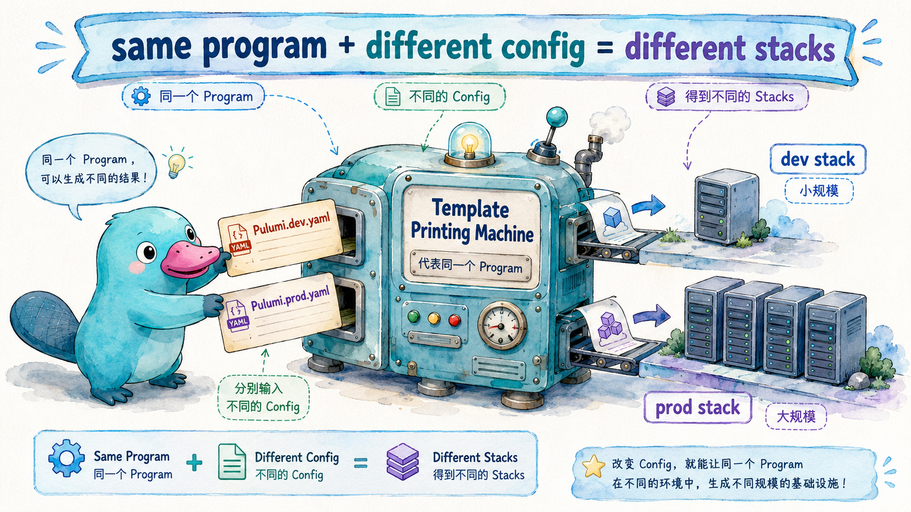

# Configuration 配置

## 本章定位

::: tip 导言
前面几章我们把「资源」与「组件」讲透了：一段程序声明、封装出一组基础设施。但真正落地时你会立刻撞上一个问题——**同一套程序，不同环境往往需要不同的值**。开发环境用 1 台 `t3.micro`，生产环境要 6 台 `m5.large`；测试集群部署在 `us-east-1`，正式集群部署在 `us-west-2`。如果把这些差异**硬编码**进程序，你就得为每个环境复制一份代码，从此陷入「改一处、漏三处」的泥潭。Pulumi 的解决办法是把这些会变的值从代码里抽出来，交给一套**配置（Configuration）系统**管理：程序只写「逻辑」，差异写进**每个 Stack 各自的配置文件**。于是「一套程序、多个 Stack、各自一份配置」成为 Pulumi 的标准工作方式——这正是之前 [Stack 详解](stacks.md) 里「Stack 是同一程序的多个实例」那句话的下半篇。
:::

理解配置，本质上是理解一件事：**程序是模板，配置是把模板实例化成具体环境的那组参数。** 本章回答以下问题：

- 为什么不能把环境差异硬编码？配置系统解决的到底是什么问题？
- 配置键为什么长成 `aws:region` 这样带冒号的形式？命名空间是干什么的？
- 怎么用 CLI 存取配置？这些值最终落在哪个文件里，能不能提交到 Git？
- 在程序里怎么读配置？`get` 与 `require` 有什么区别？怎么读带类型、带命名空间的值？
- 结构化配置（对象、数组、嵌套）怎么设、怎么读？有哪些容易踩的坑？
- 项目级配置和 Stack 级配置是什么关系？谁覆盖谁？
- Provider 是怎么通过配置拿到 region、credential 的？为什么显式 new 出来的 provider 不读配置文件？
- 组件库怎样读取属于自己命名空间的配置，做到与宿主项目互不干扰？

## 官方映射

- [Configuration](https://www.pulumi.com/docs/iac/concepts/config/)：配置键格式、CLI 存取、从代码读取、结构化配置、项目级配置、Provider 配置、Pulumi 内置配置键与 ESC。
- [Secrets](https://www.pulumi.com/docs/iac/concepts/secrets/)：配置中的机密值（`--secret` / `getSecret` / `requireSecret`），本章只点到为止，详见 [Secrets 机密处理](secrets-handling.md)。
- [Automation API](https://www.pulumi.com/docs/iac/concepts/automation-api/)：在程序之外以编程方式写入配置、动态创建 Stack 的方式（程序运行期间配置是只读的）。

## 5A.1 为什么需要配置：让同一套程序适配不同 Stack

设想你要为「开发」和「生产」两套环境部署同一个应用。它们的结构完全一样，只有几个参数不同：实例规格、副本数、所在区域。

最朴素的做法是把这些值直接写死在程序里。但只要环境多于一个，硬编码立刻带来三个麻烦：要么复制多份几乎一样的代码（维护噩梦），要么在代码里写一堆 `if (env === "prod")` 的分支（逻辑与数据纠缠在一起），要么每次部署前手工改源码（极易出错且无法审计）。

Pulumi 的配置系统把「会变的值」与「不变的逻辑」彻底分开：

- **程序**只描述逻辑：「创建 N 台某规格的实例，部署在某区域」。
- **配置**为每个 Stack 提供具体的 N、规格、区域。

这些键值对存放在 **该 Stack 的设置文件**里，文件名固定为 `Pulumi.<stack-name>.yaml`（见 [Stack 配置文件不是 Stack 本身](stacks.md)）。**这些 Stack 配置文件应当提交到版本控制**，因为它们的取值直接驱动程序的行为——它们是基础设施的一部分，不是临时草稿。



## 5A.2 配置键的格式：命名空间与项目名

配置键统一采用 `[<namespace>:]<key-name>` 的格式，用一个冒号分隔**可选的命名空间**和**真正的键名**。

如果你只写一个不带冒号的简单名字，Pulumi 会**自动**把当前项目的名字（来自 `Pulumi.yaml` 的 `name` 字段）当作命名空间。也就是说，在名为 `broome-proj` 的项目里执行 `pulumi config set name BroomeLLC`，存进文件后实际是 `broome-proj:name`。

命名空间的意义在于**隔离**。AWS 包需要一个叫 `region` 的配置，Kubernetes 包可能也想要个 `region`，你的程序自己也可能有个 `region`——如果没有命名空间，它们就会互相打架。有了命名空间，`aws:region`、`kubernetes:region`、`broome-proj:region` 各自井水不犯河水。这套机制同样适用于自定义组件（[Components](components.md)）：组件可以定义自己的键空间，不必担心与别的组件、包或项目冲突。

## 5A.3 用 CLI 存取配置

`pulumi config` 命令在**当前 Stack** 上读写配置：

- `pulumi config set <key> [value]`：把键 `<key>` 设为 `[value]`。
- `pulumi config get <key>`：读取键 `<key>` 的现有值。
- `pulumi config`：列出当前 Stack 的全部键值对（加 `--json` 则输出 JSON）。

```bash
$ pulumi config set aws:region us-west-2
$ pulumi config get aws:region
us-west-2
```

使用项目内的简单键名（假设项目名是 `broome-proj`）：

```bash
$ pulumi config set name BroomeLLC
$ pulumi config get name
BroomeLLC
```

几个要点：

- **`set` 会直接覆盖旧值，不给任何警告**。
- 如果 `set` 时**省略 `[value]`**，CLI 会**交互式提示**你输入。这个值也可以从标准输入读入，对多行内容或必须转义的值很方便：

  ```bash
  $ cat my_key.pub | pulumi config set publicKey
  ```

- 配置还可以在创建项目时一并传入。`pulumi new` 支持 `--config`，可重复多次：

  ```bash
  $ pulumi new aws-typescript --config="aws:region=us-west-2"
  ```

## 5A.4 Stack 配置文件：`Pulumi.<stack-name>.yaml`

上面这些 `set` 操作最终都落进当前 Stack 的设置文件。例如在 `dev` Stack 上设了 `aws:region`，`Pulumi.dev.yaml` 里就会出现：

```yaml
# Pulumi.dev.yaml
config:
  aws:region: us-west-2
```

你既可以用 `pulumi config set` 修改它，也可以直接用编辑器手写——两种方式等价。再次强调：**这个文件应当提交到 Git**，它和程序一起构成「这套基础设施在这个环境下的完整定义」。

## 5A.5 在程序里读取配置

程序里通过一个 `Config` 对象读取配置。两个最基础的 getter：

- `config.get(key)`：键不存在时返回 `undefined`。
- `config.require(key)`：键不存在时**抛出带提示信息的异常**，阻止部署继续，直到你用 CLI 把这个值设上。

```ts
let config = new pulumi.Config();
let name = config.require("name");           // 缺失即报错
let lucky = config.getNumber("lucky") || 42; // 缺失则用默认值 42
let secret = config.requireSecret("secret"); // 机密值，返回 Output
```

::: warning 配置在程序运行期间是只读的
程序里只能**读**配置，不能**写**。如果你需要以编程方式管理配置（写入配置值、动态创建 Stack），那是 [Automation API](automation-api.md) 的职责，而不是在 Pulumi 程序内部完成。
:::

**类型化 getter**：除了 `get` / `require`，`Config` 还提供 `getNumber` / `requireNumber`、`getBoolean` / `requireBoolean`、`getObject` / `requireObject` 等，会按目标类型解析并校验。

**机密值**：对可能是机密的配置，用 `getSecret` / `requireSecret`。它们返回的是一个 `Output`，同时携带「值」与「机密性」——这个值在任何序列化（写入 state、输出）时都会被加密或遮蔽。机密配置的细节见 [Secrets 机密处理](secrets-handling.md)。

**命名空间与 `Config` 构造函数**：`Config` 的每个方法都作用在某个命名空间上，默认是当前项目名。要读取**别的命名空间**的值，把命名空间名传给构造函数：

```ts
// 默认构造：读取不带命名空间前缀的项目级键（如 `pulumi config set name Joe`）
let config = new pulumi.Config();
let name = config.require("name");

// 传入 "aws"：读取 aws 命名空间的键（如 aws:region）
let awsConfig = new pulumi.Config("aws");
let awsRegion = awsConfig.require("region");
```

如果你在写一个会被别人引入的**组件库**（[Components](components.md)），同样可以把**库自己的名字**传给 `Config` 构造函数，让组件只读取属于自己命名空间的键，从而与宿主项目的配置互不干扰。这一用法在下一节单独展开（见 5A.6）。

## 5A.6 组件配置：让组件读取自己命名空间的配置

[Components](components.md) 一章里，我们把一组资源封装成可复用的 `ComponentResource`。当组件需要参数时，除了通过构造函数的 `args` 一个个传进去，还有一种更「配置化」的方式：**让组件直接读取属于它自己命名空间的配置**。

做法很简单——把**组件库自己的名字**当命名空间传给 `Config` 构造函数。这样组件只会读到以库名为前缀的键，既不会误读宿主项目的同名键，宿主项目也不会误读它的键：

```ts
class BucketFleet extends pulumi.ComponentResource {
    public readonly bucketNames: pulumi.Output<string[]>;

    constructor(name: string, args: { provider: aws.Provider }, opts?: pulumi.ComponentResourceOptions) {
        // 这里的 "app" 是资源类型 token（<包>:<模块>:<类型>），只用于生成 URN 前缀、标识资源类型，
        // 与下面 new pulumi.Config("app") 读取的配置命名空间毫无关系——两处同名纯属命名约定。
        super("app:index:BucketFleet", name, {}, opts);

        // 只读取 "app" 命名空间下的键：app:bucketPrefix、app:bucketCount。
        const config = new pulumi.Config("app");
        const prefix = config.require("bucketPrefix");
        const count = config.getNumber("bucketCount") ?? 1;

        const buckets: aws.s3.Bucket[] = [];
        for (let i = 0; i < count; i++) {
            buckets.push(new aws.s3.Bucket(`${name}-${prefix}-${i}`, {
                tags: { component: "BucketFleet" },
            }, { provider: args.provider, parent: this }));
        }

        this.bucketNames = pulumi.all(buckets.map(b => b.bucket));
        this.registerOutputs({ bucketNames: this.bucketNames });
    }
}
```

对比上面使用配置的写法，如果**不使用配置**，组件就得把 `prefix`、`count` 也列进 `args`，让使用者在 `new` 的时候**作为参数一个个传进来**——也就是把值「塞」进构造函数：

```ts
// 另一种写法：prefix、count 写在 args 里，由使用者实例化时传入，组件不读配置
new BucketFleet("fleet", { provider: localAws, prefix: "fleet", count: 3 });
```

这种写法的问题是：换个环境要用不同的前缀和数量，就得**回去改源码**。而本节的组件把这两个值改成自己从 `app` 命名空间读配置，于是使用者**不必再往构造函数里传 `prefix`、`count`**（`args` 里只剩 `provider`），只要在 CLI 上设置带 `app:` 前缀的键即可，源码一行不动：

```bash
$ pulumi config set app:bucketPrefix fleet
$ pulumi config set app:bucketCount 3
```

这两个 `app:` 键，与项目自己的 `bucketPrefix`（即 `<项目名>:bucketPrefix`）虽然后半段同名，却在同一个 `Pulumi.<stack>.yaml` 里**和平共处、互不覆盖**——这正是命名空间隔离的价值：组件作者圈出自己的键空间，宿主项目圈出自己的，谁也不踩谁。

> 该模式的完整动手演示见本章实验最后一步：组件 `BucketFleet` 从 `app` 命名空间读取 `app:bucketPrefix` / `app:bucketCount`，与项目级的同名键在同一份配置文件里并存。

## 5A.7 结构化配置：对象、数组与嵌套

配置不只能存简单字符串，还能存**结构化数据**——对象、数组、嵌套结构。用 `pulumi config set` 加 `--path` 标志即可，`--path` 表示这个键是一条「路径」，指明值要存进对象的哪个位置。

```bash
$ pulumi config set --path 'data.active' true
$ pulumi config set --path 'data.nums[0]' 1
$ pulumi config set --path 'data.nums[1]' 2
$ pulumi config set --path 'data.nums[2]' 3
```

存进 `Pulumi.<stack-name>.yaml` 后（假设项目名为 `proj`）：

```yaml
config:
  proj:data:
    active: true
    nums:
    - 1
    - 2
    - 3
```

注意类型推断：对结构化配置，`true` / `false` 会被存成**布尔值**，能转成整数的值会被存成**整数**。

在程序里用 `requireObject`（或 `getObject`）读取，并提供一个类型描述：

```ts
interface Data {
    active: boolean;
    nums: number[];
}

let config = new pulumi.Config();
let data = config.requireObject<Data>("data");
console.log(`Active: ${data.active}`);
```

::: warning 访问嵌套值时的常见陷阱
`requireObject` / `getObject` 返回的是一个**普通对象**（在其他语言里是字典 / map），**不是** `Config` 实例。因此你要用**标准的对象属性访问**去取嵌套值，而**不能**再链式调用 `Config` 的方法。

**正确做法**——拿到对象后用普通属性访问：

```ts
const config = new pulumi.Config();
const data = config.requireObject<Data>("data");

const active = data.active;      // ✅ 直接属性访问
const firstNum = data.nums[0];   // ✅ 继续往下点
```

**错误做法**——把返回的普通对象当成 `Config` 来用，会在运行时直接抛错：

```ts
const config = new pulumi.Config();
const data = config.requireObject<Data>("data");

// ❌ data 是普通对象，没有 requireNumber 这类方法
const firstNum = data.requireNumber("nums");
// TypeError: data.requireNumber is not a function

// ❌ 也不能在 config 上「链式」深入嵌套键，require 返回的不是 Config
const active = config.require("data").require("active");
// TypeError: config.require(...).require is not a function
```
:::

## 5A.8 项目级配置：跨 Stack 共享的默认值

有时一个项目里**多个 Stack 的某些配置是相同的**。例如 `aws:region` 可能在所有 Stack 里都一样。为每个 Stack 的配置文件都重复抄一遍既啰嗦又易错。**项目级配置**（也叫层级配置 / hierarchical configuration）允许把这类配置设在**项目级别**，所有 Stack 默认继承。

项目级配置写在项目目录下的 `Pulumi.yaml` 文件里。注意两条限制：

- **`pulumi config set` 目前不支持项目级配置**，必须直接在 `Pulumi.yaml` 里手写。
- **项目级配置目前只支持明文**（暂不支持项目级机密）。

```yaml
# Pulumi.yaml
config:
  aws:region: us-east-1
  name: BroomeLLC
  data:
    value:        # 项目级结构化配置需要这层 value 包裹
      active: true
      nums:
      - 10
      - 20
      - 30
```

::: warning 项目级与 Stack 级的 YAML 语法不一样
- **Stack 级文件**（`Pulumi.<stack-name>.yaml`）：用 `项目名:键:` 的形式，结构化值直接嵌在键下面。
- **项目级文件**（`Pulumi.yaml`）：用 `键:`（不带项目名前缀），结构化值要套一层 `value:` 包裹。

同一份配置在 `Pulumi.dev.yaml` 里长这样（项目名为 `myproject`）：

```yaml
config:
  aws:region: us-east-1
  myproject:name: BroomeLLC
  myproject:data:        # 带项目名前缀，且不需要 value 包裹
    active: true
    nums:
    - 10
    - 20
    - 30
```

这个差异很容易被忽略，在两个文件之间搬配置时尤其容易踩坑。
:::

**Stack 级覆盖项目级**：当同一个键在项目级和 Stack 级都设了值，**Stack 级的值胜出**。例如上面项目级把 `aws:region` 设为 `us-east-1`，而 `Pulumi.dev.yaml` 里写：

```yaml
config:
  aws:region: us-east-2
  name: MopLLC
```

那么 `dev` Stack 就会部署到 `us-east-2`，`name` 也变成 `MopLLC`。

**强类型配置**：项目级配置还能为 Stack 级配置定义**类型规格**并设默认值，这样 `pulumi preview` 在类型不符时会直接报错：

```yaml
# Pulumi.yaml
config:
    name:
        type: string
        description: Base name to use for resources.
        default: BroomeLLC
    subnets:
        type: array
        description: Array of subnets to create.
        items:
            type: string
```

此时所有 Stack 默认用 `BroomeLLC`；如果某个 Stack 把 `name` 设成了整数，或 `subnets` 不是字符串数组，CLI 会报错。**注意：强类型配置规格目前不支持结构化配置。**

## 5A.9 Provider 配置：region 与凭据从哪来

Provider（如 `aws`）也通过配置拿到 region、凭据等参数。官方给出三种配置方式：

1. **在 Stack 配置文件里设键**：`pulumi config set [PROVIDER]:[KEY] [VALUE]`，例如 `pulumi config set aws:region us-west-2`。
2. **设置 provider 专属的环境变量**：例如 AWS 的 `AWS_REGION` / `AWS_PROFILE`。
3. **在程序里把参数传给 provider 的 SDK 构造函数**。

有两点务必记牢：

- **配置文件里的设置只对「默认 provider」生效。** 一旦你**显式 new 出一个 provider 实例**，它**不会**去读 Stack 配置文件——你必须把参数直接传进它的构造函数。（本章及前几章的动手实验之所以能把所有 AWS 调用指向本地模拟器，正是因为我们显式构造了一个 `new aws.Provider(...)` 并在里面写死了 endpoint。）
- **配置来源（配置文件、环境变量、构造函数参数）之间的优先级，因 provider 而异**，具体顺序请查阅对应 provider 的文档。

Provider 与默认 provider 的更多细节见 [Provider 抽象](providers.md)。

## 5A.10 Pulumi 内置配置键

除了你自己和各 provider 的键，Pulumi CLI 还认识一组 `pulumi:` 命名空间下的内置键，写在 Stack 配置文件里：

- **`pulumi:disable-default-providers`**：一个包名列表，对其中的包[禁用默认 provider](providers.md)。`*` 表示对所有包禁用。

  ```yaml
  config:
    pulumi:disable-default-providers:
      - aws
      - kubernetes
  ```

- **`pulumi:tags`**：一组 [Stack 标签](stacks.md)，CLI 会在**每次 `pulumi up` 或 `pulumi refresh`** 时自动应用到 Stack 上。

  ```yaml
  config:
    pulumi:tags:
      company: "Some LLC"
      team: Ops
  ```

  注意：CLI 只**创建或更新**配置里列出的标签。如果你从配置里删掉某个标签，还得**手动**去 Pulumi Cloud 把它删掉，CLI 不会替你删。

## 5A.11 配置的边界：环境变量、ESC 与 Secrets

最后厘清几条容易混淆的边界：

- **配置 vs 环境变量**：所有 shell 环境变量都会传给运行中的程序，可用 `process.env`（Node.js）/ `os.environ`（Python）等标准 API 读取，也能用来做动态行为。但**配置更值得优先选用**——它是为「多 Stack、多人协作」场景设计的，而环境变量不是。
- **配置 vs Secrets**：机密值是配置的一个**子集**——你用 `--secret` 设、用 `requireSecret` 读的，就是被加密的配置。它在配置文件里以密文形式出现，可以放心提交到 Git。完整机制见 [Secrets 机密处理](secrets-handling.md)。
- **配置 vs Pulumi ESC**：当多个 Stack 之间有大量重复的配置和机密时，可以用 Pulumi ESC（Environments, Secrets, and Configuration）把它们集中管理，再在 Stack 配置里 `import` 进来：

  ```yaml
  # 导入名为 test 的 environment 及其全部配置
  environment:
    - test
  config:
    # 这里写本 Stack 自己的配置
  ```

  当某个键既被导入的 environment 设置、又在 Stack 配置里显式设置时，**Stack 里的显式值优先**。

## 5A.12 生产检查清单

- [ ] 所有环境差异（region、规格、副本数、域名等）都走配置，**没有任何一处硬编码**或 `if (env === ...)` 分支。
- [ ] Stack 配置文件 `Pulumi.<stack>.yaml` 已**提交到版本控制**。
- [ ] 程序里对**必须存在**的配置用 `require`（让缺失尽早报错），对**可选**的配置用 `get` 并提供默认值。
- [ ] 数字、布尔、对象类型分别用 `requireNumber` / `requireBoolean` / `requireObject`，而不是把字符串自己 `parseInt` / `JSON.parse`。
- [ ] 读取别的命名空间（如 `aws`）或组件库的配置时，给 `Config` 构造函数传了**正确的命名空间名**。
- [ ] 机密值一律用 `--secret` 设、`getSecret` / `requireSecret` 读，**绝不**以明文写进配置或代码。
- [ ] 跨 Stack 相同的值（如 `aws:region`）提到**项目级 `Pulumi.yaml`**，靠 Stack 级覆盖处理例外，避免到处复制。
- [ ] 清楚「配置文件只对默认 provider 生效」：显式 `new` 出来的 provider 必须自带参数。

## 动手实验

本实验只配置 **AWS** 版，使用 `pulumi/pulumi-aws`（`@pulumi/aws`）对接本地 **MiniStack** 模拟器，全程不需要真实 AWS 账号。你会用一组由配置驱动的 S3 Bucket 依次体验：CLI 存取配置与命名空间、在程序里 `require` / `get` 读取并驱动资源、结构化配置（`--path` 与 `requireObject`）、机密配置（`--secret`）的加密与遮蔽、「同一套程序、`dev` 与 `prod` 两个 Stack、各自一份配置、产出不同基础设施」，最后再用一个 `ComponentResource` 演示组件如何读取属于自己命名空间（`app:`）的配置。

<KillercodaEmbed src="https://killercoda.com/pulumi-tutorial/course/pulumi-tutorial/pulumi-config" title="实验：Configuration 配置（AWS / MiniStack）" desc="用 @pulumi/aws 对接 MiniStack，练习 CLI 存取配置与命名空间、在程序里 require/get 驱动资源、结构化配置 --path 与 requireObject、机密配置 --secret、dev/prod 两个 Stack 用不同配置产出不同基础设施，以及组件从自己命名空间（app:）读取配置。" />

## 本章交付物

- 一个由配置驱动的 Pulumi 程序：region、bucket 前缀、数量、标签全部来自配置而非硬编码。
- 一份带命名空间的 Stack 配置文件 `Pulumi.dev.yaml`，理解 `aws:region` 与项目级键的区别。
- 一次结构化配置（`--path` 设置对象 / 数组，`requireObject` 读取）的实践。
- 一次机密配置（`--secret`）的演示：看它在 YAML 里以密文存储、在输出里被遮蔽。
- `dev` 与 `prod` 两个 Stack：同一套程序，靠各自配置产出规模不同的基础设施。
- 一个从自己命名空间（`app:`）读取配置的 `ComponentResource` 组件演示，与项目级同名键在同一份配置文件里并存不冲突。
