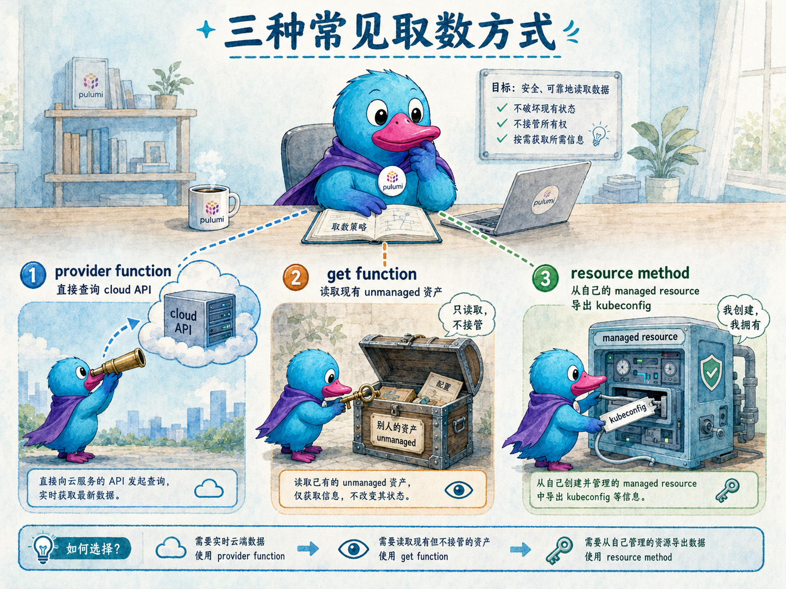
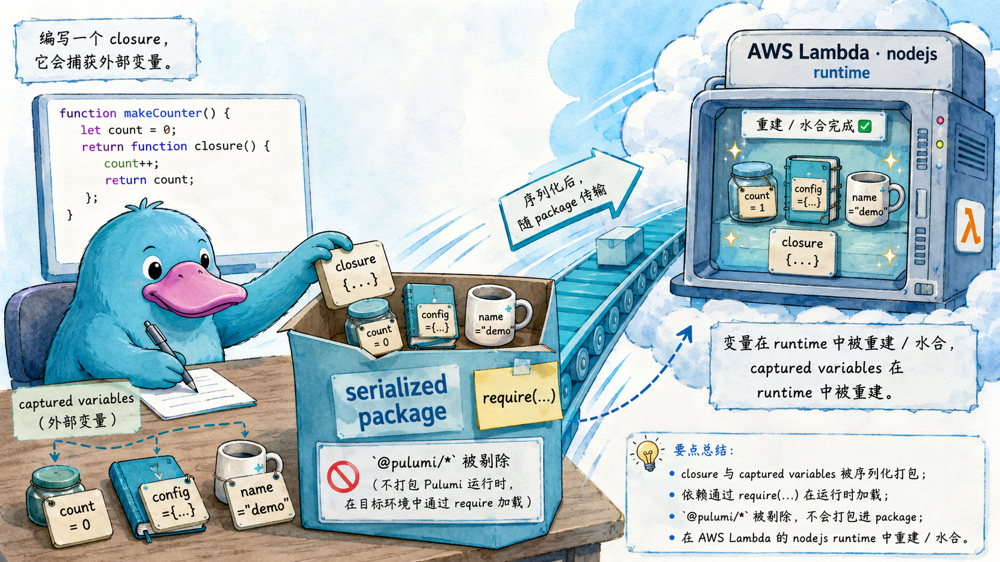

# Functions 函数

<TutorialAcknowledgement />

## 本章定位

::: tip 导言
到目前为止，我们写的 Pulumi 程序几乎只做一件事：**声明资源**（`new aws.s3.Bucket(...)`）。但真实的基础设施程序里，你还经常要做三类「不是创建资源」的事：**向云查一个值**（最新的 AMI、可用区列表、当前账号 ID）、**引用一个不归 Pulumi 管的既有资源**（别的团队建的 VPC、手工建的安全组）、**从你正在管理的资源上取一个派生值**（EKS 集群的 kubeconfig）。Pulumi 把这三件事统一抽象成 **Functions（函数）**。本章把这三类函数讲清楚，再补上一个 Node.js 专属的「高级玩法」——**函数序列化（function serialization）**：把一段 JavaScript 闭包直接变成云上的 Lambda。
:::

本章回答以下问题：

- Pulumi 的三类函数分别解决什么问题？拿到一个需求，该用哪一类？
- Provider function 的 **direct form** 与 **output form** 有什么区别？什么时候必须用哪一个？
- `get` 函数和 `pulumi import` 到底差在哪？
- 为什么 resource method（如 `getKubeconfig`）总是返回 Output、且不接受 invoke options？
- 函数序列化是怎么把一个 JavaScript 闭包「打包」成 Lambda 的？它能捕获什么、不能捕获什么？

## 官方映射

- [Functions](https://www.pulumi.com/docs/iac/concepts/functions/)：三类函数总览与选型。
- [Provider functions](https://www.pulumi.com/docs/iac/concepts/functions/provider-functions/)：direct/output form、invoke options、执行时机。
- [Get functions](https://www.pulumi.com/docs/iac/concepts/functions/get-functions/)：用静态 `get` 引用未托管资源。
- [Resource methods](https://www.pulumi.com/docs/iac/concepts/functions/resource-methods/)：挂在资源类型上的方法，如 EKS `getKubeconfig`。
- [Function serialization](https://www.pulumi.com/docs/iac/concepts/functions/function-serialization/)：把 JavaScript 回调序列化成云端运行时代码（仅 Node.js）。

## 8.1 三类函数总览：先认清你要做哪件事

Pulumi 提供三类函数，它们的区别**不在语法，而在数据从哪来**：

| 函数类型 | 数据来源 | 典型场景 | 关键特征 |
| --- | --- | --- | --- |
| **Provider function** | 云厂商 API（查询，不创建资源） | 查最新 AMI、查可用区、查当前账号 | 形如 `aws.ec2.getAmi(...)`，有 direct/output 两种形态 |
| **Get function** | 一个**已存在、但不归 Pulumi 管**的资源 | 引用别的团队建好的 VPC / 安全组 | 静态方法 `Resource.get(name, id)`，永远不会被改/删 |
| **Resource method** | 一个**你正在管理**的资源的派生值 | 取 EKS 集群的 kubeconfig | 实例方法 `cluster.getKubeconfig()`，永远是 output 形态 |



> 绘图提示词：淡水彩阴影漫画插画风格（light watercolor shaded comic illustration），青色（cyan）主色调，拟物质感。画面中央一只 Pulumi 吉祥物鸭子（the Pulumi mascot duck）站在一张办公桌前，桌上有三个不同的「取数」动作：左边鸭子拿着望远镜望向云端的一台 cloud API 服务器（provider function，querying the cloud），中间鸭子用钥匙打开一个贴着「别人的资产 / unmanaged」标签的旧箱子但只是查看不搬走（get function），右边鸭子从自己已经组装好的一台机器（managed resource）上接出一根写着 kubeconfig 的导线（resource method）。三个动作用三条不同颜色的虚线连回鸭子。professional / technical terms（provider function、get function、resource method、cloud API、unmanaged、kubeconfig）用英语，其余说明文字用中文。

选型只需问自己一句话：

- 我要**问云要一个值** → Provider function。
- 我要**引用一个别人建的、我不想接管的资源** → Get function。
- 我要**从我自己建的资源上取一个算出来的值** → Resource method。

## 8.2 Provider functions：向云 API 查询

Provider 不只提供资源类型，还在 SDK 里附带一批**函数**，用于调用平台 API 拿到「不是资源」的值。最经典的例子是查最新的 Amazon Linux AMI：

```ts
import * as aws from "@pulumi/aws";

(async () => {
  const latestAmi = await aws.ec2.getAmi({
    owners: ["amazon"],
    mostRecent: true,
    filters: [
      { name: "name", values: ["amzn2-ami-hvm-*"] },
      { name: "architecture", values: ["x86_64"] },
    ],
  });

  new aws.ec2.Instance("web-server", {
    ami: latestAmi.imageId,
    instanceType: "t3.micro",
  });
})();
```

> 桥接型（bridged）provider 会把上游 Terraform provider 的 **data source** 暴露成对应的 provider function。所以你在 Terraform 里熟悉的 data source，在 Pulumi 里基本都能找到同名的 `getX` 函数。

权威的函数清单在 [Pulumi Registry](https://www.pulumi.com/registry) 里，每个 provider 的 API 文档都列了它全部的函数。

### Direct form 与 Output form：两种形态

同一个 provider function，在大多数语言里以**两个不同名字的函数**出现：

- **Direct form**：接受**普通参数**（`string` 而非 `Input<string>`），返回 `Promise<T>`（TypeScript）。通常命名为 `getX()`。
- **Output form**：接受 **Pulumi Input**（也接受普通值），返回 `Output<T>`。通常命名为 `getXOutput()`。

```ts
// direct form：await 一个 Promise，拿到普通值
const ami = await aws.ec2.getAmi({ owners: ["amazon"], mostRecent: true });

// output form：返回 Output，能直接接住别的 Output、参与依赖图
const amiOut = aws.ec2.getAmiOutput({ owners: ["amazon"], mostRecent: true });
```

> 命名约定有两个例外要记住：**Java** 是反的——`Ec2Functions.getAmi()` 是 output form，`Ec2Functions.getAmiPlain()` 才是 direct form；**YAML** 两种形态都用 `fn::invoke`，运行时自动处理，语言层面不区分。

### 两种形态的执行时机不同

这是 direct/output form 最本质的区别，也是「该用哪个」的判断依据：

- **Direct form** 就像你语言里任何一次普通函数调用，**立即执行**。它不接受 Input/Output，因此**不被引擎追踪、不进依赖图**。
- **Output form** 接受 Input、返回 Output，所以**被引擎追踪、参与依赖图**。引擎会保证：**所有输入值都 resolve 之后**，函数才会被调用。（这也是为什么只有 output form 才有 `dependsOn`。）

### 何时必须用哪一个

官方给了两条硬规则，剩下的看偏好：

- **「函数结果决定一个资源要不要创建」→ 必须用 direct form。** 因为引擎在**构建依赖图**时（决定哪些资源要 create/update/delete）就要知道答案，这个决定必须提前算出来。direct form 正好在这个阶段同步执行。

  ```ts
  // 先查有没有匹配的 AMI，有才创建实例——这种「要不要建」的分支必须用 direct form
  const candidates = await aws.ec2.getAmiIds({
    owners: ["amazon"],
    filters: [{ name: "name", values: ["amzn2-ami-hvm-*-x86_64-gp3"] }],
  });
  if (candidates.ids.length > 0) {
    new aws.ec2.Instance("web", { ami: candidates.ids[0], instanceType: "t3.micro" });
  }
  ```

- **「函数要等某些资源先建好/某个 Output 先 resolve」→ 用 output form。** 它能直接接住 Input，无需 `apply` 包裹；要补充隐式依赖之外的依赖，用 `dependsOn`。这种情况下**技术上也能用 direct form**，但你得把整个调用塞进一个 `apply` 里，可读性会变差——所以官方不推荐。

  ```ts
  // amiNameFilter 是个 Output<string>（来自 secret 配置），output form 能直接吃进去，不用 apply
  const amiNameFilter = config.requireSecret("amiNameFilter");
  const latestAmi = aws.ec2.getAmiOutput({
    owners: ["amazon"],
    mostRecent: true,
    filters: [{ name: "name", values: [amiNameFilter] }],
  });
  new aws.ec2.Instance("web", { ami: latestAmi.imageId, instanceType: "t3.micro" });
  ```

> **Pulumi 的官方建议：默认选 output form**，除非你确实需要 direct form。原因有二：① output form 让你全程只用一套编程模型（Input/Output），不必再处理各语言特有的返回类型（TS 的 `Promise`、.NET 的 `Task`、Java 的 `CompletableFuture`）；② 语法上更简洁。两者在性能与可维护性上没有实质差别，本质是偏好问题。

### Invoke options

和资源接受 resource options 一样，provider function 也接受一组 **invoke options**：

- `dependsOn`：声明额外依赖，**仅 output form 可用**（原因见上）。
- `parent`：指定父资源，会被用来推断该调用使用哪个 provider。
- `provider`：传入一个**显式配置的 provider**，而不是用 default provider。典型用途：在多个 AWS 区域里各调用一次同一个函数。

还有几个**已废弃、不应再用**的选项（它们控制的能力如今都在「安装 provider 包」时处理了）：`pluginDownloadURL`、`version`、`async`。

## 8.3 Get functions：引用一个不归你管的资源

所有资源类都带一个静态 `get` 方法，用来**查一个已经存在、但不归 Pulumi 管理**的资源。它和 `pulumi import` 命令是两回事：

- `pulumi import`：把既有资源**纳入 Pulumi 管理**（之后 Pulumi 会改它、删它）。
- `get`：只是让你在程序里**读到**这个资源的属性。用 `get` 读出来的资源，Pulumi 在 update 时**永远不会去改它、删它**。

`get` 接受两个值：① Pulumi 用来引用它的**逻辑名**；② 它在云上的**物理 ID**。

```ts
import * as aws from "@pulumi/aws";

// 读一个已存在的安全组（不归 Pulumi 管），用它的 name 作为新实例的输入
const group = aws.ec2.SecurityGroup.get("group", "sg-0dfd33cdac25b1ec9");

const server = new aws.ec2.Instance("web-server", {
  ami: "ami-6869aa05",
  instanceType: "t2.micro",
  securityGroups: [group.name], // 引用上面读到的安全组
});
```

上例中 Pulumi 绝不会尝试修改这个安全组——它只是从你的云账号里查出这个安全组的属性，然后把它的 `name` 当作新建实例的输入。

> ⚠️ 如果你要 `get` 的资源**不存在**，Pulumi 会抛异常或报错（取决于语言），程序终止。

## 8.4 Resource methods：从你管理的资源上取派生值

有些 provider SDK 会在资源类型上挂**方法**，用来返回「由该资源算出来的值」。最典型的是 [EKS](https://www.pulumi.com/registry/packages/eks/api-docs/) 包里 `Cluster` 资源的 [`getKubeconfig`](https://www.pulumi.com/registry/packages/eks/api-docs/cluster/#method_GetKubeconfig) 方法：

```ts
import * as eks from "@pulumi/eks";

const cluster = new eks.Cluster("my-cluster", { /* ... */ });

// 在已创建的集群实例上调用方法，拿到 kubeconfig（一个 Output）
export const kubeconfig = cluster.getKubeconfig();
```

resource method 和 provider function 有两点关键不同：

- **永远是 output 形态**：它接受 `Input`、返回 `Output`。因为方法**必须等资源创建完成**才能执行（kubeconfig 要等集群真的建好才存在）。
- **不接受 invoke options**：没有 `provider` / `dependsOn` 这些选项可调。

> 把三类函数放一起对比：provider function 是「问云要一个与具体资源无关的值」，get function 是「读一个我不管的资源」，resource method 是「从我管的资源上取一个派生值」。`getKubeconfig` 属于第三类——集群是你建的，kubeconfig 是从它派生出来的。

## 8.5 Function serialization：把 JavaScript 闭包变成 Lambda

::: warning 仅限 Node.js
函数序列化**只支持 JavaScript / TypeScript**。它虽然仍受支持，但**不是 Pulumi 当前主动开发的方向**。此外，它**不支持 Bun runtime**（`runtime: bun`）——Bun 尚未完整实现序列化所依赖的 Node.js v8/inspector API；需要函数序列化时请用 `runtime: nodejs`。
:::

很多时候，一小段「运行时逻辑」本就属于云应用的一部分，把它**内联写在 Pulumi 程序里**最自然。Pulumi 让你把一个 JavaScript 回调**序列化**成制品，在云端被触发时执行——这可以补充、甚至替代你在 Lambda ZIP、Docker 镜像、VM 镜像里另写的运行时代码。

```ts
const bucket = new aws.s3.Bucket("mybucket");
bucket.onObjectCreated("onObject", async (ev: aws.s3.BucketEvent) => {
  // 这段代码会在每次有对象写入 bucket 时，作为 Lambda 被触发执行
  console.log(JSON.stringify(ev));
});
```

它的底层是 [`pulumi.runtime.serializeFunction`](https://www.pulumi.com/docs/reference/pkg/nodejs/pulumi/pulumi/runtime#serializeFunction) API：输入一个 JavaScript `Function`，返回它序列化后的文本形式。更直接的写法是 `aws.lambda.CallbackFunction`：

```ts
const lambda = new aws.lambda.CallbackFunction("mylambda", {
  callback: async (e) => {
    // 你的运行时代码……
    return someOutput;
  },
});
```

这套机制最大的价值在于：**你不用手写 `index.js`、不用打包 `node_modules`、不用配 Role 与 RolePolicyAttachment、不用建 S3 上传桶**——Pulumi 全替你做了。

### 它怎么处理「闭包捕获的外部变量」

序列化的精髓在于处理**闭包**——函数引用了定义在它外部的变量：

```ts
const obj1 = { a: 1, b: 2 };
const obj2 = new aws.s3.Bucket("mybucket");

const lambda = new aws.lambda.CallbackFunction("mylambda", {
  callback: async (e) => {
    foo(obj1);
    foo(obj2);
  },
});
```

如果原样把回调搬到云上，运行时根本没有 `obj1`、`obj2`。所以 Pulumi 会**分析回调捕获了哪些值，把整个对象图（含原型链、属性、方法）序列化**过去，在运行时重建。要点：

- **捕获在序列化时被求值**：Pulumi 执行到 `new aws.lambda.CallbackFunction` 那一刻，捕获的是变量**当下的值**。因此**强烈建议不要捕获会被修改的可变值**。这里有个容易踩的细节：序列化遇到 `Promise` 时会 `await` 它，而在这次 `await` 期间，Node.js 可能继续跑你程序里的其他代码、顺手改掉某个已被捕获的变量——于是「先序列化谁、序列化到的是改前还是改后的值」变得难以预料。一旦同时捕获了 Promise 和可变值，行为就会变得难以推理。
- **每次触发都会重建捕获的值**：Lambda 每次被调用前，这些值都会被重新「水合」。单次调用内的改动可见，但**不会延续到下一次调用**——就像每个访问网页的客户端都拿到一份新鲜的变量副本。
- **能裁剪的会被裁剪**：Pulumi 会尽量删掉证明用不到的部分以减小体积；但当对象内部互相引用（如方法里 `this.bar()`）时，会保守地整体序列化。
- **模块按 `require` 处理，不被整体序列化**：回调里 `import * as fs from "fs"`，序列化后变成运行时的 `var fs = require("fs")`。这样既不会把整个模块序列化进去（体积、原生函数都是问题），又能用 `node_modules` 里现成的等价代码。**例外**：你 Pulumi 应用自身的「本地模块」不会出现在上传的 `node_modules` 里，所以它会被当普通值序列化过去。



> 绘图提示词：淡水彩阴影漫画插画风格（light watercolor shaded comic illustration），青色（cyan）主色调，拟物质感。左侧一只 Pulumi 吉祥物鸭子（the Pulumi mascot duck）坐在写字台前写一段 JavaScript closure，台面上散落着几个贴标签的小物件代表 captured variables（外部变量）。鸭子把 closure 和这些小物件一起塞进一个标着「serialized package」的快递箱，箱子上印着 require(...) 的便签表示模块按 require 处理、`@pulumi/*` 被剔除。箱子沿着一条青色传送带飞向右上方云端一台贴着「AWS Lambda · nodejs」标签的运行时机器，机器里同样的小物件被重新摆好（变量在运行时被重建/水合）。professional / technical terms（closure、captured variables、serialized、require、AWS Lambda、nodejs runtime）用英语，其余说明文字用中文。

### 已知限制与依赖处理

- **原生函数（native functions）不可捕获**：任何本身是原生函数、或传递性引用了原生函数的值，都无法被捕获。
- **`package.json` 的 `dependencies` 决定上传哪些包**：Pulumi 会把 `dependencies` 里的包传递性地打进 Lambda。注意 `@pulumi/...` 包**会被自动剔除**——它们只服务于部署期，运行时用不上。
- **`aws-sdk` 可不写**：AWS 总会给 Lambda 带上它，无需自己显式声明。

### 自定义 Lambda

`CallbackFunction` 会用一套合理默认值生成 Lambda（角色、权限、超时、内存、Node 运行时版本等）。任何一项都能覆盖：

```ts
const lambda = new aws.lambda.CallbackFunction("mylambda", {
  callback: async (e) => {
    // ……
    return someOutput;
  },
  timeout: 60, // 只允许运行 1 分钟
});
```

需要给某个「接受回调的 API」传定制 Lambda 时，先把 `CallbackFunction` 建出来，再整个传进去：

```ts
bucket.onObjectCreated(
  "mytrigger",
  new aws.lambda.CallbackFunction("mylambda", {
    callback: async (eventInfo) => {
      for (const record of eventInfo.Records) {
        // 处理每条通知
      }
    },
    timeout: 60,
  }),
);
```

## 8.6 选型决策清单

- [ ] 要**向云查一个与具体资源无关的值**（AMI、可用区、账号 ID）？→ **Provider function**。
- [ ] 该 provider function 的结果要**决定某资源是否创建**？→ 用 **direct form**（`getX`）。
- [ ] 该 provider function 的输入是 **Output / secret / 要等别的资源**？→ 用 **output form**（`getXOutput`），必要时配 `dependsOn`。没有特殊理由时，**默认 output form**。
- [ ] 要**引用一个别人建好、我不想接管**的资源？→ **Get function**（`Resource.get(name, id)`），它永远不会被改/删。
- [ ] 真的想**接管**既有资源（让 Pulumi 管它）？→ 不是 `get`，用 `pulumi import`。
- [ ] 要从**我自己管理**的资源上取派生值（如 kubeconfig）？→ **Resource method**（`cluster.getKubeconfig()`）。
- [ ] 想把一段**运行时逻辑内联**进程序、直接变成 Lambda？→ **Function serialization**（仅 Node.js，注意捕获可变值与原生函数的限制）。

## 动手实验

本章实验是一个 **AWS 版**动手实验，用 **MiniStack** 在本地模拟 AWS，把四类函数全部跑一遍：

- **Provider functions**：用 `aws.getCallerIdentityOutput` / `getCallerIdentity` 对比 output form 与 direct form。
- **Get functions**：先用 CLI 在 MiniStack 里建一个 SNS Topic（不归 Pulumi 管），再用 `aws.sns.Topic.get(...)` 把它读进来，并给它挂一个由 Pulumi 管理的订阅。
- **Function serialization**：用 `aws.lambda.CallbackFunction` 把一段捕获了外部变量的 JavaScript 闭包序列化成 Lambda，部署到 MiniStack（Node.js 运行时），再 `invoke` 看它真的运行。
- **Resource methods**：用 `@pulumi/eks` 在 MiniStack 上拉起一个（由真实 k3s 容器模拟的）EKS 集群，调用 `cluster.getKubeconfig()` 取出 kubeconfig。

<KillercodaEmbed src="https://killercoda.com/pulumi-tutorial/course/pulumi-tutorial/pulumi-functions" title="实验：Functions 四类函数（AWS / MiniStack）" desc="在 MiniStack 上依次体验 provider functions 的 direct/output 形态、get function 引用未托管资源、把闭包序列化成 Lambda 并 invoke、以及 EKS 的 getKubeconfig resource method。" />

## 本章交付物

- 一句话说清三类函数的分工：**provider function 问云要值、get function 读未托管资源、resource method 从已托管资源取派生值**。
- provider function 的 **direct form 与 output form** 的区别（参数类型、返回类型、执行时机），以及「结果决定是否创建用 direct、输入是 Output 用 output、默认 output」的判断规则。
- `get` 与 `pulumi import` 的本质差异：前者只读、永不改删，后者纳入管理。
- resource method 为何**永远是 output 形态**、且**不接受 invoke options**。
- 函数序列化如何把 JavaScript 闭包打包成 Lambda：捕获变量在序列化时求值、模块按 `require` 处理、原生函数不可捕获、`@pulumi/*` 被剔除——以及「不要捕获可变值」这条铁律。

