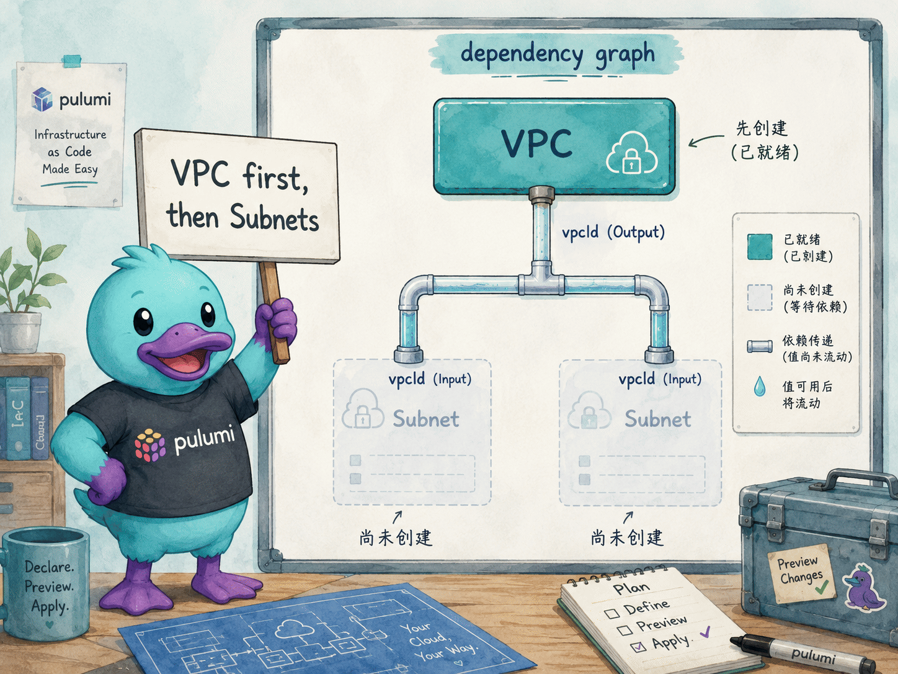
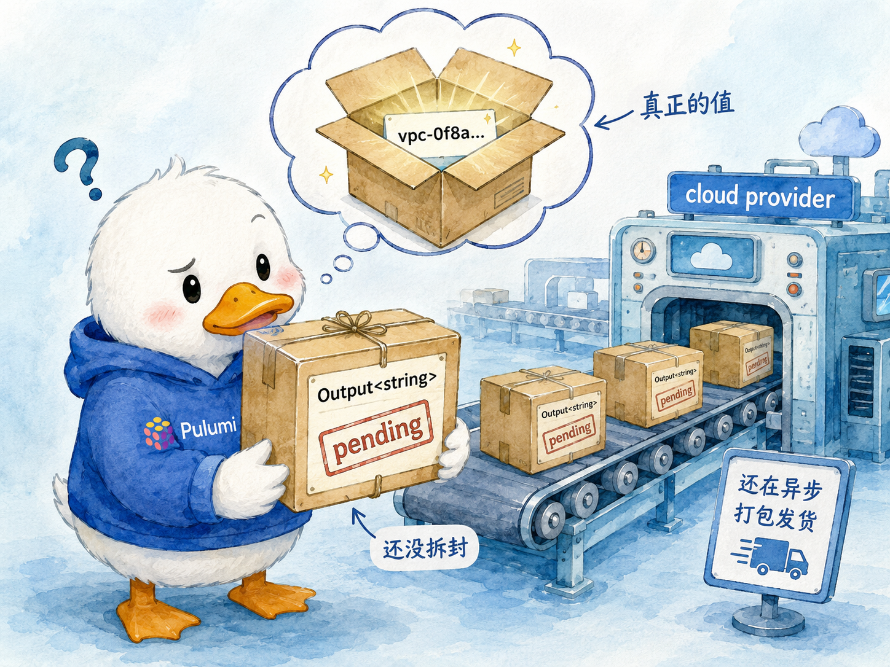
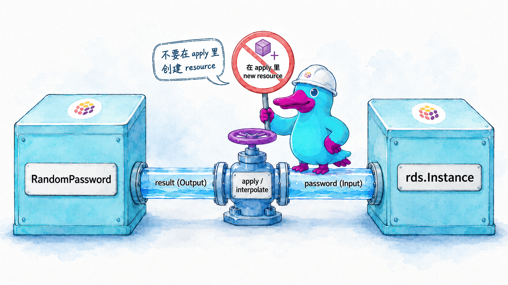

# Inputs, Outputs

## 本章定位

::: tip 导言
从本章开始，我们进入 Pulumi 最核心、也最有别于普通程序的概念。它之所以特别，根源在于 IaC 程序的运行时特点：资源的许多属性要等资源真正创建后才能确定（known after apply），程序「书写时」根本拿不到这些值。为此，Pulumi 借鉴了**函数式编程**的思路，把「将来才知道的值」装进一个类似 future / monad 的容器 `Output<T>`，再用 `apply`、`all` 等组合子把它们串联起来——串联的同时自动记录值与值之间的依赖，最终织出一张运行时 DAG，引擎据此规划求值与创建顺序。这种「靠推断出的依赖关系自动传播数据流」的特征，与**响应式编程（reactive programming）**确实同源；二者的区别在于 `Output<T>` 是一次性求值的延迟值，而非随时间持续变化的数据流（stream），因此严格说它更贴近响应式编程的近亲——**数据流编程（dataflow programming）**。无论归到哪一类，关键是先记住一句话：**你在代码里操作的，往往不是「值本身」，而是「装着未来之值的盒子」**——这正是后面所有 `apply` / `all` / helper 用法的由来。
:::

前面几章里，我们已经多次写过这样的代码：把一个资源的某个属性，传给另一个资源当参数。例如把 VPC 的 ID 传给 Subnet，把 `RandomPassword` 的 `result` 传给数据库实例。当时我们没有深究：**为什么不能像普通变量那样，直接 `console.log` 出 VPC 的 ID？为什么要用 `.apply(...)` 才能把它拼进一个字符串？**

本章就把这两个贯穿 Pulumi 全程的核心类型讲透——**Input（输入）** 和 **Output（输出）**。它们是 Pulumi「用通用编程语言写出声明式基础设施」这件事得以成立的关键。理解了它们，你才算真正读懂了 Pulumi 程序的数据流。

本章回答四个问题：

- Input 和 Output 到底是什么？为什么命令式语言写出来的程序，能表现得像声明式 IaC？
- 一个值「要等资源建好才知道」，在代码里怎么安全地使用它？（`apply`）
- 要同时用到好几个资源的输出值时，怎么把它们组合起来？（`all`）
- 拼字符串、生成 JSON 这类最常见的操作，有没有比 `apply` 更省心的写法？（helpers）

## 官方映射

- [Inputs & outputs](https://www.pulumi.com/docs/iac/concepts/inputs-outputs/)：Input/Output 的定义、为何必要、依赖追踪。
- [Accessing single outputs with Apply](https://www.pulumi.com/docs/iac/concepts/inputs-outputs/apply/)：`apply`、lifting、错误处理、`pulumi.output()` 把 Input 转成 Output。
- [Accessing multiple outputs with All](https://www.pulumi.com/docs/iac/concepts/inputs-outputs/all/)：`all` 组合多个 Output 成字符串或数据结构。
- [Using Output Helpers](https://www.pulumi.com/docs/iac/concepts/inputs-outputs/helpers/)：`interpolate` / `concat` 与 `jsonStringify` / `jsonParse`。

## 6.1 Input 与 Output 到底是什么

先给出两个最朴素的定义：

- **Input（输入）**：你**提供给**资源的值。它可以是必填的，也可以是可选的。例如 `aws.ec2.Subnet` 的 `vpcId` 是必填输入（子网必须属于某个 VPC），而 `aws.s3.Bucket` 的 `forceDestroy` 是可选输入，默认为 `false`。
- **Output（输出）**：资源**创建之后才知道**的值。例如创建一个 `aws.ec2.Vpc`，它的 VPC ID 就是一个输出——这个值你无法预先指定，只有 VPC 在 AWS 上真正建好之后才会知道。

在 Pulumi 的 SDK 里，这两个概念被定义成两个泛型类型。以 TypeScript 为例：

| 类型 | 含义 | 关键特征 |
|------|------|----------|
| `Input<T>` | 资源某个参数能接受的值 | 它既接受**普通值**（plain `T`），也接受 `Output<T>` |
| `Output<T>` | 一个「将来才会知道」的 `T` | 异步值，不能直接当普通 `T` 用 |

这里有个让初学者安心的事实：**任何 `Input<string>` 类型的参数，都可以直接塞一个普通的 `string` 进去。** 你不需要为了「类型对齐」而把每个字面量包一层。下面两种写法都合法：

```ts
// byteLength 的类型是 Input<number>，这里直接给普通数字
const myId = new random.RandomId("mine", {
    byteLength: 8,
});

// algorithm 的类型是 Input<string>，这里直接给普通字符串
const key = new tls.PrivateKey("my-private-key", {
    algorithm: "ECDSA",
});
```

> `Input<string>` 在 SDK 里其实是一个**联合类型（union type）**的别名——`string | Promise<string> | Output<string>`，意思是「普通字符串、字符串的 Promise、字符串的 Output，三者都收」。
>
> 顺带解释一下**联合类型**：TypeScript 里用竖线 `|` 把几个类型并起来，写成 `A | B | C`，表示「这个位置可以是 A、也可以是 B、还可以是 C」中的任意一种，就像「三选一」的允许清单。例如 `string | number` 表示「既能放字符串，也能放数字」。它不是把多个类型合并成一个新类型，而是声明「这几种都接受」。
>
> 回到上面的例子：你传入一个普通 `string`，它**本来就属于这个联合里的一种**，编译器直接放行，运行时这个值也**原封不动**，没有发生任何类型转换——这和 JavaScript 里 `"5" * 2` 把字符串悄悄变成数字那种 coercion 是两回事。可以这样理解：这个参数的「插槽」开了三种形状的口子，普通字符串正好是其中一种形状，插进去即可。（至于 Pulumi 在内部如何把它统一成 Output 来追踪依赖，那是 SDK 运行时的事，与 TypeScript 的类型系统无关。）

不同语言的实现并不一样：**C# 恰恰相反，用的是隐式类型转换。** 同样一段逻辑，C# 写法如下：

```csharp
using Pulumi;
using Pulumi.Random;
using Pulumi.Tls;

// ByteLength 的类型是 Input<int>，这里直接给普通 int
var myId = new RandomId("mine", new RandomIdArgs
{
    ByteLength = 8,
});

// Algorithm 的类型是 Input<string>，这里直接给普通 string
var key = new PrivateKey("my-private-key", new PrivateKeyArgs
{
    Algorithm = "ECDSA",
});
```

> 在 .NET SDK 里，`Input<T>` 不是联合类型，而是一个**类**，它定义了一个**用户自定义的隐式转换运算符（implicit conversion operator）**，简化后形如：
>
> ```csharp
> public static implicit operator Input<T>(T value) => Output.Create(value);
> ```
>
> 于是当你把普通 `string` 赋给 `Input<string>` 参数时，C# 编译器会自动调用这个运算符，把该值**包装**成一个 `Output<string>` 存起来——这是货真价实的隐式转换，运行时确实发生了「裸值 → 包装对象」的转变。这与 TypeScript 的联合类型（不转换、值不变）形成对比：两种语言达到的效果一样（普通值和 Output 都能传），但底层机制一个是「类型本就兼容」，一个是「自动转换」。

除了普通的原生类型外，Input 还被设计成又接受 Output 类型的数据，根本目的只有一个：让你能够把**一个资源的 Output 直接传给另一个资源的 Input**——这是 Pulumi 程序中最高频的动作。

## 6.2 为什么需要 Input 和 Output：依赖追踪与声明式

Pulumi 程序是用 TypeScript、Python、Go 这类**命令式**通用语言写的，但它表现得像**声明式** IaC：你只描述「我想要什么」，Pulumi 自己算出「该按什么顺序创建、修改、删除」。这件看似矛盾的事，正是靠 Input/Output 实现的。

先对比两种编程范式：

- **命令式**：你写下一步步指令，并规定它们的执行顺序。例如「先建 VPC，等它建好，取出它的 ID，再用这个 ID 建 Subnet」。
- **声明式**：你只描述期望的终态，由系统自己推导出实现路径。例如「我要一个 VPC，以及一个属于它的 Subnet」，系统自动判断出 VPC 必须先建、建好后再建 Subnet。

Pulumi 用一招把命令式语言变成声明式：**当你把资源 A 的 Output 当作资源 B 的 Input 传过去时，Pulumi 就在背后记下「B 依赖 A」这条边。** 整个程序运行下来，这些边连成一张**依赖图（dependency graph）**，引擎据此决定操作顺序。

以 VPC 和 Subnet 为例，Pulumi 会保证：

- **`pulumi up` 时**：在 VPC 创建完、VPC ID 已知之前，绝不创建任何 Subnet。如果是第一次运行，Pulumi 会等 VPC 建好；如果 VPC 早已存在、你只是新增一个 Subnet，那么这个 Subnet 会立即创建，因为 VPC ID 已经记录在 state 文件里了。
- **`pulumi destroy` 时**：顺序反过来——在所有 Subnet 都删干净之前，绝不删除 VPC。



绝大多数依赖都是这样**通过 Output→Input 自动建立**的，你什么都不用做。少数情况下，两个资源之间存在「代码里看不出来」的隐含依赖（例如某个资源必须在另一个生效后才能正常工作，但它们并不共享任何属性），这时才需要用 [`dependsOn`](https://www.pulumi.com/docs/iac/concepts/resources/options/dependson) 资源选项显式声明。

## 6.3 Output 为什么不能当普通值用

资源创建后，云厂商 API 会返回一批属性，这些就是该资源的 Output。Output 在概念上很像编程里的 **Promise / Future（承诺 / 期约）**：它代表一个**当下还不知道、但将来会知道**的值——因为云厂商创建资源是异步的，有时要花好几分钟。

正因为 Output 是异步值，它**不能像普通 `string`、`number` 那样直接使用**。最典型的错误，就是想直接打印它：

```ts
import * as awsx from "@pulumi/awsx";

const vpc = new awsx.ec2.Vpc("vpc");

console.log(vpc.vpcId); // ❌ 你期待打印 VPC ID
```

运行 `pulumi up`，你不会看到 VPC ID，而是看到一坨 Output 对象的内部结构：

```text
OutputImpl {
  __pulumiOutput: true,
  resources: [Function (anonymous)],
  isKnown: Promise { <pending> },
  isSecret: Promise { <pending> },
  promise: [Function (anonymous)],
  ...
}
```

原因很简单：执行这行 `console.log` 的那一刻，VPC 还没创建，VPC ID 这个值**根本还不存在**。Pulumi 不可能凭空打印一个还不存在的值。

要安全地拿到 Output 里的真实值，必须使用 SDK 提供的几种方法，它们都会**等值就绪后再执行你的逻辑**：

| 方法 | 用途 |
|------|------|
| [`apply`](https://www.pulumi.com/docs/iac/concepts/inputs-outputs/apply/) | 访问**单个** Output 的真实值 |
| [`all`](https://www.pulumi.com/docs/iac/concepts/inputs-outputs/all/) | 同时访问**多个** Output 的真实值 |
| [helpers](https://www.pulumi.com/docs/iac/concepts/inputs-outputs/helpers/) | 针对「拼字符串」「处理 JSON」这两类最常见操作的简写函数 |



> **关键说明**：`apply` 和 `all` 的返回值**本身仍然是一个 Output**。也就是说，你对 Output 做任何变换，得到的还是 Output。这不是缺陷，而是特性——它让依赖关系能够一路传递下去，不会在变换中丢失。

## 6.4 `apply`：访问单个 Output 的值

`apply` 用来访问**单个** Output 的真实值并对它做运算。它的工作方式是：等 Output 的值就绪后，调用你传入的函数，并把真实值作为参数交给这个函数。

`apply` 主要用于四类场景：

- 打印 Output 值（调试 Pulumi 程序）；
- 访问复杂类型里的**嵌套值**（Output 是对象或数组时）；
- 基于 Output 的真实值**做变换**，生成新值；
- 把一个 `Input<T>` 强制转成 `Output<T>`，以便对它调用 `apply`（见 6.4.4）。

> **注意**：YAML 没有 `apply`。YAML 是纯声明式语言，无法对解析后的值运行函数，因此本章的代码示例不包含 YAML；在 YAML 里要用 Output，直接用插值语法 `${myResource.myProperty}` 引用即可。

### 6.4.1 打印 Output 值

承接上一节那个失败的 `console.log`，正确写法是把打印逻辑放进 `apply`：

```ts
import * as awsx from "@pulumi/awsx";

const vpc = new awsx.ec2.Vpc("vpc");

vpc.vpcId.apply(id => console.log(`VPC ID: ${id}`));
```

`pulumi up` 会等 VPC 真正建好、VPC ID 解析出来之后，再执行回调，于是你能在诊断信息里看到：

```text
Diagnostics:
  pulumi:pulumi:Stack (aws-iac-dev):
    VPC ID: vpc-0f8a025738f2fbf2f
```

### 6.4.2 访问嵌套值与 lifting

有时资源的某个 Output 属性是数组或多层嵌套的对象。例如一个 AWS ACM 证书资源，它的 `domainValidationOptions` 是一个数组，每个元素里又有 `resourceRecordName` 等字段。要拿数组第一项里的某个字段，正统写法是用 `apply`：

```ts
import * as aws from "@pulumi/aws";

const zone = new aws.route53.Zone("zone", { name: "example.com" });
const cert = new aws.acm.Certificate("cert", {
    domainName: "example.com",
    validationMethod: "DNS",
});

// 用 apply 逐个取出嵌套值
const certValidationApply = new aws.route53.Record("certValidationApply", {
    name: cert.domainValidationOptions.apply(opts => opts[0].resourceRecordName),
    type: cert.domainValidationOptions.apply(opts => opts[0].resourceRecordType),
    zoneId: zone.zoneId,
    ttl: 60,
    records: [
        cert.domainValidationOptions.apply(opts => opts[0].resourceRecordValue),
    ],
});
```

这样写很啰嗦。Pulumi 提供了一个更顺手的能力——**lifting（提升）**：你可以**直接**在一个 `Output<T>` 上访问属性或数组元素，无需显式调用 `apply`。Pulumi 的类型系统会自动把这次访问「提升」到 Output 的上下文里，返回一个新的、指向该嵌套值的 Output，并且**完整保留依赖信息**。于是上面的代码可以简化成：

```ts
// 用 lifting 直接访问嵌套值，可读性大幅提升
const certValidationLifting = new aws.route53.Record("certValidationLifting", {
    name: cert.domainValidationOptions[0].resourceRecordName,
    type: cert.domainValidationOptions[0].resourceRecordType,
    zoneId: zone.zoneId,
    ttl: 60,
    records: [
        cert.domainValidationOptions[0].resourceRecordValue,
    ],
});
```

> **lifting 的边界**：lifting 适用于绝大多数嵌套属性和数组元素访问，但偶尔会因语言特性而在运行时报错。例如在 TypeScript 中，如果一个 Output 解析后是 `undefined`，再对它 lifting 访问 `someProperty` 就会运行时出错。这种可能为空的情况，请改用 `apply` 并在回调里做空值检查。

### 6.4.3 用 `apply` 生成新的 Output 值

字符串类的 Output 在值返回之前，无法直接参与拼接等运算。最常见的需求是「把某个 Output 拼进一个更大的字符串」。例如，给一台 EC2 实例的公网 DNS 名加上 `https://` 前缀，组成完整 URL：

```ts
import * as aws from "@pulumi/aws";

const server = new aws.ec2.Instance("web-server", {
    ami: "ami-0319ef1a70c93d5c8",
    instanceType: "t2.micro",
});

const url = server.publicDns.apply(dnsName => `https://${dnsName}`);

export const instanceUrl = url;
```

部署后输出大致如下：

```text
Outputs:
    instanceUrl: "https://ec2-52-59-110-22.eu-central-1.compute.amazonaws.com"
```

注意 `apply` 的返回值 `url` 是一个**新的** `Output<string>`：它会等回调算出新值，同时把原 Output（`server.publicDns`）的依赖关系一并继承下来。

> 对「拼字符串」这种最常见的操作，其实有比裸用 `apply` 更简洁的写法——Output helpers（见 6.6）。这里先用 `apply` 演示原理，6.6 再给出更顺手的等价写法。

### 6.4.4 把 Input 转成 Output

资源参数的类型是 `Input<T>`，意味着它既收普通值、也收 `Output<T>`，大多数时候这种灵活性已经够用。但有些场景下，你手里拿到的是一个 `Input<T>`，却需要确保它是一个**确定的 `Output<T>`**——最常见的原因就是「想对它调用 `apply`」。这类需求多出现在：

- **编写 component 资源**：component 的构造函数通常接受 `Input<T>` 参数，好让调用方既能传普通值也能传 Output；但在 component 内部，你常常需要对这些参数 `apply` 或做其他 Output 运算，这就要求它们是 `Output<T>`。
- **编写接受 `Input<T>` 的工具函数**：函数对外收 `Input<T>` 图个调用方便，内部却要先转成 `Output<T>` 才能 `apply`。

Pulumi 提供了 `pulumi.output()` 来做这件事——它接受任意 `Input<T>`（普通值或已有的 Output），返回一个保证是 `Output<T>` 的值：

```ts
import * as pulumi from "@pulumi/pulumi";
import * as aws from "@pulumi/aws";

// 这个工具函数内部需要 Output<string> 才能 apply
function buildUrl(host: pulumi.Input<string>): pulumi.Output<string> {
    return pulumi.output(host).apply(h => `https://${h}`);
}

// 传普通字符串也行
const fromPlain = buildUrl("example.com");

// 传资源的 Output 也行
const bucket = new aws.s3.BucketV2("my-bucket");
const fromOutput = buildUrl(bucket.websiteEndpoint);
```

如果传进去的本来就是 `Output<T>`，`pulumi.output()` 原样返回；如果传的是普通值，它会包一层、立刻以该值就绪。无论哪种情况，结果都是一个可以放心 `apply` 的 `Output<T>`。

### 6.4.5 在 `apply` 里处理错误

传给 `apply` 的回调函数可能会失败——例如解析出来的值不满足你程序要求的某个条件。在所有 Pulumi 语言里，**回调内部抛出的未捕获错误都会被当作部署失败上报**：`pulumi up` 会中止本次更新，并在诊断信息里打印这个错误。错误不会被悄悄吞掉，语言进程也不会进入不可恢复状态，你**无需**用 try/catch 把 `apply` 包起来。事实上，从回调里抛错，正是「当某个值不达标就让更新失败」的惯用做法：

```ts
const validated = name.apply(n => {
    if (!n.includes("a")) {
        throw new Error(`name "${n}" must contain the letter 'a'`);
    }
    return n;
});
```

只要 `name` 在运行时解析出的真实值确实不含字母 `a`，回调就会抛错，这次更新就会失败——而且无论 `validated` 之后有没有被程序用到都是如此（Pulumi 会对所有已注册的 Output 求值，不会因为某个 Output 没被使用就跳过它的回调）。反过来，如果你想**优雅地容错、继续执行**而不是让更新失败，就在回调内部自己处理——例如捕获错误后返回一个默认值，而不是把错误抛出去。

## 6.5 `all`：组合多个 Output

当你需要**同时**用到多个 Output 时，用 `all`。它就像跨多个资源的 `apply`：等所有 Output 都就绪后，把它们作为一组普通值交给回调。`all` 的返回值同样还是一个 Output。

### 6.5.1 用多个 Output 拼成一个字符串

假设你有一个 server 资源和一个 database 资源，想用它们的名字拼出一条数据库连接串。用 `all` 把两个 Output 一起传进回调：

```ts
import * as pulumi from "@pulumi/pulumi";

const connectionString = pulumi
    .all([sqlServer.name, database.name])
    .apply(([server, db]) =>
        `Server=tcp:${server}.database.windows.net;initial catalog=${db};`);
```

最终解析出的连接串形如：

```text
Server=tcp:myDbServer.database.windows.net;initial catalog=myExampleDatabase;
```

### 6.5.2 用多个 Output 构造数据结构

`all` 不只能拼字符串，还能把多个 Output 组装成新的数据结构，例如数组或对象：

```ts
import * as pulumi from "@pulumi/pulumi";

// 组装成一个对象
const connectionDetailsObj = pulumi
    .all([server.ipAddress, database.port])
    .apply(([ip, port]) => ({
        serverIp: ip,
        databasePort: port,
    }));

// 组装成一个数组
const connectionDetailsArr = pulumi
    .all([server.ipAddress, database.port])
    .apply(([ip, port]) => [ip, port]);
```

> 补充：在多数 SDK 里，`all` 的参数**可以混用普通值和 Output**，不必每一项都是 Output。不过如果先用 `pulumi.output()` 把所有值显式转成 `Output<T>` 再传入，程序的数据流会更清晰、更可预测——这不是强制要求，而是一种值得养成的习惯。

## 6.6 Output Helpers：拼字符串与处理 JSON 的简写

「用 Output 拼字符串」和「把含 Output 的结构序列化成 JSON」是两类最高频的操作。为此，Pulumi 在各语言 SDK 里提供了一组 **helper 函数**：它们内部仍然封装着 `apply` / `all`，但对外的接口更贴近该语言原生的字符串与 JSON 写法。

经验法则：**简单的拼字符串、JSON 序列化，用 helper；比这更复杂的变换，才直接用 `apply` / `all`。**

### 6.6.1 字符串插值：`interpolate` 与 `concat`

TypeScript / JavaScript 提供两个字符串 helper，都接受单个或多个 Output：

- `pulumi.interpolate` —— 一个标签模板字面量，可以直接在 `${}` 里写 Output，是 TypeScript 里最地道的写法。
- `pulumi.concat()` —— 把一串字符串和 Output 拼接成单个 `Output<string>`，适合从动态列表（而非固定模板）拼字符串。

```ts
import * as pulumi from "@pulumi/pulumi";
import * as aws from "@pulumi/aws";

const bucket = new aws.s3.Bucket("bucket");
const file = new aws.s3.BucketObject("bucket-object", {
    bucket: bucket.id,
    key: "some-file.txt",
    content: "some-content",
});

// concat：把一组参数依次拼接
export const s3Url1: pulumi.Output<string> =
    pulumi.concat("s3://", bucket.bucket, "/", file.key);

// interpolate：用模板字面量，Output 会被正确展开
export const s3Url2: pulumi.Output<string> =
    pulumi.interpolate`s3://${bucket.bucket}/${file.key}`;
```

对比 6.4.3 那个手写 `apply` 的 URL 例子，这里用 `interpolate` 一行就能搞定，可读性明显更好。

> 各语言的字符串插值 helper 名称不同：TypeScript 是 `pulumi.interpolate`，Python 是 `pulumi.Output.format()`，Go 是 `pulumi.Sprintf()`，.NET 是 `Output.Format()`，Java 是 `Output.format()`。

### 6.6.2 JSON helper：序列化与反序列化

很多云资源要求传入 JSON 字符串——IAM 策略、S3 桶策略、Lambda 配置等等。直接用 `apply` 手工拼 JSON 既繁琐又易错，JSON helper 让你能在含 Output 的结构上直接工作。

**把含 Output 的结构序列化成 JSON 字符串**，用 `pulumi.jsonStringify()`。它接受普通值与 Output 混合的结构，整体序列化成 `Output<string>`，可直接作为另一个资源的 Input：

```ts
import * as pulumi from "@pulumi/pulumi";
import * as aws from "@pulumi/aws";

// 当前账号 ID，是一个 Output
const accountID = aws.getCallerIdentityOutput().accountId;
const bucket = new aws.s3.Bucket("my-bucket");

const policy = new aws.s3.BucketPolicy("my-bucket-policy", {
    bucket: bucket.id,
    policy: pulumi.jsonStringify({
        Version: "2012-10-17",
        Statement: [
            {
                Effect: "Allow",
                Principal: {
                    // jsonStringify 可与 interpolate 配合，处理需要拼接的 ARN
                    AWS: pulumi.interpolate`arn:aws:iam::${accountID}:root`,
                },
                Action: "s3:ListBucket",
                Resource: bucket.arn,
            },
        ],
    }),
});
```

构造资源标识符时常常要在某个 Output 后面追加路径后缀。例如，作用于桶内对象（而非桶本身）的 S3 策略，其 `Resource` 必须以 `/*` 结尾。由于桶 ARN 是 Output，需要把 `jsonStringify` 与 `interpolate` 配合使用：

```ts
const policy = new aws.s3.BucketPolicy("my-bucket-policy", {
    bucket: bucket.id,
    policy: pulumi.jsonStringify({
        Version: "2012-10-17",
        Statement: [
            {
                Effect: "Allow",
                Principal: "*",
                Action: "s3:GetObject",
                // 在桶 ARN 后追加 "/*"，指向桶内所有对象
                Resource: pulumi.interpolate`${bucket.arn}/*`,
            },
        ],
    }),
});
```

**反过来，把一个 JSON 字符串 Output 解析成原生对象**，用 `pulumi.jsonParse()`。它接受一个 `Output<string>`，返回解析后的 `Output<any>`，行为等同于 `JSON.parse()`：

```ts
import * as pulumi from "@pulumi/pulumi";

const jsonIAMPolicy = pulumi.output(`{
    "Version": "2012-10-17",
    "Statement": [
        { "Effect": "Allow", "Action": "s3:*", "Resource": "arn:aws:s3:::my-bucket" }
    ]
}`);

// 解析后清空 Statement 列表
const policyWithNoStatements: pulumi.Output<object> =
    pulumi.jsonParse(jsonIAMPolicy).apply(policy => {
        policy.Statement = [];
        return policy;
    });

export const policy = policyWithNoStatements;
```

> 各语言的 JSON helper 名称：序列化为 `pulumi.jsonStringify()`（TS）、`pulumi.Output.json_dumps()`（Python）、`pulumi.JSONMarshal()`（Go）、`Output.JsonSerialize()`（.NET）；反序列化为 `pulumi.jsonParse()`（TS）、`pulumi.Output.json_loads()`（Python）、`Output.JsonDeserialize<T>()`（.NET）。

## 6.7 重要陷阱：不要在 `apply` / `all` 里创建资源

这是 Input/Output 章节里最值得划重点的生产隐患：**应尽量避免在 `apply` 或 `all` 的回调里创建资源。**

原因在于 `pulumi preview` 的工作机制：除非 Output 的值在 preview 阶段就已经是已知的，否则**回调里创建的资源不会出现在 `pulumi preview` 的输出里**。这会导致 preview 显示的计划与 `up` 实际执行的变更不一致，让你看不清这次部署到底会动哪些资源——这在生产环境里是非常危险的。

正确做法是：**如果一个资源要依赖某个 Output，就把这个 Output 直接当作 Input 传给它**，而不是在 `apply` 里 `new`。Pulumi 会自动处理依赖追踪，保证创建顺序正确：

```ts
import * as aws from "@pulumi/aws";
import * as random from "@pulumi/random";

const password = new random.RandomPassword("password", {
    length: 16,
    special: true,
    overrideSpecial: "!#$%&*()-_=+[]{}<>:?",
});

const example = new aws.rds.Instance("example", {
    instanceClass: "db.t3.micro",
    allocatedStorage: 64,
    engine: "mysql",
    username: "someone",
    password: password.result, // 把 password 的 Output 直接当 Input 传入
});
```

> 同理，**不能在 `apply` 里创建 stack output**（TypeScript 的 `export`、Python 的 `pulumi.export()`、Go 的 `ctx.Export()` 等）。stack output 必须在程序顶层创建。如果你要导出一个依赖 Output 的值，直接导出那个 Output 即可——Pulumi 会在它被访问时自动解析。



## 6.8 物理 ID、URN 与逻辑名：传的到底是哪个身份

当你把一个资源的 Output 传给另一个资源的 Input 时，传的几乎总是该资源的**物理 ID（physical ID）**——provider 创建资源后分配、由 Pulumi 通过 `resource.id` 暴露的标识符。它既不是 URN（Pulumi 内部用），也不是你在代码里写的逻辑名（logical name）。

搞清楚某个场景下该用「物理 ID / URN / 资源引用」中的哪一个，能避免接线资源时最常见的类型不匹配错误。这部分内容在[资源与精细控制](resources.md)一章的「资源的四种身份」里已经详细讲过，可回看对照。

## 本章小结与检查清单

- **Input 与 Output 是 Pulumi 的两个核心类型**：Input 是你给资源的值（接受普通值或 Output），Output 是资源建好才知道的异步值。
- **声明式靠依赖追踪实现**：把资源 A 的 Output 传给资源 B 的 Input，Pulumi 自动记下依赖，推导出正确的创建/删除顺序。
- **Output 不能当普通值用**：直接 `console.log` 只会打印出 Output 对象本身；要拿真实值，用 `apply` / `all` / helpers。
- **`apply` 处理单个 Output**：打印、访问嵌套值（优先用 lifting）、做变换、把 Input 转成 Output（`pulumi.output()`）；回调抛错即让更新失败。
- **`all` 处理多个 Output**：等全部就绪后一并交给回调，可拼字符串或构造数据结构。
- **helpers 是高频操作的简写**：`interpolate` / `concat` 拼字符串，`jsonStringify` / `jsonParse` 处理 JSON。

落地前对照一遍：

- [ ] 没有任何地方对 Output 直接做字符串拼接或 `console.log`（应改用 `apply` / `interpolate`）。
- [ ] 访问嵌套 Output 优先用 lifting；可能为 `undefined` 的地方改用 `apply` 并做空值检查。
- [ ] 拼字符串优先用 `interpolate` / `concat`，生成 JSON 优先用 `jsonStringify`，而非手写 `apply`。
- [ ] **没有在 `apply` / `all` 回调里创建资源或 stack output**；依赖 Output 的资源，直接把 Output 当 Input 传入。
- [ ] 接受 `Input<T>` 的工具函数 / component 内部，用 `pulumi.output()` 转成 `Output<T>` 再 `apply`。
- [ ] 资源间接线时，确认传的是物理 ID（`resource.id`）而非逻辑名或 URN。

## 动手实验

本章提供 **AWS** 与 **Azure** 两版实验，分别使用真实的云 provider SDK 对接本地模拟器，因此无需任何云账号或凭据：

- AWS 版用 `pulumi/pulumi-aws`（`@pulumi/aws`）对接 **MiniStack**，以一组 S3 Bucket 演示 Output 不是普通值、`apply` 变换、Output→Input 依赖追踪、`all` 组合与 `interpolate` / `concat` / `jsonStringify` 等 helpers。
- Azure 版用 `pulumi/pulumi-azure`（`@pulumi/azure`）对接 **miniblue**，以一组 Resource Group 演示同一组概念。

<KillercodaEmbed src="https://killercoda.com/pulumi-tutorial/course/pulumi-tutorial/pulumi-inputs-outputs" title="实验：Inputs 与 Outputs（AWS / MiniStack）" desc="用 @pulumi/aws 对接 MiniStack，以 S3 Bucket 演示 Output 不是普通值、apply 变换、Output→Input 依赖、all 组合，以及 interpolate / concat / jsonStringify。" />

<KillercodaEmbed src="https://killercoda.com/pulumi-tutorial/course/pulumi-tutorial/pulumi-inputs-outputs-azure" title="实验：Inputs 与 Outputs（Azure / miniblue）" desc="用 @pulumi/azure 对接 miniblue，以 Resource Group 演示 Output 不是普通值、apply 变换、Output→Input 依赖、all 组合，以及 interpolate / concat / jsonStringify。" />
