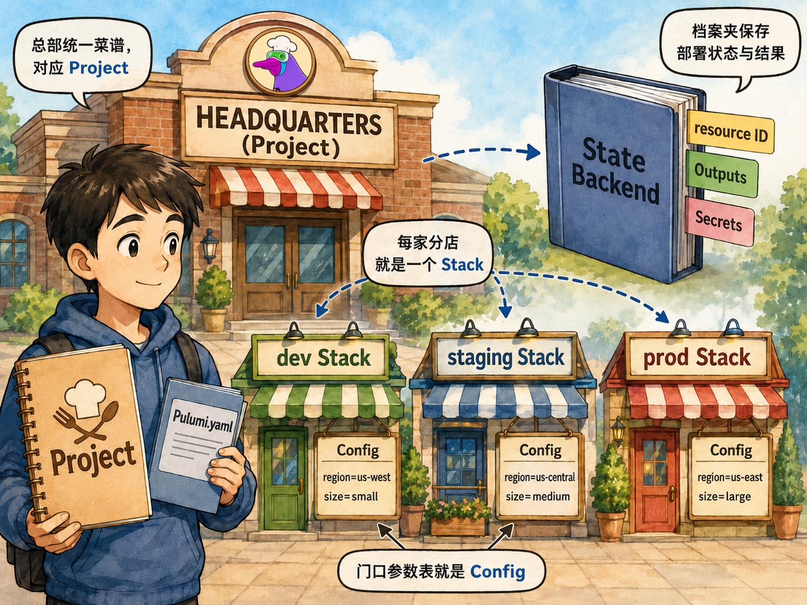
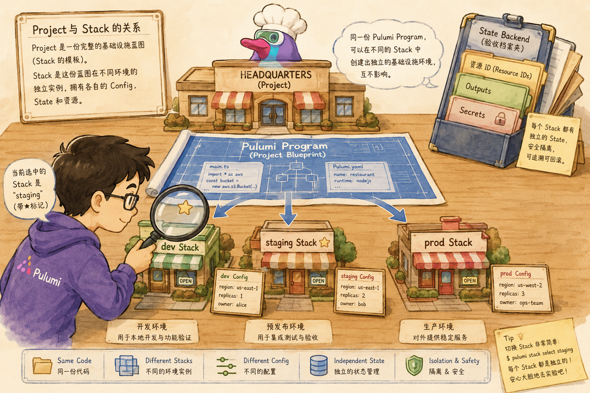
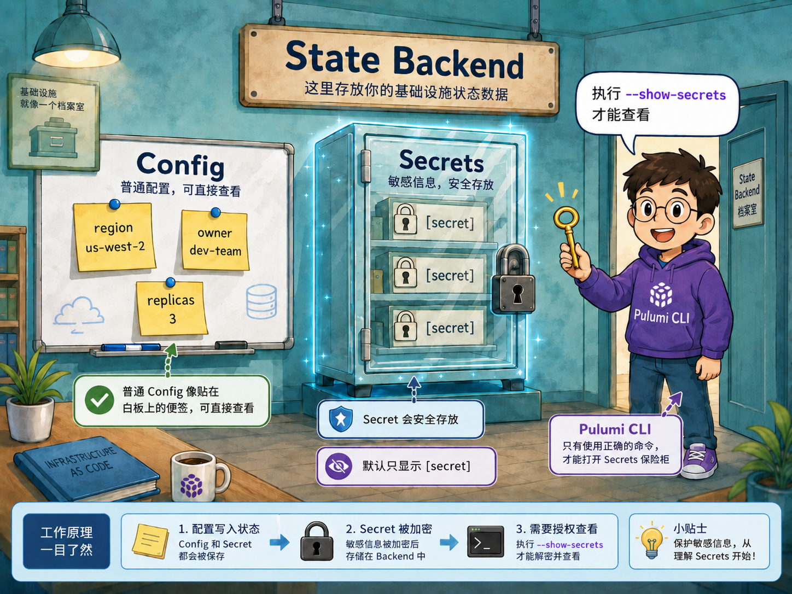
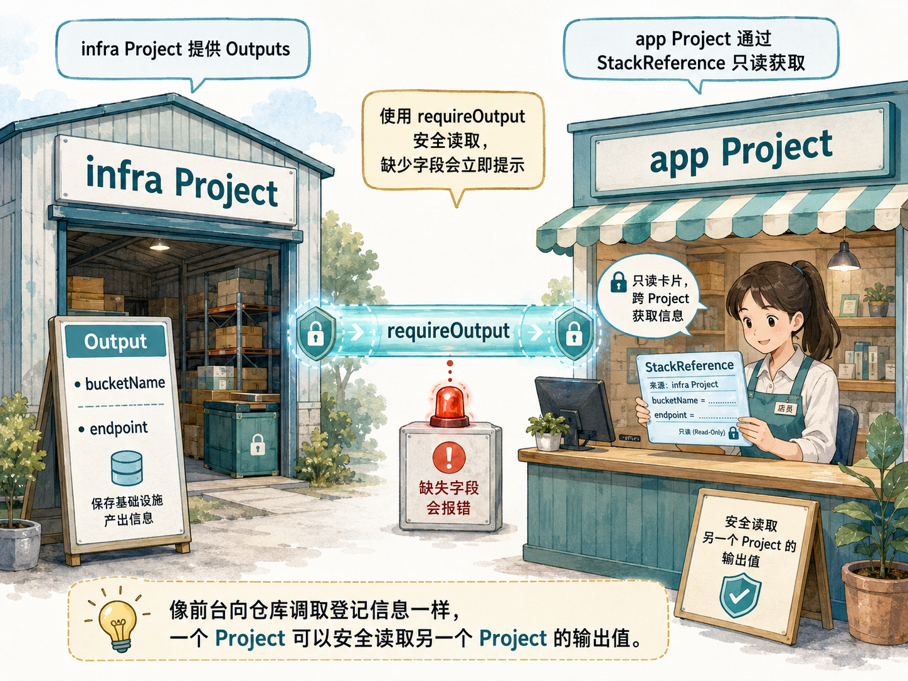

# 项目、堆栈与状态管理

## 本章定位

上一章你已经安装了 Pulumi CLI。本章开始进入 Pulumi 的第一个核心心智模型：**Project 是一套基础设施程序，Stack 是这套程序的一次独立部署，State 是 Pulumi 记住“上次真实世界长什么样”的账本**。

初学者最容易把 Pulumi 项目理解成“一个脚本”。更准确地说，它像一家连锁餐厅的标准操作手册：

- **Project** 像总店的菜谱和装修图纸：菜单怎么写、厨房怎么布置、收银台放哪里，规则是一套。
- **Stack** 像每一家分店：北京店、上海店、测试店都按同一本手册开张，但地址、库存、价格、营业时间可以不同。
- **Config** 像每家分店自己的参数表：端口、区域、命名后缀、开关、密码。
- **Output** 像分店开业后贴出来的信息：门牌号、订餐电话、后厨系统地址。
- **Secret** 像保险柜里的钥匙：同样属于参数或输出，但不能明文贴在墙上。
- **StackReference** 像分店之间传递“只读联系卡”：前台系统读取后厨系统的地址，但不直接接管后厨的装修。
- **State** 像验收档案：记录 Pulumi 上次部署过哪些资源、它们的 ID、依赖关系、输出和加密标记。



如果只记住一句话，请记住：**Project 负责定义“同一类系统怎么建”，Stack 负责定义“这个环境具体怎么建”，State 负责让 Pulumi 知道“上一次已经建成了什么”。**

## 参考资料

- [Creating Pulumi Projects](https://www.pulumi.com/tutorials/pulumi-fundamentals/create-a-pulumi-project/)：项目目录、`pulumi new`、`Pulumi.yaml`、入口文件与依赖。
- [Building with Pulumi](https://www.pulumi.com/tutorials/building-with-pulumi/)：多个 Stack、Outputs、Secrets 与 StackReference 的学习主线。
- [Understanding Stacks](https://www.pulumi.com/tutorials/building-with-pulumi/understanding-stacks/)：`pulumi stack init`、`pulumi stack ls`、`pulumi stack select`。
- [Understanding Stack Outputs](https://www.pulumi.com/tutorials/building-with-pulumi/stack-outputs/)：`export const ...` 与 `pulumi stack output`。
- [Working with Secrets](https://www.pulumi.com/tutorials/building-with-pulumi/secrets/)：`pulumi config set --secret`、`requireSecret` 与 `--show-secrets`。
- [Understanding Stack References](https://www.pulumi.com/tutorials/building-with-pulumi/stack-references/)：一个 Stack 如何读取另一个 Stack 的输出。
- [Project file reference](https://www.pulumi.com/docs/iac/concepts/projects/project-file/)：`Pulumi.yaml` 字段全集与语义。
- [Stack settings file reference](https://www.pulumi.com/docs/iac/concepts/projects/stack-settings-file/)：`Pulumi.<stack>.yaml` 字段与加密语义。
- 延伸概念文档：`content/docs/iac/concepts/projects/`、`content/docs/iac/concepts/stacks.md`、`content/docs/iac/concepts/state-and-backends.md`、`content/docs/iac/concepts/config.md`。

> 本章保持上一章约定：**使用 `pulumi login --local` 与本地 State Backend，不要求 Pulumi Cloud 账号**。在本地后端中引用其他 Stack 时，组织名前缀使用固定值 `organization`，例如 `organization/infra/dev`。

## 2.1 Project：一套可重复执行的基础设施程序

Pulumi Project 是一个目录，以及目录里描述基础设施程序所需的一组文件。创建项目最省心的方式是使用 `pulumi new typescript -y`：这条命令会自动生成项目骨架、初始化默认 Stack，并安装依赖。你也可以手写这些文件，但初学阶段建议先理解每个文件的职责。

一个 TypeScript Project 通常长这样：

```text
my-first-app/
	Pulumi.yaml
	index.ts
	package.json
	Pulumi.dev.yaml
```

最关键的是三类文件：

| 文件 | 角色 | 初学者类比 |
|------|------|------------|
| `Pulumi.yaml` | Project 元数据：项目名、Runtime、入口等 | 总店招牌和操作手册封面 |
| `index.ts` / `__main__.py` | Pulumi Program：声明想要哪些资源 | 施工图纸或菜谱正文 |
| `package.json` / `requirements.txt` | 语言依赖 | 厨房需要采购的工具和原料 |
| `Pulumi.<stack>.yaml` | Stack 配置 | 某家分店自己的参数表 |

`Pulumi.yaml` 的项目名很重要，因为 Config 默认会被项目名命名空间化。比如项目叫 `shop-api`，执行：

```bash
pulumi config set port 3000
```

最终写入配置文件时会变成类似：

```yaml
config:
	shop-api:port: "3000"
```

这可以避免同一个 Stack 中不同 Provider 或不同组件的配置键互相撞名。比如 `aws:region` 是 AWS Provider 的命名空间，`shop-api:port` 是你这个 Project 的命名空间。

### 2.1.1 `Pulumi.yaml`（Project File）速览

官方文档里把 `Pulumi.yaml` 叫作 Project file。你可以把它理解成“这份 IaC 工程的项目清单”。有几个初学者经常忽略、但很关键的点：

- 文件名必须是大写 `P` 开头，即 `Pulumi.yaml` 或 `Pulumi.yml`。
- 最少需要两个字段：`name` 和 `runtime`。
- `main` 可以改变程序入口目录或入口文件；在 Node.js 中它和 `package.json` 的 `main` 类似，但 `Pulumi.yaml` 优先级更高。

最常用字段可以先记这张表：

| 字段 | 用途 | 什么时候要关心 |
|------|------|----------------|
| `name` | Project 名，参与配置命名空间（如 `shop-api:port`） | 所有项目都要明确命名 |
| `runtime` | 运行时（`nodejs`、`python`、`go`、`dotnet`、`java`、`yaml`、`bun`） | 新建项目或跨语言迁移时 |
| `main` | 指定程序入口目录/文件 | 代码不在默认目录、或需要自定义入口时 |
| `description`/`author`/`website`/`license` | 项目元信息 | 团队协作、模板沉淀时 |
| `config` | 项目级配置 schema（类型、默认值、是否 secret） | 想把配置约束前置到项目规范时 |
| `stackConfigDir` | 自定义 `Pulumi.<stack>.yaml` 所在目录 | 多环境配置需要集中管理时 |
| `backend.url` | 指定状态后端地址 | 使用本地后端或自建后端时 |
| `requiredPulumiVersion` | 约束 CLI 版本范围 | 团队需要锁定最低版本能力时 |

再补两个容易踩坑的细节：

- Python 项目常见 `runtime.options.virtualenv`，用于告诉 Pulumi 使用哪个虚拟环境。
- `options.refresh: always` 可让每次操作前先 refresh state，但会增加执行时间，通常用于对一致性要求很高的场景。

一句话总结：`Pulumi.yaml` 不只是“写个项目名就完了”，它是 Project 的控制面。前期把关键字段约定好，后面多环境和多人协作会顺很多。

## 2.2 Program：代码不是“执行步骤”，而是“声明目标状态”

Pulumi Program 是普通的通用编程语言代码，但它不是传统脚本。传统脚本像“先买砖，再砌墙，再刷漆”的步骤清单；Pulumi Program 更像“我要一间有两扇窗、一扇门、蓝色屋顶的房子”的目标图纸。

例如：

```ts
import * as pulumi from "@pulumi/pulumi";

const config = new pulumi.Config();
const port = config.requireNumber("port");

export const url = pulumi.interpolate`http://localhost:${port}`;
```

这里有三个动作：

- `new pulumi.Config()` 读取当前 Stack 的配置。
- `requireNumber("port")` 要求当前 Stack 必须提供 `port`。
- `export const url = ...` 把部署后的信息作为 Stack Output 暴露出去。

当你运行 `pulumi preview` 或 `pulumi up` 时，Pulumi 会运行这段程序，收集资源声明与输出，然后把它们交给 Deployment Engine 进行对比和执行。

## 2.3 Stack：同一套图纸，不同的独立环境

每个 Pulumi Program 都必须部署到某个 Stack。Stack 是 Project 的一个独立实例，常见命名包括：

- `dev`：开发环境，配置宽松、资源较小、允许快速试错。
- `staging`：预发布环境，尽量接近生产，用来验收发布。
- `prod`：生产环境，配置更保守、权限更严格、变更更谨慎。
- `feature-x-dev`：某个功能分支的临时环境。

常用命令如下：

```bash
pulumi stack init staging
pulumi stack ls
pulumi stack select dev
```

`pulumi stack ls` 输出里的 `*` 表示当前 active stack。这个细节很重要：`pulumi config set`、`pulumi preview`、`pulumi up`、`pulumi destroy` 都作用在 active stack 上。很多“我明明改了配置为什么没生效”的问题，本质都是改错了 Stack。



## 2.4 Config：把环境差异从代码里拿出来

如果没有 Config，你很容易写出这样的代码：

```ts
const bucketName = "my-prod-bucket";
```

这会让 Project 和某个环境绑死。更好的方式是：

```ts
const config = new pulumi.Config();
const namePrefix = config.require("namePrefix");
const stack = pulumi.getStack();

const bucketName = `${namePrefix}-${stack}`;
```

然后在不同 Stack 中设置不同配置：

```bash
pulumi stack select dev
pulumi config set namePrefix demo

pulumi stack select prod
pulumi config set namePrefix company
```

这样 Project 的代码保持一份，Stack 的差异进入 `Pulumi.dev.yaml`、`Pulumi.prod.yaml`。你可以把它理解成“总部菜单不变，每家分店的营业参数不同”。

创建新环境时，有一个很实用的命令：

```bash
pulumi stack init staging --copy-config-from dev
```

它适合创建一个新环境时先复制已有环境的配置，再修改少数差异。生产实践中常见做法是：复制 `staging` 到 `prod`，然后只调整规模、域名、保护开关和凭据。

### 2.4.1 `Pulumi.<stack>.yaml`（Stack Settings File）速览

每个 Stack 都有一份独立设置文件，文件名固定是：

```text
Pulumi.<stack-name>.yaml
```

例如 `dev` 对应 `Pulumi.dev.yaml`，`prod` 对应 `Pulumi.prod.yaml`。你可以把它理解成“这家分店自己的配置和保险柜标签”。

官方文档里最常见的字段有这些：

| 字段 | 作用 | 初学者怎么理解 |
|------|------|----------------|
| `config` | 这个 Stack 的配置键值 | 这家环境专属参数表 |
| `secretsprovider` | 机密加密方式 | 保险柜用什么锁 |
| `encryptionsalt` / `encryptedkey` | 加密元数据（Pulumi 自动维护） | 锁的内部参数，别手改 |
| `environment` | ESC 环境导入（可选） | 额外引用一份集中配置 |

一个最小示例：

```yaml
config:
	shop-api:namePrefix: demo
	aws:region: us-west-2
```

包含 Secret 的示例（注意 `secure:`）：

```yaml
secretsprovider: passphrase
encryptionsalt: v1:...snip...
config:
	shop-api:serviceToken:
		secure: v1:...encrypted...
```

初学者最需要记住的 4 条实践：

- 优先用 CLI 改配置（`pulumi config set` / `pulumi config set --secret`），不要手工拼 `secure:` 值。
- `encryptionsalt` 和 `encryptedkey` 是 Pulumi 自动管理字段，不要手改。
- 团队共享环境（如 `dev`、`staging`、`prod`）通常建议把 `Pulumi.<stack>.yaml` 纳入版本控制；临时测试 Stack 可以不提交。
- 如果想把这些文件放到子目录集中管理，可在 `Pulumi.yaml` 里设置 `stackConfigDir`。

一句话总结：`Pulumi.yaml` 是“项目总说明”，`Pulumi.<stack>.yaml` 是“某个环境的具体配置单”。两者配合，才能把多环境管理做稳。

## 2.5 Stack Outputs：部署后的“门牌号”

Stack Output 是 Pulumi Program 顶层导出的值。它们会在 `pulumi up` 结束时显示，也可以用 CLI 查询。

```ts
export const bucketName = bucket.bucket;
export const url = pulumi.interpolate`http://localhost:${port}`;
```

查询输出：

```bash
pulumi stack output bucketName
pulumi stack output --json
```

Output 适合暴露“部署完成后才知道、但别的系统需要知道”的信息，例如：

- S3 Bucket 名称。
- API 网关地址。
- 数据库连接端点。
- Key Vault 或 Secret 名称。
- 某个模拟服务的本地 endpoint。

不要直接导出完整资源对象。资源对象里往往包含大量字段，既难读，也可能把不该公开的内部状态暴露出去。通常只导出 ID、名称、URL 或少数必要属性。

## 2.6 Secrets：同样是配置，但要放进保险柜

State 会记录资源输入、输出和配置。如果里面包含密码、Token、连接串，就必须用 Secret 标记。

设置加密配置：

```bash
pulumi config set --secret serviceToken S3cr37
```

读取 Secret：

```ts
const config = new pulumi.Config();
const serviceToken = config.requireSecret("serviceToken");
```

导出 Secret：

```ts
export const serviceTokenPreview = serviceToken;
```

默认输出会被遮蔽：

```text
Outputs:
	serviceTokenPreview: [secret]
```

如果确实要在本地调试时查看明文，需要显式加上：

```bash
pulumi stack output serviceTokenPreview --show-secrets
```



本教程使用本地后端，并通过空的 `PULUMI_CONFIG_PASSPHRASE` 简化实验。真实生产环境请使用安全的 Secrets Provider 或 Pulumi Cloud/KMS 等托管密钥能力，并妥善管理解密权限。

## 2.7 StackReference：跨 Stack 读取“只读联系卡”

StackReference 让一个 Pulumi Program 在运行时读取另一个 Stack 的 Outputs。它解决的是“系统之间需要共享部署结果，但不应该互相改资源”的问题。

想象你有两个 Project：

- `infra`：创建网络、存储、Key Vault、数据库等基础设施。
- `app`：部署应用，需要知道 `infra` 输出的 endpoint 或资源名称。

`infra` 导出：

```ts
export const bucketName = bucket.bucket;
```

`app` 读取：

```ts
import * as pulumi from "@pulumi/pulumi";

const stack = pulumi.getStack();
const infra = new pulumi.StackReference(`organization/infra/${stack}`);

export const sourceBucket = infra.requireOutput("bucketName");
```

这里使用 `requireOutput` 而不是 `getOutput`，因为缺少 `bucketName` 应该立刻失败。对于基础设施契约，失败得早比悄悄得到 `undefined` 更安全。

在 Pulumi Cloud 中，StackReference 通常写成 `<org>/<project>/<stack>`。在本教程的本地后端中，`org` 固定写成 `organization`，例如 `organization/projects-stacks-aws-infra/dev`。

这是 Pulumi 对 DIY / local backend 的命名约定：本地后端没有 Pulumi Cloud 的多组织租户模型，所以组织名位置必须使用固定字面量 `organization`。真正决定引用哪个上游的是中间的 Project 名和最后的 Stack 名；Project 名必须和上游 `Pulumi.yaml` 的 `name` 字段一致。



## 2.8 State：Pulumi 的验收档案

State 是 Pulumi 判断“下一次要改什么”的依据。它记录：

- 资源的 URN、类型、逻辑名和物理 ID。
- 资源之间的依赖边。
- 输入属性、输出属性和 Secret 标记。
- 当前 Stack 的 Outputs。
- Provider 插件和部署元数据。

本地后端下，状态保存在 `~/.pulumi` 目录。你可以导出当前 Stack 的状态：

```bash
pulumi stack export --file stack.json
```

导入状态也存在：

```bash
pulumi stack import --file stack.json
```

但导入是危险操作：它会直接改写 Pulumi 对现实世界的认知。初学阶段只需要学会“导出观察”，不要把导入当成日常修复手段。生产环境要先备份、评审、演练，再执行导入。

## 2.9 常见误区

| 误区 | 正确认知 |
|------|----------|
| Project 等于一个环境 | Project 是程序；Stack 才是环境实例 |
| `pulumi up` 总是作用在 dev | 它作用在 active stack 上，先看 `pulumi stack ls` |
| Config 是全局的 | Config 属于某个 Stack，并按 Project 命名空间存储 |
| Output 就是普通变量 | Output 往往要等资源创建后才有值，适合暴露部署结果 |
| Secret 不会进入 State | Secret 会进入配置或 State，但以加密形式保存 |
| StackReference 会管理对方资源 | 它只读取对方 Outputs，不接管对方资源生命周期 |

## 2.10 生产建议清单

- 先用 `dev` / `staging` / `prod` 建立清晰环境边界，再讨论更复杂的租户或区域拆分。
- 把环境差异放入 Config，不要把 `prod`、区域、域名、密码硬编码进代码。
- Stack Output 只导出别人真正需要消费的字段，避免导出完整资源对象。
- Secret 从进入系统的第一刻就用 `pulumi config set --secret` 或 `requireSecret` 标记。
- 用 `requireOutput` 表达强契约，用 `getOutput` 表达可选契约。
- 在执行 `destroy`、`import`、`stack rm` 前先确认 active stack。
- 本地实验可以用 local backend；团队协作时再评估 Pulumi Cloud 或自托管对象存储后端的锁、审计、备份能力。

## 小结

Project、Stack、Config、Output、Secret、StackReference 和 State 是 Pulumi 的基础语法，也是后面理解资源依赖、组件封装、Automation API 和 CI/CD 的地基。

本章没有急着讲云资源细节，而是先把“环境边界”和“状态边界”讲清楚。只有知道当前命令作用在哪个 Stack、配置从哪里来、输出如何被消费、Secret 如何被保护，你才能放心地把 Pulumi 用到真实团队工作流里。

## 动手实验

本章实验分为 AWS 与 Azure 两个版本，二者都使用本地后端，不需要云账号，也不需要登录 Pulumi Cloud。AWS 版使用 [MiniStack](https://github.com/ministackorg/ministack) 模拟 AWS S3；Azure 版使用 [miniblue](https://github.com/lonegunmanb/miniblue) 模拟 Azure 风格资源。

<KillercodaEmbed src="https://killercoda.com/pulumi-tutorial/course/pulumi-tutorial/pulumi-projects-stacks-state" title="实验：Projects、Stacks 与 State（AWS / MiniStack）" desc="使用 MiniStack 模拟 AWS S3，创建 dev/prod 两个 Stack，设置 Config 与 Secret，导出 Stack Output，并用 StackReference 跨项目读取输出。" />

<KillercodaEmbed src="https://killercoda.com/pulumi-tutorial/course/pulumi-tutorial/pulumi-projects-stacks-state-azure" title="实验：Projects、Stacks 与 State（Azure / miniblue）" desc="使用 ghcr.io/lonegunmanb/miniblue:sha-11ef0e8 模拟 Azure 风格资源，练习 Stack、Config、Secret、Output、State export 与 StackReference。" />

## 本章交付物

- Project/Stack/State 关系图。
- `dev` 与 `prod` 两个 Stack 的配置文件。
- 一个明文 Config 与一个加密 Secret。
- 可通过 CLI 查询的 Stack Outputs。
- 一个跨 Project 的 StackReference 示例。
- 一份本地 State 导出文件与状态结构观察记录。