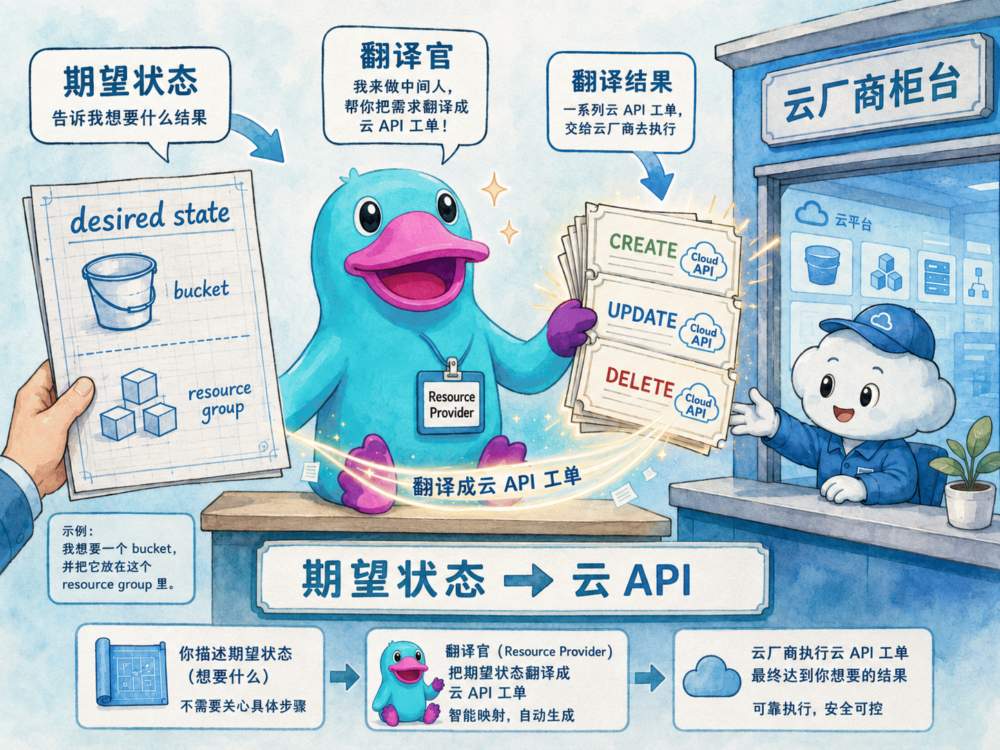
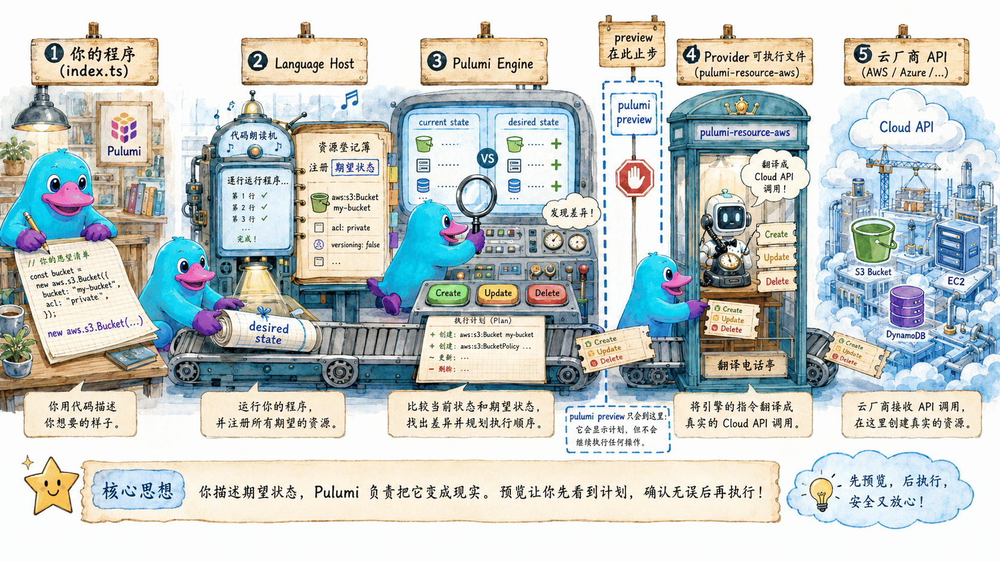
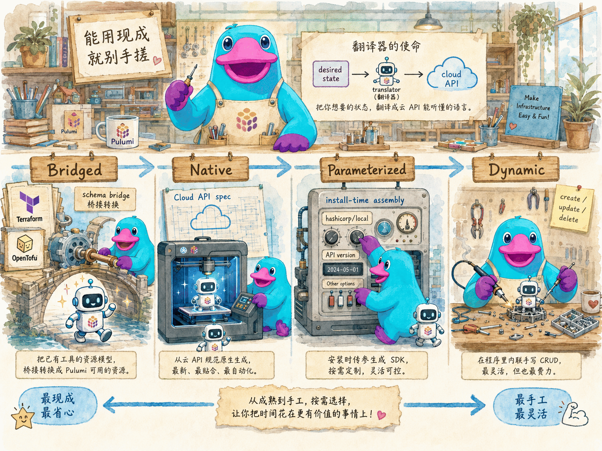

# Provider 抽象

## 本章定位

上一章我们反复用到一个东西：把 `aws.Provider` / `azure.Provider` 显式 `new` 出来，再用 `{ provider }` 挂到资源上，让资源指向本地模拟器。本章就专门把这个之前一笔带过的主角讲清楚——**Resource Provider（资源 provider）**。

先给出本章的核心论断：**Provider 是「你的期望状态」和「云厂商 API」之间的翻译官。** 没有它，你的 Pulumi 程序只是一堆描述「我想要什么」的对象，无人将它们落实为云上真实的资源。

本章回答四个问题：

- 为什么 IaC 程序需要 provider 这层抽象？它究竟解决了什么问题？
- 一次 `pulumi up` 里，你的代码、language host、provider 可执行文件、云 API 是怎么协作的？
- provider 有哪几种实现形态（bridged / native / parameterized / dynamic）？该怎么选？
- default provider 和 explicit provider 有什么区别，什么时候必须用 explicit？

## 官方映射

- [Resource providers](https://www.pulumi.com/docs/iac/concepts/providers/)：provider 的两部分结构、类型、default vs explicit、禁用 default provider。
- [Using any Terraform provider](https://www.pulumi.com/docs/iac/concepts/providers/any-terraform-provider/)：用 `pulumi package add terraform-provider` 把任意 Terraform/OpenTofu provider 拉进 Pulumi。
- [Dynamic resource providers](https://www.pulumi.com/docs/iac/concepts/providers/dynamic-providers/)：在程序内联实现 `ResourceProvider`，自定义 CRUD。

## 4.1 为什么 IaC 程序需要 provider 这层抽象

设想没有 provider，你要自己写「把一个 S3 Bucket 变出来」的代码，你得：

1. 处理 AWS 的签名认证（SigV4）、区域 endpoint、重试与限流；
2. 知道创建 Bucket 调哪个 API、删除调哪个、改 tag 调哪个；
3. 自己比对「现在云上长什么样」和「代码里想要什么样」，算出要 create / update / replace / delete；
4. 把创建后云返回的 ID、ARN 等存下来，下次好对得上；
5. 换一朵云（Azure、GCP、Kubernetes）就把上面全部重写一遍。

这五件事，**每一种资源、每一朵云都要重复一遍**——这正是 provider 为你封装的部分。有了 provider 抽象，你的程序只需要声明**期望状态（desired state）**：

```ts
new aws.s3.Bucket("media", { tags: { team: "platform" } });
```

剩下的「怎么调 API、怎么 diff、怎么记 ID、怎么重试」全部交给 provider。于是 IaC 程序获得了三个关键能力：

- **声明式**：你写「要什么」，不写「怎么做」。diff 与 CRUD 编排由 provider + 引擎负责。
- **多云统一**：AWS、Azure、Kubernetes、Cloudflare……都是「装一个 provider」，编程模型完全一致。
- **可组合**：provider 是插件，社区和厂商各自维护，你按需安装，像装 npm 包一样。

> 换句话说：**Resource 是名词（你想要的东西），Provider 是动词（把名词变成现实的人）。**



## 4.2 一次 `pulumi up` 里 provider 站在哪

provider 由**两部分**组成：

- **可执行文件（plugin）**：真正去调云 API 的进程，名字形如 `pulumi-resource-aws`。它实现了 Pulumi 引擎约定的 gRPC 接口。
- **SDK**：让你在 TypeScript / Python / Go 等语言里以强类型方式声明资源的库，例如 `@pulumi/aws`。

一次部署的协作链路大致是：

```text
你的程序 (index.ts)
   │  new aws.s3.Bucket(...)
   ▼
Language Host (pulumi-language-nodejs)   ← 运行你的代码，收集资源注册
   │  注册「期望状态」
   ▼
Pulumi Engine                            ← 比对 state，编排 CRUD 顺序
   │  Create/Update/Delete 请求
   ▼
Provider 可执行文件 (pulumi-resource-aws) ← 翻译成真实 API 调用
   │
   ▼
云厂商 API (AWS / Azure / ...)
```



关键点：**你的代码只负责「构建期望状态的资源图」，真正的 API 调用发生在 provider 进程里，由引擎在 diff 之后调度。** 这也是为什么 `pulumi preview` 能在不真正动云的情况下算出计划——它走完了「程序 → 引擎 diff」，但不让 provider 执行写操作。

> 第一次 `pulumi up` 时，CLI 会自动把程序需要、但本地插件缓存里还没有的 provider 可执行文件下载下来。这就是为什么新项目第一次部署会看到「Downloading provider...」。

## 4.3 provider 的几种实现形态

| 形态 | 怎么来的 | 代表 | 何时用 |
|------|----------|------|--------|
| **Bridged（桥接）** | 用 [Pulumi Terraform Bridge](https://github.com/pulumi/pulumi-terraform-bridge) 把一个 Terraform/OpenTofu provider 的 schema 翻译成 Pulumi schema | `@pulumi/aws`、`@pulumi/gcp`、`@pulumi/azure` | 绝大多数主流云，直接装 SDK 即可 |
| **Native（原生）** | 从云厂商 API 规范直接生成资源定义与 CRUD | `@pulumi/azure-native`、`@pulumi/kubernetes` | 想要最新、最全的云 API 覆盖 |
| **Parameterized（参数化）** | 安装时传参，在本地生成 SDK；典型是 **Any Terraform Provider** | `terraform-provider`（包裹任意 TF provider）、`azure-native`（指定 API 版本） | Registry 里没有现成 Pulumi 包，但有 Terraform provider |
| **Dynamic（动态）** | 在程序里内联实现 `ResourceProvider`，无需单独打包 | 你自己写的 `pulumi.dynamic.Resource` | 简单 API、临时对接、Registry 与 TF 都没有 |

> 需要注意：`azure-native` 本质上是 **native** provider，同时**可选地**支持参数化——安装时传入一个 Azure API 版本，生成针对该版本的 SDK。参数化是它的额外能力，并非使用它的必要步骤；上表把它同时列在 native 与 parameterized 两行，正是为了表达这一点。



选型直觉（从左往右优先级递减）：

1. **Registry 里有现成 Pulumi 包** → 直接 `npm install`，体验最好。
2. **没有 Pulumi 包，但有 Terraform/OpenTofu provider** → 用 Any Terraform Provider（4.5）。
3. **连 TF provider 都没有，只是想对接一个简单 API** → 先考虑 [Command provider](https://www.pulumi.com/registry/packages/command/)，再考虑 dynamic provider（4.6）。

## 4.4 Default provider 与 Explicit provider

同一朵云，你有两种使用 provider 的方式：

| | **Default provider** | **Explicit provider** |
|---|---|---|
| 是否声明 | 从不在程序里声明 | 显式 `new aws.Provider(...)`，它本身就是一个资源 |
| 配置来源 | 系统环境（环境变量、`~/.aws/...`）或 stack 配置键（如 `aws:region`） | 你在声明时直接传参，且参数可以是 Pulumi Input/Output |
| 如何挂到资源 | 自动（资源没设 `provider` 选项时） | 必须给资源显式设 `{ provider }`（或给 component 设 `providers`） |
| 能否禁用 | 能 | 不能（它就是你创建的） |
| 最适合 | 单 provider、单环境的简单场景 | 多区域 / 多集群 / 同栈多环境 |

**Default provider** 是最简便的方式。配置通过 stack 配置键设置：

```bash
pulumi config set aws:region us-east-1     # 明文
pulumi config set --secret aws:secretKey ... # 密文要加 --secret
```

stack 配置里的默认 provider 配置**优先于**环境变量等隐式来源。

**Explicit provider** 支持 default provider 无法实现的场景。最典型的两个：

```ts
// 1) 同一个程序里部署到多个 AWS 区域
const useast1 = new aws.Provider("useast1", { region: "us-east-1" });
const cert = new aws.acm.Certificate("cert", { /* ... */ }, { provider: useast1 });
```

```ts
// 2) 先创建一个 K8s 集群，再立刻往这个新集群里部署
//    集群的 kubeconfig 是一个 Output，只有 explicit provider 能接住它
const k8s = new kubernetes.Provider("k8s", { kubeconfig: cluster.kubeconfig });
const pod = new kubernetes.core.v1.Pod("pod", { /* ... */ }, { provider: k8s });
```

第二个场景**只能**用 explicit provider：default provider 的配置在程序启动时就固定了，而新集群的 kubeconfig 要等集群建好才知道——这正是「explicit provider 的配置是 Pulumi Input/Output」的价值。

> 需要注意：上面「多区域要用 explicit provider」是 **AWS** 的情况。**Azure** 不受默认区域限制，可以直接在资源定义里指定区域，无需为每个区域单独创建并配置 provider。

> 上一章实验里我们 `new aws.Provider("ministack", { endpoints: ... })`，本质就是用 explicit provider 把所有调用改指向本地模拟器——这是 explicit provider 的第三类常见用途：**把整朵云替换为测试替身**。

Component 还能用 `providers`（复数）给所有子资源批量指定：

```ts
const app = new MyApp("app", {}, { providers: { aws: useast1, kubernetes: k8s } });
```

### 禁用 default provider

遗漏 `provider` 选项是一个常见且危险的错误：资源会**默默使用 default provider**，可能被部署到错误的环境。如果想强制「每个资源都必须显式指定 provider」，可以在 stack 级禁用 default provider：

```bash
pulumi config set --path 'pulumi:disable-default-providers[0]' aws   # 只禁用 aws
pulumi config set --path 'pulumi:disable-default-providers[0]' '*'   # 禁用全部
```

禁用后，任何没有设置 `{ provider }` 的资源都会直接报错，而不是默默使用系统配置。生产项目、尤其是多环境项目，强烈建议以此作为保障。

## 4.5 Any Terraform Provider：把任意 TF provider 拉进 Pulumi

Pulumi Registry 已经覆盖了主流云，但世界上还有**成千上万**个 Terraform/OpenTofu provider（社区的、SaaS 的、你公司内部的）没有现成 Pulumi 包。**Any Terraform Provider** 让你把它们任意一个变成本地 Pulumi SDK：

```bash
pulumi package add terraform-provider hashicorp/local
```

这条命令做两件事：

1. 在你项目语言里**本地生成一份强类型 SDK**（TypeScript 放在 `sdks/` 下），有自动补全、类型检查、内联文档，体验和官方包一模一样。
2. 在 `Pulumi.yaml` 的 `packages` 段写入这条依赖：

```yaml
packages:
  local:
    source: terraform-provider
    version: 0.10.0          # terraform-provider 桥接包的版本
    parameters:
      - hashicorp/local      # 被包裹的 TF provider
      - 2.5.1                # 建议锁定 TF provider 版本，保证可复现
```

随后像用任何 Pulumi 包一样用它：

```ts
import * as local from "@pulumi/local";

const file = new local.File("hello", {
  filename: "/tmp/hello.txt",
  content: "written by a terraform provider, driven by pulumi\n",
});
```

要点与最佳实践：

- **默认从 OpenTofu registry 拉取**，它与 Terraform registry API 兼容，两边的 provider 都能用。也可指定具体 registry、版本，甚至本地 provider 二进制（适合公司内部 provider）。
- **锁定版本**：`pulumi package add terraform-provider hashicorp/local 2.5.1`，否则会默认使用 latest 版本，破坏可复现性。
- **`pulumi install`**：克隆仓库后用它一次性补齐——它会读取 `Pulumi.yaml` 的 `packages`，必要时重新生成本地 SDK 并下载 provider 二进制（二进制缓存在项目外，整台机器只需下载一次）。
- 生成的 SDK 自带 `.gitignore`，你可以选择把 SDK 代码提交进版本库（CI 更快）或不提交（仓库更小、克隆后 `pulumi install` 现生成）。

局限：本地包没有 Registry 上的网页文档（只有内联文档）；provider 本身的功能 bug 要找该 TF provider 的维护者，而不是 Pulumi。

## 4.6 Dynamic Provider：在程序里自己实现 CRUD

当你要管理的东西**既没有 Pulumi 包、也没有 Terraform provider**，但 API 很简单（一个内部系统、一个小 SaaS、一段自定义逻辑），可以直接在程序里内联实现一个 **dynamic provider**——不用单独打包，TypeScript 与 Python 可用。

你要做的就是实现 `pulumi.dynamic.ResourceProvider` 接口。**只有 `create` 是必需的**，实战中通常还要实现 `update` 和 `delete`：

```ts
import * as pulumi from "@pulumi/pulumi";

const greetingProvider: pulumi.dynamic.ResourceProvider = {
  async create(inputs) {
    // 这里本应调用某个真实 API；演示里我们只做一次纯计算
    return { id: `greeting-${Date.now()}`, outs: { shout: String(inputs.message).toUpperCase() } };
  },
  async update(id, olds, news) {
    return { outs: { shout: String(news.message).toUpperCase() } };
  },
  async delete(id, props) {
    // 真实场景在这里调删除 API
  },
};

class Greeting extends pulumi.dynamic.Resource {
  public readonly shout!: pulumi.Output<string>;
  constructor(name: string, message: pulumi.Input<string>, opts?: pulumi.CustomResourceOptions) {
    super(greetingProvider, name, { message, shout: undefined }, opts);
  }
}
```

引擎调用这些方法的时机，和标准 provider 完全一致：

1. 资源还不存在 → 调 `create`。
2. 已存在、再次部署 → 先 `check` 校验参数，再 `diff` 判断「原地改」还是「替换」。
3. 需要替换 → 先 `create` 新的，再 `delete` 旧的。
4. 不需要替换 → 调 `update`。

也就是说，**你写的 `create`/`update`/`delete` 就是 4.2 那条链路里 provider 进程要执行的部分**——dynamic provider 把「翻译官」这个角色直接交到你手里，是理解 provider 抽象最直观的方式。

注意它的**关键限制**：

- **单语言**：只能被同语言（写它的那门语言）的程序使用。要跨语言，得做 bridged / native provider。
- **不支持 `read`**：因此 `pulumi import` 和静态 `get` 对 dynamic 资源不可用。
- **函数序列化限制**：方法会被序列化到独立进程执行，能捕获的外部变量受限（见函数序列化文档）。把依赖写进 inputs、在方法内部按需引入，比在模块作用域捕获更稳妥。
- 仅 **TypeScript / Python**；TS 下不支持 pnpm 与 Bun runtime。

> 官方提醒：动手写 dynamic provider 前，先问自己「现成 provider、Any Terraform Provider、Command provider 是不是已经够用了」。dynamic provider 常常不是最佳解，只在简单且别无选择时才划算。

## 4.7 选型决策清单

- [ ] 这朵云 / 这个服务，**Registry 有现成 Pulumi 包吗**？有就直接装 SDK。
- [ ] 没有，但**有 Terraform/OpenTofu provider**？用 `pulumi package add terraform-provider`，并锁定版本。
- [ ] 都没有，只是想对接一个简单 API？先看 **Command provider**，不够再写 **dynamic provider**。
- [ ] 单云单环境？用 **default provider**，配置走 `pulumi config set <provider>:<key>`。
- [ ] 多区域 / 多集群 / 同栈多环境 / 指向测试替身？用 **explicit provider**，把它当资源 `new` 出来再 `{ provider }` 挂上。
- [ ] 生产 / 多环境项目？考虑用 `pulumi:disable-default-providers` 作为保障，强制显式指定 provider。
- [ ] 用了 Any Terraform Provider？锁定 `Pulumi.yaml` 中 `packages` 的版本，团队成员用 `pulumi install` 补齐。

## 动手实验

本章实验是一个**纯本地、零云依赖**的 TypeScript 项目，完整体验三种 provider 形态：

- **default vs explicit provider**：用 `@pulumi/random`（一个 bridged provider，无需任何凭据）对比两种用法。
- **Any Terraform Provider**：用 `pulumi package add terraform-provider hashicorp/local` 把一个**没有官方 Pulumi 包**的 Terraform provider 拉进来，创建一个本地文件。
- **Dynamic Provider**：内联实现一个 `ResourceProvider`，亲手写 `create`/`update`/`delete`，观察引擎如何在 `up` / 改属性 / `destroy` 时调用它们。

<KillercodaEmbed src="https://killercoda.com/pulumi-tutorial/course/pulumi-tutorial/pulumi-providers" title="实验：Provider 抽象（纯本地）" desc="用 @pulumi/random 对比 default 与 explicit provider，用 pulumi package add 拉入任意 Terraform provider，并亲手实现一个 dynamic provider 的 CRUD。" />

## 本章交付物

- 一句话讲清 provider 抽象解决的问题：把「期望状态」翻译成「云 API 调用」。
- 一次 `pulumi up` 中代码、language host、引擎、provider 可执行文件、云 API 的协作链路。
- bridged / native / parameterized / dynamic 四种形态的辨别与选型直觉。
- default 与 explicit provider 的对照表，以及「何时必须用 explicit」「如何禁用 default」。
- 用 Any Terraform Provider 接入任意 TF provider 的完整流程与锁定版本的习惯。
- 亲手实现一个 dynamic provider 的 CRUD，理解 provider 进程在做什么。
