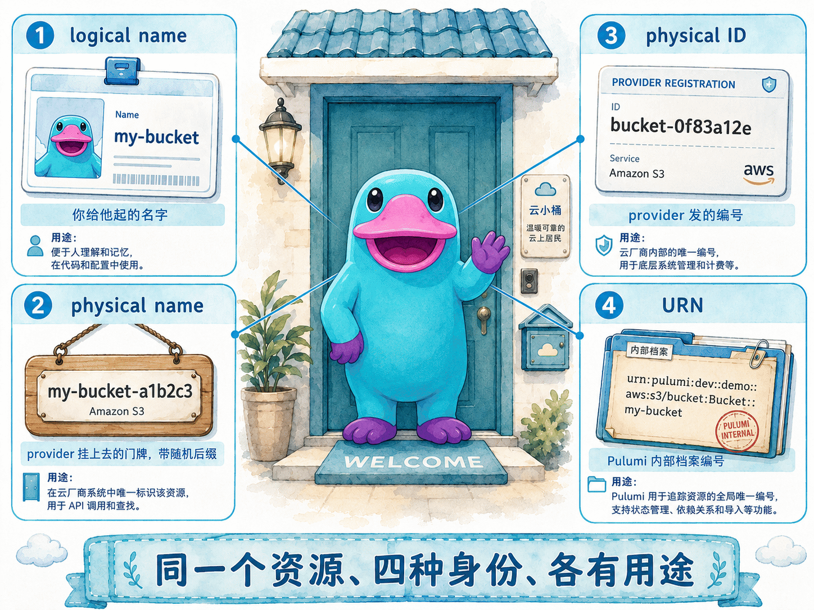

# 资源与精细控制

## 本章定位

前几章我们介绍了 Project、Stack、State 等概念。本章进入 Pulumi 的核心抽象——**Resource（资源）**：它是组成云基础设施的基本单元，一个 S3 Bucket、一个 Resource Group、一个 Virtual Machine 都是一个 Resource。

本章回答四个问题：

- 一个 Resource 在代码里、在 Pulumi 内部、在云上分别叫什么名字？（命名与身份）
- Pulumi 怎么知道哪些资源要先建、哪些要后建？（依赖）
- 怎么在不重建资源的前提下安全地重命名、重构、改属性？（Resource Options）
- 哪些操作会悄悄触发 `replace`（先建后删甚至先删后建），从而带来停机风险？

## 官方映射

- [Resources](https://www.pulumi.com/docs/iac/concepts/resources/)：`Resource` 基类、`CustomResource` 与 `ComponentResource`。
- [Resource names and identity](https://www.pulumi.com/docs/iac/concepts/resources/names/)：logical name、physical name、physical ID、URN 与 auto-naming。
- [Resource options](https://www.pulumi.com/docs/iac/concepts/resources/options/)：`protect`、`dependsOn`、`aliases`、`deleteBeforeReplace` 等全部选项。

## 3.1 一个 Resource 是怎么声明出来的

所有基础设施资源都继承自 `Resource` 基类，并分成两个子类：

- **`CustomResource`**：由某个 resource provider（AWS、Azure、GCP、Kubernetes……）管理的真实云资源。
- **`ComponentResource`**：把若干资源打包成一个更高层抽象的逻辑分组，本身不对应任何云资源（下一章详解）。

> component 是一组 Pulumi 资源的逻辑集合，对外却表现为**单个** Pulumi 资源。它把彼此相关的资源及其配置封装在一起，让使用者通过一个简单、定义良好的接口就能创建复杂的基础设施，而无需了解内部实现细节。本章只需先有这个印象即可，[企业级架构：Components](components.md) 一章会专门讲它的写法与最佳实践。

声明一个资源，就是用它的「期望状态」构造一个实例：

```ts
let res = new Resource(name, args, options);
```

这三个参数贯穿全章：

| 参数 | 含义 | 例子 |
|------|------|------|
| `name` | **logical name**（逻辑名），同类资源在一个 Stack 内必须唯一 | `"media-bucket"` |
| `args` | 输入属性对象，可以是原始值，也可以是其他资源的 `Output<T>` | `{ tags: { team: "platform" } }` |
| `options` | 可选的 Resource Options，控制依赖、保护、provider、导入等 | `{ protect: true }` |

要查某个资源支持哪些 `args`，去 [Pulumi Registry](https://www.pulumi.com/registry/) 看对应 provider 的 API 文档。

## 3.2 一个资源的四种身份

初学者最容易混淆的，就是一个资源「到底叫什么名字」。Pulumi 里一个资源同时有**四种身份**，各管各的用途：

| 身份 | 谁决定 | 例子 | 用途 |
|------|--------|------|------|
| **Logical name** | 你的代码（构造函数第一个参数） | `"my-bucket"` | 驱动 URN，通常也是物理名的前缀 |
| **Physical name** | provider，受 logical name + auto-naming 影响 | `"my-bucket-d7c3a1f"` | 真正调云 API 用的名字，从 provider 输出属性读回 |
| **Physical ID** | provider 创建后返回 | `"vpc-0abc1234"`、Azure ARM ID | `import`、`get` 与按 ID 引用资源时用，`resource.id` |
| **URN** | Pulumi 从 project/stack/type/logical name 推导 | `urn:pulumi:dev::app::aws:s3/bucket:Bucket::my-bucket` | Pulumi 内部全局唯一标识，CLI/state 用 |



最常见的错误，是把 **physical ID（`resource.id`）** 和 **URN（`resource.urn`）** 搞混：

- 云 provider 的 API、`pulumi import` 想要的是 **physical ID**。
- URN 几乎只在 Pulumi 内部使用，应用代码里很少直接碰。
- `dependsOn` 要的是**资源引用本身**（那个变量），既不是 URN 也不是 ID。Python 里写 `depends_on=[bucket]`，不要写 `depends_on=[bucket.urn]`。

### Logical name 与变量名无关

```ts
var foo = new aws.Thing("my-thing");
```

这里 `"my-thing"` 是 logical name，参与 URN；而变量 `foo` 只是代码里的引用，把它改成 `bar` 再 `pulumi up`，基础设施不会有任何变化（除非你 `export` 了它）。

## 3.3 Physical name 与 Auto-Naming

logical name 和 physical name 经常**不一样**。默认情况下，Pulumi 对大多数资源做 **auto-naming**：用 logical name 加一个随机后缀拼出物理名。所以 logical name 是 `my-role`，物理名往往是 `my-role-d7c2fa0`。

这个随机后缀有两个作用：

- **避免命名冲突**：同一个 project 的多个 stack（dev/staging/prod）可以同时部署而互不撞名。
- **支持零停机替换**：某些更新必须替换资源，Pulumi 默认**先创建新的、再把引用切过去、最后删旧的**，随机后缀让新旧资源能在替换期间共存。

### 覆盖 auto-naming：自己指定物理名

大多数资源有一个属性（常是 `name`，但因资源而异）可以直接指定物理名：

```ts
let role = new aws.iam.Role("my-role", { name: "my-role-001" });
```

这一行里藏着两个不同的名字，别混淆：

- `"my-role"`（构造函数第一个参数）是 **logical name**，只在 Pulumi 内部使用、参与 URN，云上看不到它。
- `name: "my-role-001"`（args 里的属性）是 **physical name**，是真正创建到 AWS 上的 IAM Role 名字。

如果不写 `name`，physical name 会由 auto-naming 自动生成（`my-role` + 随机后缀，如 `my-role-d7c2fa0`）；一旦像这里这样显式写死 `name`，physical name 就完全由你指定。

> 注意：`aws.s3.Bucket` 用的属性是 `bucket` 而不是 `name`；`aws.kms.Key` 干脆没有物理名。具体看 Registry。

**一旦你显式指定物理名，就放弃了随机后缀带来的防撞名保护。** 对可能被替换的资源，要配合 `deleteBeforeReplace: true`，让 Pulumi 先删旧再建新，避免新旧同名冲突：

```ts
let role = new aws.iam.Role("my-role", {
  name: `my-role-${pulumi.getProject()}-${pulumi.getStack()}`,
}, { deleteBeforeReplace: true });
```

### 全局配置 auto-naming

除了逐个资源指定，还能用 `pulumi:autonaming` 配置统一控制命名策略。在 `Pulumi.<stack>.yaml` 里可以直接写：

```yaml
config:
  pulumi:autonaming:
    mode: default      # 默认：logical name + 随机后缀
```

常见模式：

| 配置 | 效果 | 风险 |
|------|------|------|
| `mode: default` | logical name + 随机后缀（等价于不配置） | 无 |
| `mode: verbatim` | 物理名 = logical name，无随机后缀 | 替换时会**先删后建**，可能停机 |
| `mode: disabled` | 强制所有资源显式指定物理名 | 漏写即报错 |
| `pattern: ${name}-${hex(8)}` | 自定义命名模板 | 模板无随机部分时同样先删后建 |

> 在 `Pulumi.yaml`（项目级）里配置时要多包一层 `value:` 键；在 `Pulumi.<stack>.yaml`（stack 级）里则可直接写。还能按 provider 或按资源类型分别配置，例如让 `azure-native` 用 `verbatim`、`storage:Account` 用 `${name}${string(6)}`。组织级别还可借助 Pulumi ESC 统一管理 autonaming 策略。

一个关键提醒：**改动 autonaming 配置不会立刻重命名已有资源**，只影响此后新建或因其他原因被替换的资源。想让现有 dev stack 全部换名，得 destroy 再重建。

## 3.4 URN、资源类型与「改名即重建」

### Resource type token

每个资源都属于某个资源类型，格式是 `<package>:<module>:<typename>`：

- `aws:s3/bucket:Bucket`
- `azure-native:compute:VirtualMachine`
- `random:index:RandomPassword`

`<package>` 决定用哪个 Pulumi Package 和底层 provider，`<module>` 是包内模块路径，`<typename>` 是类型名。

### URN 怎么来的

URN 由 project 名、stack 名、资源类型、logical name，以及（对 component 子资源而言）所有父资源的类型链共同推导：

```text
urn:pulumi:production::acmecorp-website::custom:resources:Resource$aws:s3/bucket:Bucket::my-bucket
            ^stack       ^project          ^parent-type            ^resource-type        ^logical-name
```

URN 必须全局唯一。如果两个资源的 type + name + parent 都一样，会报 `Duplicate resource URN`。

### 这是本章最关键的一条规则

> **任何改变 URN 的操作，都会让 Pulumi 把它当成「旧资源删除 + 新资源创建」两个不相关的资源处理。**

会改变 URN 的操作主要有两类：

- 改了构造函数里的 **logical name**。
- 改了资源的**父子结构**（`parent`）。

这两种都会得到不同的 URN，于是触发 `create` + `delete`，而不是温和的 `update`/`replace`。**想改名又不想重建，必须用 `aliases` 选项**（见 [3.7](#_3-7-resource-options-全表)）。

## 3.5 Physical ID：认领既有资源的钥匙

资源创建完成后，provider 会分配一个 **physical ID**，通过 `resource.id` 输出属性暴露：

- AWS：`vpc-0abc1234`、bucket 名等（ARN 通常在单独的 `arn` 属性）。
- Azure：长长的 ARM ID `/subscriptions/<sub>/resourceGroups/...`。
- GCP：self-link URL。

因为 `id` 是 `Output<T>`，创建前不可知，用法和其他 output 一样——直接传给下一个资源的输入，或用 `.apply()` 变换：

```ts
const bucket = new aws.s3.Bucket("my-bucket");
const obj = new aws.s3.BucketObject("hello.txt", {
  bucket: bucket.id,        // 直接传 Output<string>，无需 .apply()
  content: "Hello, Pulumi!",
});
```

physical ID 在**认领既有云资源**时尤其重要：`import` 资源选项和 `get` 静态方法都接受 physical ID。

> 安全提示：physical ID 始终以明文存进 state，**无法加密**，即使用 `additionalSecretOutputs` 也不行。不要让敏感值出现在资源 ID 里。

## 3.6 依赖建模：Pulumi 怎么排执行顺序

### 隐式依赖（首选）

当一个资源的输入引用了另一个资源的 output，Pulumi 自动建立依赖，并据此排序：

```ts
const rg = new azure.core.ResourceGroup("app-rg", { location: "eastus" });
const account = new azure.storage.Account("data", {
  resourceGroupName: rg.name,   // 隐式依赖：account 一定在 rg 之后创建
  location: rg.location,
  accountTier: "Standard",
  accountReplicationType: "LRS",
});
```

### 显式依赖 `dependsOn`

当两个资源没有数据上的引用关系，但你确实需要保证顺序（例如某个 IAM 策略必须先生效），用 `dependsOn`：

```ts
const obj = new aws.s3.BucketObject("config", { /* ... */ }, {
  dependsOn: [bucket],          // 传资源引用，不是 .urn / .id
});
```

### `parent`、`provider` 与 `providers`

- `parent`：建立父子关系，影响 URN 和某些选项的继承（component 常用）。
- `provider`：给这个资源指定一个显式配置的 provider，而不是默认 provider（本章实验正是用它把资源指向本地模拟器）。
- `providers`：给一个 component 的所有子资源批量指定 provider。

## 3.7 Resource Options 全表

所有资源都支持一组通用选项。下表按官方分类列出，重点选项在 3.8 详解：

| 选项 | 作用 | 适用 |
|------|------|------|
| `additionalSecretOutputs` | 指定额外要加密的 output | custom |
| `aliases` | 重命名/重构时不触发替换 | custom + component |
| `customTimeouts` | 覆盖默认的创建/更新/删除超时 | custom |
| `deleteBeforeReplace` | 替换时先删旧再建新 | custom |
| `deletedWith` | 父资源被删时跳过本资源的 delete | custom |
| `dependsOn` | 在依赖图之外补充显式依赖 | custom + component |
| `hideDiffs` | 只压缩 CLI 里的 diff 显示，不影响实际更新 | custom |
| `hooks` | 在生命周期特定阶段运行自定义逻辑 | custom + component |
| `ignoreChanges` | diff 时忽略指定属性的变化 | custom |
| `import` | 把既有云资源纳入 Pulumi 管理 | custom |
| `parent` | 建立父子关系 | custom + component |
| `protect` | 标记保护，防止误删 | custom + component |
| `provider` | 使用显式配置的 provider | custom + component |
| `providers` | 给 component 的子资源指定 providers | component |
| `replaceOnChanges` | 把指定属性的变化当作强制替换 | custom |
| `retainOnDelete` | Pulumi 删除时把资源留在云上 | custom |
| `transforms` | 注册时动态改写资源属性 | custom + component |
| `version` | 锁定 provider 插件版本 | custom |

### Component 选项继承

当某些选项设在 component 上，会自动**沿父子链下传**给子资源，子资源无需重复设置。会继承的有：`aliases`、`deletedWith`、`protect`、`provider`、`providers`、`retainOnDelete`、`transforms`、`transformations`。

不会继承的（如 `dependsOn`、`ignoreChanges`、`customTimeouts`、`replaceOnChanges`）需要在每个子资源单独设置，或用 component 的 `transforms` 在子资源注册时注入。

> `additionalSecretOutputs`、`deleteBeforeReplace`、`import` 只能用于 custom resource，设在 component 上会报错。

## 3.8 关键选项详解

### `protect`：防止误删

把资源标记为受保护后，`pulumi destroy` 或任何会删除它的操作都会被拦截：

```ts
const db = new aws.rds.Instance("prod-db", { /* ... */ }, { protect: true });
```

想删除时，要先去掉 `protect`（或用 `pulumi state unprotect`）。生产数据库、State 存储桶等都建议加上。

### `aliases`：零重建的重命名/重构

3.4 说过，改 logical name 会触发 create+delete。如果你只是想**重命名代码里的资源、保留云上实体**，用 `aliases` 告诉 Pulumi「这个新名字其实就是以前那个资源」：

```ts
// 原来叫 "web"，现在想叫 "frontend"
const frontend = new aws.s3.Bucket("frontend", { /* ... */ }, {
  aliases: [{ name: "web" }],
});
```

这样 `pulumi preview` 就不再是「删 web、建 frontend」，而是「把 web 这条 state 记录改名为 frontend」，云上资源原地保留。重构父子结构时同理。

#### alias 什么时候能删？

alias 是**迁移期的桥梁**：它只在某个 stack 执行 `pulumi up` 时，把那个 stack 的 state 里的旧 URN 迁移成新名字。迁移是**每个 stack 各自发生**的——所以能不能删 alias，取决于「是否所有用到它的 stack 都已经迁移完毕」。对比两种情况：

**场景 A：自己的项目，stack 数量可控 → 可以删。**

假设一个 project 有 `dev`/`staging`/`prod` 三个 stack，你把 `web` 改名为 `frontend` 并加了 alias。先把三个 stack 各跑一遍，它们的 state 就都从 `web` 迁移到了 `frontend`：

```bash
pulumi stack select dev     && pulumi up   # state: web → frontend
pulumi stack select staging && pulumi up   # state: web → frontend
pulumi stack select prod    && pulumi up   # state: web → frontend
```

此时三个 state 里都只剩 `frontend`、旧 URN 不复存在。**因为你掌握全部 stack 列表、且确认每个都迁移过了**，下一次提交就可以安全删掉 alias——再跑 `up` 是 state 与代码完全一致的 no-op。

**场景 B：对外发布、被他人复用的 component → 不要轻易删。**

假设你维护一个公共包，`v1.0.0` 里资源叫 `web`，`v1.1.0` 改名 `frontend` 并加了 alias。如果你在 `v1.2.0` 顺手删掉 alias，而某个消费者还停在 `v1.0.0`（state 里是 `web`），他一旦**直接升级到 v1.2.0**（代码是 `frontend`、且没有 alias），就**跳过了**带 alias 的 v1.1.0，迁移桥梁断裂——他的 `pulumi up` 会把 `web` 删掉（真实资源销毁）再新建 `frontend`。

因为你无法枚举所有消费者、也无法替他们 `up`，公共 component 的 alias 往往要**保留很长的弃用周期，甚至长期保留**（留着几乎没有成本）。

> 一句话判断：**能列举出「所有」用到该资源的 stack、并确认它们「每一个」都跑过带 alias 的 `up`，才可以删 alias。** 自己的项目通常满足；对外发布的 component 通常不满足。

### `deleteBeforeReplace` 与 `replaceOnChanges`

- `replaceOnChanges`：把某些属性的变化**强制**当作替换，即使 provider 本来认为可以原地更新。
- `deleteBeforeReplace`：当替换发生时，**先删旧再建新**（默认相反）。指定了固定物理名、不能新旧共存时必须用它。

```ts
// replaceOnChanges：哪些属性改动触发替换
// 这里强制「改 storageType 就重建实例」，即使 provider 支持原地改
const db = new aws.rds.Instance("app-db", {
  instanceClass: "db.t3.micro",
  storageType: "gp2",
}, { replaceOnChanges: ["storageType"] });
```

```ts
// deleteBeforeReplace：替换时先删后建
const role = new aws.iam.Role("app-role", {
  name: "app-role-fixed",
}, { deleteBeforeReplace: true });
```

两者常**搭配**使用：`replaceOnChanges` 决定「哪些属性改动会触发替换」，`deleteBeforeReplace` 决定「触发替换后先删还是先建」。

> 代价：先删后建意味着存在一段「资源不存在」的窗口，可能停机。只在确有命名冲突时使用。
>
> 还有两个连带风险要留意：一是 `deleteBeforeReplace` 会**沿依赖链向下传染**——被先删的资源若有下游依赖，可能连带触发更多替换，放大停机面；二是某些云 API（如 AWS）是**最终一致**的，旧资源的删除尚未完全传播到位就开始创建新资源，可能让依赖它的资源进入损坏状态。

### `ignoreChanges`：与外部漂移和平共处

有些属性会被云平台、自动伸缩或其他工具在带外修改。如果你不想每次 `pulumi up` 都把它们改回来，用 `ignoreChanges` 忽略这些属性的 diff：

```ts
const svc = new aws.ecs.Service("svc", {
  desiredCount: 2,              // 初始值
}, { ignoreChanges: ["desiredCount"] });   // 之后由 autoscaler 接管，Pulumi 不再纠正
```

> 注意：`ignoreChanges` 比较的是「你程序里的新值」与「state 里记录的旧值」，被忽略的属性会沿用 state 中的旧值，外部对这些属性的改动因此得以保留。若想让 state 跟上云上的真实值，需要主动 `pulumi refresh`（或 `pulumi up --refresh`），否则 state 里仍是旧值。

### `hideDiffs`：只压缩输出，不改变行为

`ignoreChanges` 容易和一个名字相近的选项混淆——`hideDiffs`。两者看起来都和「diff」有关，作用却完全不同：

- `ignoreChanges` 影响**行为**：被列出的属性变化会被忽略，不会触发更新。
- `hideDiffs` 只影响**显示**：它接受一组属性路径，把这些属性在 CLI 里的 diff 细节**折叠**起来，但 Pulumi 照常检测、照常更新、照常写 state。

换句话说，`hideDiffs` 是给那些「diff 又长又吵、容易刷屏」的属性准备的降噪开关，让 `pulumi preview`/`up` 的输出清爽一些，并不会改变任何资源的实际更新结果。它只对 custom resource 有意义。这在维护开源的公共 Component 时将很有用，有时你需要更新一些不会影响到实际云资源的配置，例如 telemetry 数据，你很清楚这些变更不会造成任何实际的云端变更，但每次发布版本时大量的 telemetry 变化（例如版本号）也会对最终用户的变更审查带来大量的噪音，这时就可以使用 `hideDiffs`。

```ts
// prop 仍会被正常更新，只是 CLI 不再展开它冗长的前后值对比
let res = new MyResource("res", { prop: "new-value" }, { hideDiffs: ["prop"] });
```

它同样支持嵌套的**属性路径**，可以精确折叠对象或数组里的某一层。例如折叠 AWS 负载均衡器监听器里所有 target group 的 `weight`：

```ts
}, { hideDiffs: ["defaultActions[*].forward.targetGroups[*].weight"] });
```

> 一句话区分：想**不触发更新**用 `ignoreChanges`；只想**让输出别刷屏**用 `hideDiffs`。

### `retainOnDelete` 与 `deletedWith`

- `retainOnDelete`：`pulumi destroy` 时把资源**留在云上**，只从 state 移除。适合迁移、交接或保护有状态资源。
- `deletedWith`：当指定的「伞资源」（如 Resource Group）也在被删时，跳过本资源自己的 delete API（反正会随父一起被删）。

### `transforms`：在资源注册前批量改写

`transforms` 给一个资源（以及它的**所有子资源**）注册一组回调，在每个资源真正被创建之前，**改写它的输入属性或 resource options**。它最典型的用途是作用在 component 上，统一调整 component 内部那些你无法直接配置的子资源——比如给它们补一个 `ignoreChanges`/`protect`，或往 `tags` 里追加内容。

每个 transform 是一个回调，引擎会把资源的**类型、名字、输入属性、resource options** 交给它；回调返回一组新的属性和选项，引擎就用新值来构造资源。返回 `undefined`（或原样返回）表示保持不变。

下面这个例子遍历某个 component 子树里所有 VPC 和 Subnet，给它们统一加上 `ignoreChanges: ["tags"]`（例如 tags 由 Pulumi 之外的系统管理）：

```ts
const vpc = new MyVpcComponent("vpc", {}, {
  transforms: [args => {
    if (args.type === "aws:ec2/vpc:Vpc" || args.type === "aws:ec2/subnet:Subnet") {
      return {
        props: args.props,
        opts: pulumi.mergeOptions(args.opts, { ignoreChanges: ["tags"] }),
      };
    }
    return undefined;
  }],
});
```

如果想作用于**整个 stack 的所有资源**，可以注册 **stack transform**：它挂在根 stack 资源上，被所有资源继承。常见场景是给所有支持 tag 的资源批量打统一标签：

```ts
pulumi.runtime.registerResourceTransform(args => {
  if (isTaggable(args.type)) {
    args.props["tags"] = Object.assign(args.props["tags"], autoTags);
    return { props: args.props, opts: args.opts };
  }
});
```

> `transforms` 是旧 `transformations` 选项的替代品，后者未来会被弃用。相比之下，`transforms` 能改写 awsx、eks 这类**打包 component** 的子资源，并支持 async 回调。新代码一律用 `transforms`。
>
> 还有一个细节：对于 awsx/eks 这种**打包 component**，transform 会被调用**两次**——一次在 component 构造之前（改写传给 provider 的输入与选项），一次在 provider 真正创建 component 时（改写 component 内部配置的选项）。

### `hooks`：在生命周期节点插入自定义逻辑

`hooks` 让你在资源生命周期的特定时刻运行一段自己的代码，按时机分成 **before**（动作之前）和 **after**（动作之后）两类，覆盖三种动作：

- **create**：资源创建前后（首次创建，或因不可变属性变化触发替换时也会跑）。
- **update**：资源原地更新前后。
- **delete**：资源删除前后（`destroy`、从程序里移除、或替换时的删除阶段）。

钩子回调会拿到资源的 URN、ID，以及相关的输入/输出属性（after 钩子能读到更新后的新 output）。钩子支持 TypeScript/JavaScript、Python、Go、C#/.NET；**Java 和 YAML 不支持**。挂在 component 上的钩子只对 component 自身的生命周期生效，**不会自动下传给子资源**，需要逐个子资源单独挂。

```ts
const afterHook = new pulumi.ResourceHook("after", async args => {
  const outputs = args.newOutputs as aws.ec2.InstanceState;
  // ……例如轮询健康检查，直到实例就绪才返回
});

const server = new aws.ec2.Instance("webserver-www", { /* ... */ }, {
  hooks: { afterCreate: [afterHook], afterUpdate: [afterHook] },
});
```

**错误处理**要特别注意：

- **before 钩子返回错误** → 它要拦的那个动作不会执行，整个部署失败。
- **after 钩子返回错误** → 底层操作其实**已经完成并写入 state**，但部署随后仍判为失败（自 v3.238.0 起的默认行为；更早版本只记一条警告并继续）。
- 想让某个钩子的失败「不致命」（例如只是发个通知），给它设 `ignoreErrors: true`，失败会降级成警告并继续；也可以给整次部署加 `--continue-on-error`。
- 还有一类 **error 钩子**（`onError`），在操作失败时触发，可用来重试。它会拿到这个资源之前**历次失败的错误列表**（最新的在前），你可以据此判断该重试还是让失败冲出程序；同一操作最多重试 100 次。

> 删除钩子有个容易踩的坑：`pulumi destroy` 默认不运行你的程序，钩子也就无从注册。要让 delete 钩子生效，必须加 `--run-program`，否则 Pulumi 检测到带钩子的 stack 会直接报错。从程序里移除资源时，也要**先留着 delete 钩子跑完一次 `up`**，再删钩子代码。

### `import`：在代码里认领一个既有资源

`import` 选项解决的问题是：云上**已经存在**一个资源（别人手工建的、或别的工具建的），你想让 Pulumi 接管它，又**不希望** Pulumi 重新创建一个。做法是照常声明这个资源，并把它的 **physical ID** 填进 `import` 选项：

```ts
// 认领一个已经存在的 S3 Bucket，而不是新建
const bucket = new aws.s3.Bucket("media", {
  bucket: "my-existing-bucket",   // 这些属性必须和云上现状一致
  tags: { team: "platform" },
}, { import: "my-existing-bucket" });   // ← physical ID
```

下一次 `pulumi up` 时会发生三件事：

1. Pulumi **认领**这个既有资源写入 state，而**不是**创建新的；
2. 它会**对照**你声明的属性和云上的真实状态：只要你填齐了该资源的全部必填参数，即使其余属性与现状有出入，导入也仍会**成功**，随后 Pulumi 会按你代码里的输入去**修改**这个资源（preview 里会出现一条 `update`）——所以你得把代码写到和现状一致，否则刚导入就被无意间改了；
3. 认领成功后，把 `{ import: ... }` 这个选项**删掉**即可（资源声明本身保留），之后它就是一个被 Pulumi 正常管理的资源了。

> 官方还反复强调两点：① 导入前要确保 stack 配置正确（最典型的是 **region**），否则 provider 会去错误的地方读资源；② 如果你导入的资源带 `name` 这类物理名属性、却没有显式写死它，auto-naming 生成的随机名一定和云上现状对不上，preview 里会冒出一条 `update`。解决办法是显式指定物理名，或关闭 auto-naming。

> `import` **选项**是「在代码里手写声明 + 认领」，适合少量、你清楚属性的资源。如果资源很多、或不想手写一长串属性，可以改用 `pulumi import` **命令**：它同样完成认领，还会**自动生成**对应的资源代码供你粘贴。这套命令式 / 批量导入的完整流程见 [Stack 章的 state import](stacks.md) 与官方 Importing resources 指南。两者最终都要求：**程序里必须存在这个资源的声明**，否则下次 `pulumi up` 会把它当成「要删除」。

## 3.9 生产检查清单

- [ ] 给生产数据库、状态存储、密钥等关键资源加 `protect: true`。
- [ ] 重命名或移动资源前，先 `pulumi preview` 看是不是 create+delete；如果是，改用 `aliases`。
- [ ] 显式指定物理名的资源，评估是否需要 `deleteBeforeReplace`。
- [ ] 会被外部系统改动的属性，用 `ignoreChanges` 列出来，避免无谓 diff。
- [ ] 谨慎使用 `verbatim`/无随机后缀的 autonaming，理解它在替换时会先删后建。
- [ ] 不要把敏感值放进资源的 physical ID（无法加密）。

## 动手实验

本章提供 **AWS** 与 **Azure** 两版实验，分别使用真实的云 provider SDK 对接本地模拟器，因此无需任何云账号或凭据：

- AWS 版用 `pulumi/pulumi-aws`（`@pulumi/aws`）对接 **MiniStack**，以 S3 Bucket 演示命名、依赖、`aliases`、`deleteBeforeReplace`、`protect` 与 `ignoreChanges`，并用一组 VPC/网卡资源演示 `transforms` 如何给未关联安全组的网卡自动补上默认防火墙。
- Azure 版用 `pulumi/pulumi-azure`（`@pulumi/azure`）对接 **miniblue**，以 Resource Group 和 Storage Account 演示同一组概念，并额外展示 provider 如何改写物理名以满足命名约束；最后用一组 VNet/子网资源演示 `transforms` 如何给未关联 NSG 的子网自动补上默认 NSG。

<KillercodaEmbed src="https://killercoda.com/pulumi-tutorial/course/pulumi-tutorial/pulumi-resources-options" title="实验：资源与精细控制（AWS / MiniStack）" desc="用 @pulumi/aws 对接 MiniStack，观察 URN 与四种身份，并演示 deleteBeforeReplace、dependsOn、aliases 零重建迁移、protect、ignoreChanges 与 transforms 自动补默认安全组。" />

<KillercodaEmbed src="https://killercoda.com/pulumi-tutorial/course/pulumi-tutorial/pulumi-resources-options-azure" title="实验：资源与精细控制（Azure / miniblue）" desc="用 @pulumi/azure 对接 miniblue，以 Resource Group 演示四种身份、auto-naming、deleteBeforeReplace、隐式/显式依赖、aliases、protect、ignoreChanges 与 transforms 自动补默认 NSG。" />

## 本章交付物

- 资源四种身份（logical name / physical name / physical ID / URN）的对照理解。
- 一份 Resource Options 速查表与「会触发替换」的操作清单。
- 一次用 `aliases` 完成的零重建重命名演示。
- 一次 `deleteBeforeReplace` 解决固定物理名替换冲突的演示。
- `protect` 拦截删除、`ignoreChanges` 忽略漂移的实践经验。