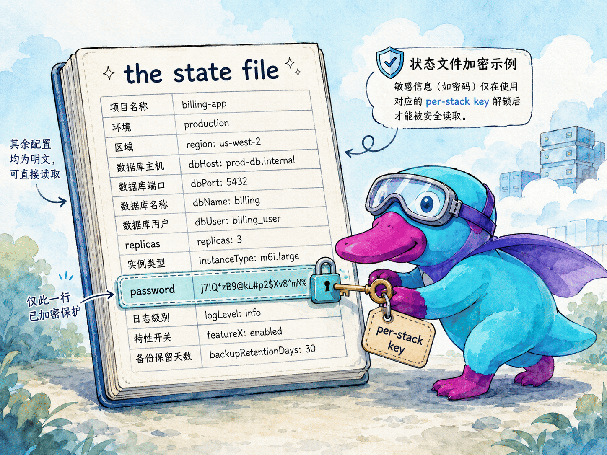
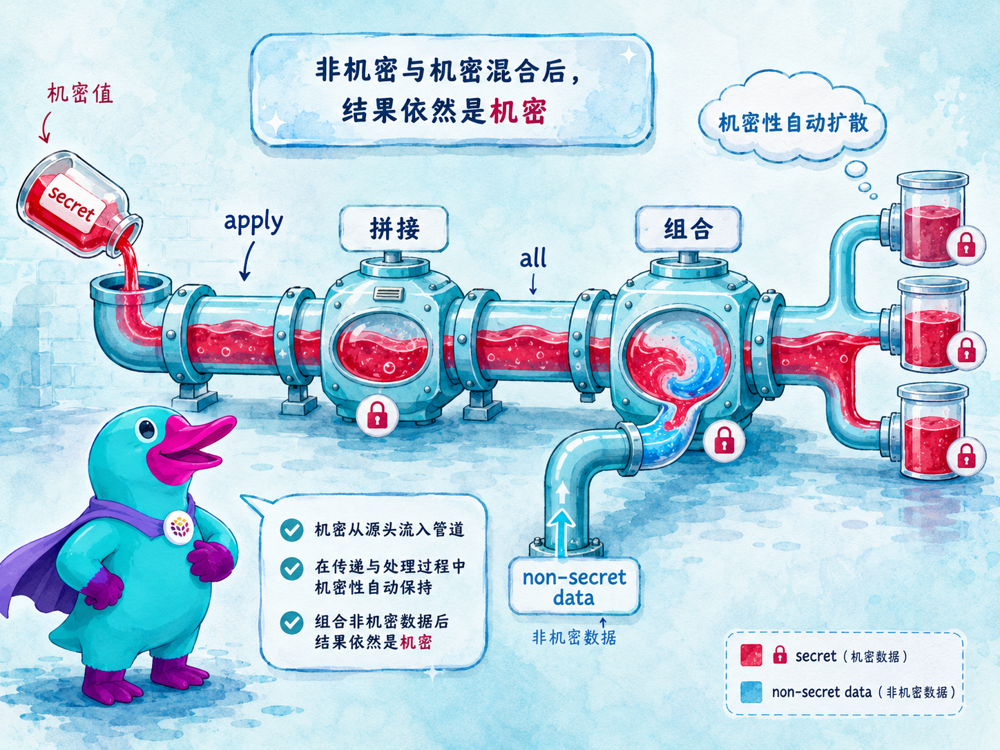
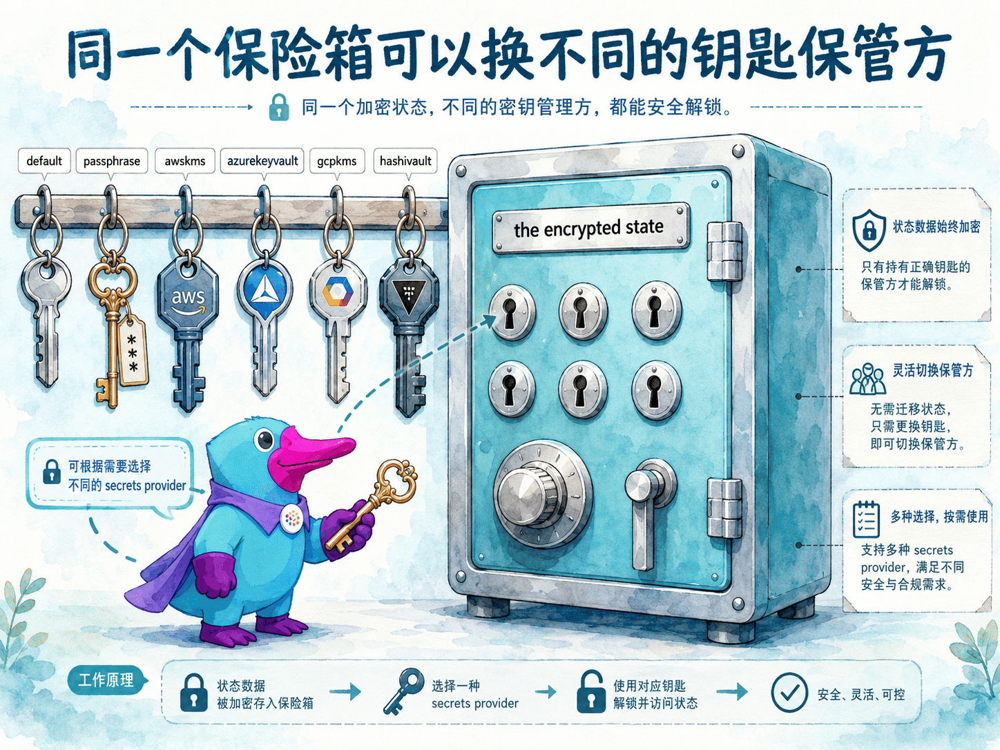
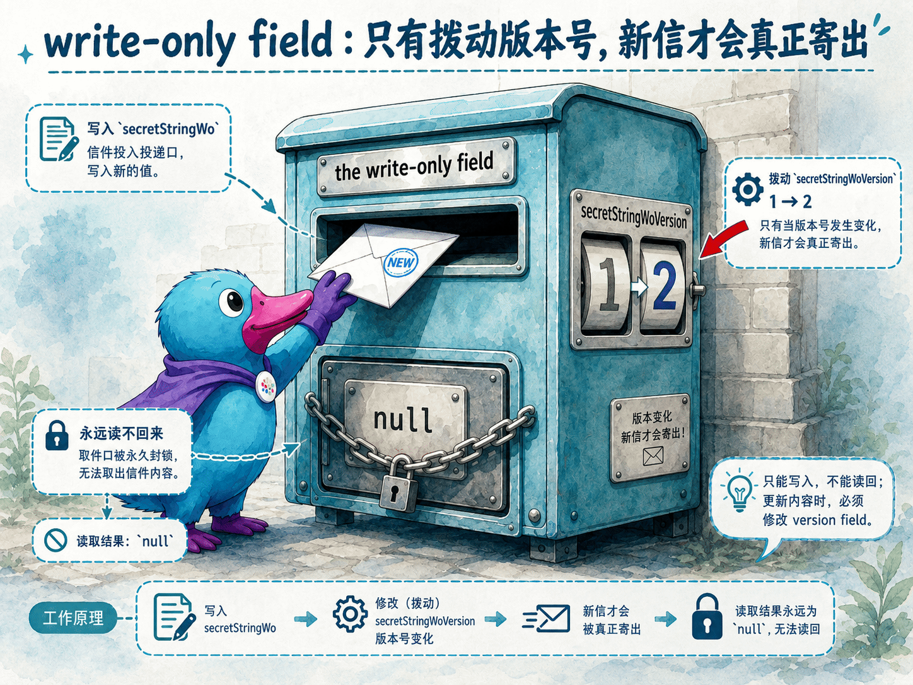

# Secrets 机密处理

<TutorialAcknowledgement />

## 本章定位

::: tip 导言
上一章我们讲清楚了 Output——那个「装着未来之值的盒子」。但有一类值，光「装进盒子」还不够：数据库密码、API Token、私钥……这些**敏感数据**一旦以明文落进 state 文件，就等于把家门钥匙放在门口的地垫下。Pulumi 为此提供了一套贯穿全程的 **Secret（机密）** 机制：你把某个值标记为 secret，引擎就会在它**流经的每一处**——state 文件、配置文件、CLI 输出——自动加密或遮蔽，并且这种「机密性」会像染色一样，随 `apply` / `all` 传播到由它派生出的每一个新值上。理解 Secret，本质上是理解一件事：**在 Pulumi 里，「这个值是机密」不是你某一处的临时处理，而是一个会自动扩散、贯穿整条数据流的属性。**
:::

第 6 章里，我们见过这样的写法：把 `config.requireSecret("dbPassword")` 传给数据库实例，或者给 `RandomPassword` 加上 `additionalSecretOutputs`。当时我们没有深究：**这些值被标记成 secret 之后，到底发生了什么？为什么打印出来是 `[secret]`？它在 state 文件里长什么样？换一个加密 provider 又是怎么回事？**

本章把 Pulumi 的机密处理讲透，回答以下问题：

- 敏感值不加密会有什么后果？Pulumi 用什么办法保护它们？
- 在代码里怎么创建一个 secret？（config 的 secret getter 与 `pulumi.secret()`）
- secret 和 Output 是什么关系？为什么说机密性会「传染」？哪些情况下它会意外泄漏？
- 配置文件里的 secret 长什么样，能不能放心提交到 Git？
- 默认加密不够用时，怎么换成 AWS KMS、Azure Key Vault 这类自有加密 provider？
- 什么是 **write-only fields（只写字段）**？它和 secret 有什么区别，又该在什么时候用？

## 官方映射

- [Secrets](https://www.pulumi.com/docs/iac/concepts/secrets/)：secret 的定义、编程方式创建、与 Output 的关系、配置中的加密、加密 provider、提交源码、ESC。
- [Write-only Fields](https://www.pulumi.com/docs/iac/concepts/secrets/write-only-fields/)：只写字段的来源、Pulumi 的处理方式、版本字段触发更新。
- [AWS `secretsmanager.SecretVersion`](https://www.pulumi.com/registry/packages/aws/api-docs/secretsmanager/secretversion/)：本章动手实验使用的只写字段 `secretStringWo` / `secretStringWoVersion`。

## 7.1 为什么需要 Secret：state 文件里的明文风险

所有资源的输入、输出值都会被记录进 stack 的 **[state](projects-stacks-state.md)**，存放在 Pulumi Cloud、某个 state 文件，或你自选的 DIY 后端里。绝大多数值都只是普通的明文字符串——配置项、计算出的 URL、资源 ID 等等，明文存储毫无问题。

但有些值是**敏感数据**：数据库密码、服务 Token。如果它们也以明文躺在 state 里，那么任何能读到 state 文件的人——拿到 S3 桶访问权限的同事、误把 state 提交进 Git 的你、入侵了后端存储的攻击者——都能直接看到这些机密。

Pulumi 的应对分两层：

1. **整体传输与存储加密**：Pulumi Cloud 会对整个 state 文件做安全的传输与静态加密。
2. **单值加密（secret）**：在此之上，Pulumi 还支持把**单个值**标记为 secret 并单独加密，确保这些值**永远不会以明文出现在 state 文件里**。默认使用 Pulumi Cloud 提供的、**每个 stack 一把**的自动加密密钥；你也可以换成自己的加密 provider（见 7.6）。

> 一个让人安心的事实：**Pulumi CLI 从不把你的云凭据（AWS/Azure/GCP 的 access key 等）传给 Pulumi Cloud。** 那些凭据只在你本地用于和云 API 通信，与 secret 加密是两回事。



## 7.2 编程方式创建 secret

在程序里，有两种方式创建一个 secret 值：

1. **从配置里读 secret**：用 `config.getSecret(key)` 或 `config.requireSecret(key)` 读取一个已经被标记为机密的配置项。
2. **把已有值包成 secret**：用 `pulumi.secret(value)` 显式地把一个普通值变成 secret。

以创建一个 AWS SSM Parameter Store 的安全值为例。Parameter Store 能存普通字符串，也能存机密字符串。要存一个加密值，我们需要给 `value` 属性传入内容——但**最自然的写法（直接传明文 `value`）会让这个值同时以明文进入 Pulumi state**。所以必须确保传进去的是一个 secret：

```ts
const cfg = new pulumi.Config();
const param = new aws.ssm.Parameter("a-secret-param", {
    type: "SecureString",
    value: cfg.requireSecret("my-secret-value"),
});
```

这样一来，`Parameter` 资源的 `value` 属性在 Pulumi state 文件里就是**加密**的。

更关键的是：**Pulumi 会追踪 secret 的「传递使用（transitive use）」**，确保机密不会在不经意间泄漏进 state。这种追踪包括：

- 自动把「由 secret 输入派生出来的数据」也标记为 secret；
- 对任何包含 secret 的资源属性做完整加密。

换句话说，机密性会**沿着数据流自动扩散**——这正是下一节要讲的核心。

## 7.3 Secret 与 Output 的关系

Secret 和普通的资源输出**类型完全相同**，都是 `Output<T>`。区别只在于：secret 在内部被打上了「持久化到 state 前需要加密」的标记。

理解这一点，就能推出一条最重要的规则：**当你用 `apply` 或 `Output.all` 把一个 secret 组合进新值时，得到的结果也会被标记为 secret。** 机密性像染料一样，顺着 Output 的变换链条一路染下去。

```ts
const dbConn = pulumi
    .all([host, cfg.requireSecret("dbPassword")])
    .apply(([h, pw]) => `postgres://admin:${pw}@${h}:5432/app`);
// dbConn 自动成为 secret —— 因为它的原料里有一个 secret
```

一个 Output 可以通过以下任意一种方式被标记为 secret：

- 用 `Config.getSecret` / `Config.requireSecret` 从配置读取 secret；
- 用 `pulumi.secret` 新建一个 secret 值（例如生成一个随机密码后立即包成 secret）；
- 用 [`additionalSecretOutputs`](resources.md) 资源选项把某个资源属性标记为 secret；
- 用 `apply` 或 `all` 基于另一个 secret 计算出新值。

一旦某个 Output 被标记为 secret，Pulumi 引擎就会在它**流经的所有存储位置**自动加密。



### 7.3.1 `apply` 回调里拿到的是明文

有一个**必须警惕**的细节：当你对一个 secret 调用 `apply` 或 `all` 时，回调函数内部拿到的是**解密后的明文值**。Pulumi 能保证 `apply` 的**返回值**继续被标记为 secret，但它**无法保证你在回调内部不把明文泄漏出去**——比如你在回调里 `console.log(pw)`，或者把它写进一个文件。

```ts
cfg.requireSecret("dbPassword").apply(pw => {
    console.log(pw); // ❌ 明文密码会被打印出来，机密性在这里被你亲手破坏
    return pw;
});
```

所以请记住：**回调内部的明文值，要像对待真实密码一样谨慎**，只把它传给你信任的代码，绝不主动打印、落盘或上报。

### 7.3.2 显式把资源输出标记为 secret

有时某个资源的输出本身就是敏感的，但 provider 并没有默认把它标记为 secret。这时用 [`additionalSecretOutputs`](resources.md) 资源选项，让 Pulumi 把指定的输出当作 secret，在 state 及它流向的任何地方加密：

```ts
const password = new random.RandomPassword("password", {
    length: 16,
}, { additionalSecretOutputs: ["result"] });
```

### 7.3.3 陷阱：资源 ID 永远无法加密

这是机密处理里**最容易翻车**的一个点：**资源的 [physical ID](resources.md)（provider 分配、由 `id` 输出暴露的标识符）永远以明文存进 state，无法加密。** 把 `id` 加进 `additionalSecretOutputs` **没有任何效果**——因为 `id` 是一个特殊属性，而非普通输出。

这在「某个资源把敏感的、生成出来的值放进它的 ID」时会出问题。典型例子是 `random.RandomString`：它的 `result`（生成的随机串）同时也被暴露为该资源的 `id`，于是即便你把 `result` 标记为 secret，这个生成的字符串仍会以明文出现在 state 里——因为它还藏在 `id` 那一栏。

正确做法是：**改用那种「只把敏感值作为普通输出、不放进 ID」的资源。** 例如 `random.RandomPassword`，它把生成的密码放在 `result` 输出里（`id` 不是那个密码），于是把 `result` 标记为 secret 就能在所有存储位置加密它：

```ts
const password = new random.RandomPassword("password", {
    length: 16,
}, { additionalSecretOutputs: ["result"] });
```

> 一句话记牢：**不要让敏感值出现在资源的 physical ID 里。** 选资源时，优先选把机密放在普通输出（如 `result`）而非 `id` 上的那一个。

## 7.4 配置中的加密 secret

除了在代码里创建 secret，更常见的入口是**配置（config）**。

默认情况下，配置值以**明文**保存。当某个配置项是敏感数据时，给 `pulumi config set` 加上 `--secret` 标志，Pulumi 就会加密这个值，存进去的是密文而非明文：

```bash
$ pulumi config set --secret dbPassword S3cr37
```

> 默认情况下，Pulumi CLI 用一把「每个 stack 一把」、由 Pulumi Cloud 托管的加密密钥，配合每个值各自的 nonce 来加密。要换成别的加密 provider，见 7.6。

设好之后，列出配置时，`dbPassword` 的明文**不会被打印出来**：

```bash
$ pulumi config
KEY                        VALUE
aws:region                 us-west-1
dbPassword                 [secret]
```

同样地，如果程序试图把 `dbPassword` 打印到控制台——无论有意还是无意——Pulumi 都会把它**遮蔽（mask）**掉：

```ts
import * as pulumi from "@pulumi/pulumi";
const config = new pulumi.Config();
console.log(`Password: ${config.require("dbPassword")}`);
```

运行结果：

```bash
$ pulumi up
Password: [secret]
```

> **存含特殊字符的 secret 时要小心 shell 转义**：当值里含有 `$`、`!`、`@`、`#` 等字符时，shell 可能在值传到 Pulumi 之前就改写它。可以用引号包裹、按 shell 规则转义，或对复杂值改用输入重定向 / 从文件管道输入，以完全绕开 shell 解释。

### 7.4.1 显式声明某个值是明文

出于安全考虑，Pulumi CLI 会尝试检测「看起来像 API Token 或密码」的配置值。有时它会**误判**，在命令行报警并中止任务。要避免这种误判，给 `pulumi config set` 加上 `--plaintext` 标志，明确告诉 Pulumi「这个值我就是要明文存、不是 secret」：

```bash
$ pulumi config set --plaintext aws:region us-west-2
```

### 7.4.2 结构化配置里的 secret

结构化配置（嵌套对象 / 数组）里的某一项也能单独设为 secret。例如一组 endpoint，每个有 `url` 和 `token`，其中 `token` 设为机密：

```bash
$ pulumi config set --path endpoints[0].url https://example.com
$ pulumi config set --path --secret endpoints[0].token accesstokenvalue
```

写进 `Pulumi.<project-name>.yaml` 后大致如下，注意 `token` 是一段 `secure:` 密文：

```yaml
config:
  project-name:endpoints:
    - token:
        secure: AAABALsgfFnV0KbGLybu5f+oTqUFmPl2l7oer5EACw15g7rE6GMYQqGgMoZ07QgT
      url: https://example.com
```

> 这些 secret 值在运行时会被**解密成明文**交给程序。虽然技术上你也能用普通（非 secret）getter 读到它，但这几乎肯定不是你想要的——请**始终用 secret 版本的 getter**（`getSecret` / `requireSecret`），这样才能确保所有由它派生出去的值也都被标记为 secret。

### 7.4.3 在代码里读取配置与 secret

访问配置或 secret，用 `pulumi.Config` 类型。它的构造函数接受一个可选的命名空间（namespace）；省略时默认用当前项目名作为命名空间。假设已经设好两个配置：

```bash
$ pulumi config set name BroomeLLC             # 明文值
$ pulumi config set --secret dbPassword S3cr37 # 加密的 secret
```

程序里这样读：

```ts
import * as pulumi from "@pulumi/pulumi";

const config = new pulumi.Config();

const name = config.require("name");
const dbPassword = config.requireSecret("dbPassword");
```

这里 `name` 就是普通字符串 `BroomeLLC`，而 `dbPassword` 是一个**被加密的 secret Output 值**。

> **关于命名空间**：上面 CLI 与 `pulumi.Config` 构造函数里的 key 都没写命名空间，意味着它们默认用项目名作命名空间。你也可以显式指定，例如 `pulumi config set broome-proj:name BroomeLLC` 配合 `new pulumi.Config("broome-proj")`。项目自身的配置用默认命名空间即可；但**包（package）和组件（component）需要各自独立的命名空间**，这时就要显式传入。

## 7.5 把配置提交到源码管理

当你运行 `pulumi config set --secret` 生成一个 secret 时，Pulumi CLI 用该 stack 专属的加密密钥加密原始值，把密文存进 stack 配置文件（如 `Pulumi.dev.yaml`）。打开它，会看到类似：

```yaml
config:
  myStack:somePlainTextItem: somePlainText
  myStack:someSecretItem:
    secure: AAABAIIlW0ewSuZ1FJxw/+Rpw6BNqTUvGJ30O8WkpL2hB4aPyS7UU68=
```

要解密这段密文，需要当初加密它的那把密钥。对用 Pulumi Cloud 管理的 stack，密钥会**自动获取**——但仅限对该 stack 有[读权限](https://www.pulumi.com/docs/iac/concepts/state/)的用户。对 DIY 后端，则需用户自己提供（passphrase provider 用 stack 的口令，其它 provider 则通过向加密 provider 认证）。

正因如此，**把这些配置文件提交进源码管理是安全且推荐的做法**（包括 passphrase provider 用的 `encryptionSalt`、或其它 secret provider 用的 `encryptedKey`）——这样代码与配置就能一起做版本管理。如果你确实不想提交，也可以用 [`pulumi config refresh`](https://www.pulumi.com/docs/iac/cli/commands/pulumi_config_refresh/) 依据最近一次部署的配置重建它们。

## 7.6 配置 secret 的加密 provider

Pulumi Cloud 会自动替你管理「每个 stack 一把」的加密密钥。任何时候你用 `--secret` 加密一个值、或在运行时把值包成 secret，CLI 与 Pulumi Cloud 之间都会用一套安全协议，确保 secret 数据在传输中、静态存储时、以及物理落地的任何位置都是加密的。

但**默认加密机制在以下两种情况下可能不够用**：

1. 你**脱离 Pulumi Cloud** 使用 CLI——要么是本地模式，要么用 S3 / Azure Blob / GCS 等后端插件存 state；
2. 你的团队已经有一个**偏好的云加密 provider**，希望统一用它。

这两种情况下，你照样能用上面讲的全部 secret 功能，只需让 Pulumi 改用你指定的加密 provider。

### 7.6.1 初始化 stack 时指定加密 provider

在 `pulumi stack init` 时通过 `--secrets-provider` 指定：

```bash
$ pulumi stack init <name> --secrets-provider="<provider>://<provider-settings>"
```

之后该 stack 的所有加密操作都会走这个自定义 provider。Pulumi 用 Go Cloud Development Kit 实现可插拔的 secret provider，支持以下几种：

| provider | 用途 | 示例 settings |
|----------|------|---------------|
| `default` | Pulumi Cloud 托管的每 stack 密钥（默认） | —— |
| `passphrase` | 用一个口令（passphrase）派生密钥，纯本地 | 通过 `PULUMI_CONFIG_PASSPHRASE` 提供口令 |
| `awskms` | [AWS KMS](https://aws.amazon.com/kms/) | `awskms://<keyid>?region=us-east-1` |
| `azurekeyvault` | [Azure Key Vault](https://azure.microsoft.com/services/key-vault/) | `azurekeyvault://<vault>.vault.azure.net/keys/<key>` |
| `gcpkms` | [Google Cloud KMS](https://cloud.google.com/kms/) | `gcpkms://projects/.../cryptoKeys/<key>` |
| `hashivault` | [HashiCorp Vault Transit](https://www.vaultproject.io/docs/secrets/transit) | `hashivault://<key>` |

以 AWS KMS 为例，可用 ID / alias / ARN 三种方式指定密钥：

```bash
$ pulumi stack init my-stack \
    --secrets-provider="awskms://1234abcd-12ab-34cd-56ef-1234567890ab?region=us-east-1"
```

如果你之前配过 AWS CLI，会复用同一套凭据来用该 KMS 密钥加解密，因此要确保这套凭据对密钥有相应权限。也可用标准的 `AWS_ACCESS_KEY_ID` / `AWS_SECRET_ACCESS_KEY` 环境变量覆盖。自 Pulumi CLI v3.33.1 起，可在 query string 里加 `awssdk=v2&profile=<name>` 来指定 AWS profile；自 v3.41.1 起还支持用 `context_{key}={value}` 设置 KMS 加密上下文（encryption context），配合 IAM 策略条件做更细粒度的权限控制。



### 7.6.2 为已有 stack 更换加密 provider

要给一个**已经存在**的 stack 更换 secret provider，用 [`pulumi stack change-secrets-provider`](https://www.pulumi.com/docs/iac/cli/commands/pulumi_stack_change-secrets-provider)：

```bash
$ pulumi stack change-secrets-provider "<secrets-provider>"
```

它会把 provider 配置和 stack state 文件里的加密 secret **重新加密**成新 provider 的形式。支持的目标 provider 同样是 `default` / `passphrase` / `awskms` / `azurekeyvault` / `gcpkms` / `hashivault`。换完之后，运行 `pulumi preview` 应该**看不到任何待变更**——你的配置 secret 和 state 文件此时已用新 provider 加密。

## 7.7 用 Pulumi ESC 管理 secret

[Pulumi ESC](https://www.pulumi.com/docs/esc/)（Environments, Secrets, and Configuration）让你能在 secret 真正存放的地方管理它。ESC 在常见的 secret 管理器 / vault 之上提供一层**集中抽象**，同时用 RBAC 和审计控制提供安全保障。两个典型场景：

- **跨团队共享 secret**：例如集中的账单团队维护支付 API key，把它们定义在一个 `Billing` 环境里；订阅管理团队的环境 `import` 这个 `Billing` 环境，就能在受访问控制约束的前提下读到那些 secret。
- **跨云 secret**：当你的产品同时用到 GCP Secrets Manager 和 Azure Key Vault，ESC 能把这些分散的 secret 访问**收敛到单一入口**，其它 stack 或环境 import 这个环境后即可统一访问。

> **ESC 与 GCP Secrets Manager / Azure Key Vault 是什么关系？** 它们不是同类替代品，而是「上下两层」：GCP Secrets Manager、Azure Key Vault 这类**保管库（vault）**是机密**真正存放的地方**；ESC 不再额外存一份机密，而是架在这些 vault **之上的一层抽象与治理层**——它通过各云的连接器在运行时**按需读取**底层 vault 里的值，再用统一接口、RBAC 与审计把这些值分发给 Pulumi stack、CI 或应用。于是消费方只需对接 ESC 一处，无需分别去对接每朵云的 SDK 与凭据。
>
> 注意别和 7.6 的加密 provider 混淆：7.6 里的 `gcpkms` / `azurekeyvault` 是拿云 KMS / Key Vault 当 **state 的加密密钥保管方**（加解密用途）；而这里 ESC 关联的是把 GCP Secrets Manager / Azure Key Vault 当作**机密值的来源**（读取用途）。

ESC 是一个较大的独立主题，本章不展开，你只需先记住它的定位：**当 secret 分散在多个 vault、多个团队、多朵云时，ESC 是那个统一的访问与治理层。**

## 7.8 Write-only fields（只写字段）

到这里我们讲的都是 **secret**：值会被**加密后写进 state**，需要时再解密读回。还有另一类与之相关、但机制不同的字段——**write-only fields（只写字段）**。

**只写字段**是这样一类资源属性：它们可以在资源**创建（或更新）时被设置**，但云厂商的 API **永远不会把它们读回来**。也就是说，Pulumi 根本无法从云端再读到这些值。

### 7.8.1 来源：Terraform 的只写字段

只写字段是某些 provider 从其底层 **Terraform provider** 继承来的概念。这些 provider 出于安全原因，故意把某些字段设计成只写。例如一个数据库密码可以在创建时设置，但 provider 在后续 API 调用里永远不会返回那个密码的真实值。

> Pulumi 支持这类属性，**主要是为了与底层 Terraform provider 保持 schema 一致**。在 Pulumi 里，敏感数据**始终可以作为 secret 存进 state**——只要该能力可用，secret 就是更推荐的做法。换句话说：**能用 secret 解决的，优先用 secret；只写字段是为了对接 Terraform 生态而存在的另一种选择。**

### 7.8.2 Pulumi 如何处理只写字段

当 Pulumi 遇到一个只写字段时：

1. 这个值会在**创建 / 更新**时被使用，并发送给云 API；
2. 它的初始值会作为 **secret 写进 Pulumi state 的 inputs**，且**始终是密文、绝不以明文出现**；至于 outputs，不同资源表现略有差异（有的显示为 `null`，有的显示为一段加密占位密文），但**真实值都无法从中读回**；
3. 后续的 **Read 操作**中，provider 不会返回真实的只写值（如 SSM 的例子会被置为 `null`）；
4. 后续的 **preview / update** 中，Pulumi **不会**对这些字段检测或显示 diff——因为它们不靠普通值比对来跟踪。

把这四条和 secret 对比着看，差异就清楚了：

| 维度 | Secret | 只写字段（write-only） |
|------|--------|------------------------|
| 是否进 state | 加密后进 state（inputs 与 outputs 都可能有） | 以密文进 **inputs**；outputs 视资源而定（`null` 或加密占位密文），都读不回真实值 |
| 能否读回 | 能（解密后读回） | **不能**：provider 不返回真实值 |
| 是否参与 diff | 参与（值变了会显示 diff） | **不参与**普通 diff，靠版本字段触发更新 |
| 主要用途 | Pulumi 原生、推荐的机密处理方式 | 与 Terraform provider 的 schema 对齐 |

### 7.8.3 版本字段：怎么触发只写字段的更新

既然只写字段不参与 diff，那怎么更新它？答案是：**配套的「版本字段（version field）」**。

有些 provider 用一个**只写版本字段**来把控对只写字段的更新。这个版本字段处于 Pulumi 完整的生命周期管理之下，并与那个只写字段绑定。**对版本字段做改动，就会促使 Pulumi 把只写字段的值重新下发到云基础设施。**

官方文档用 AWS SSM Parameter 举例（它支持只写的安全字符串）：

```ts
import * as pulumi from "@pulumi/pulumi";
import * as aws from "@pulumi/aws";

// 创建一个带只写字段的 SSM Parameter
const testParameter = new aws.ssm.Parameter("test-param", {
    name: "/test/writeonly-parameter",
    type: aws.ssm.ParameterType.SecureString,
    description: "Test parameter with write-only fields",
    // 只写字段
    valueWo: "write-only-secret-value",
    valueWoVersion: 1,
});
```

它的生命周期是这样的：

1. **首次创建**：`valueWo` 被发送给云 API，并作为 secret 存进 Pulumi state 的 inputs；`valueWoVersion` 也被存下并在 state 里被追踪。
2. **后续读取**：创建后 Pulumi 从云端读回资源时——`valueWo` 在 state outputs 里是 `null`（provider 不返回只写值），而 `valueWoVersion` 仍在 state 里被追踪、可以读回。
3. **更新只写值**：要更新 `valueWo`，**必须递增 `valueWoVersion`**：

```ts
const updatedParameter = new aws.ssm.Parameter("test-param", {
    name: "/test/writeonly-parameter",
    type: aws.ssm.ParameterType.SecureString,
    description: "Test parameter with write-only fields",
    valueWo: "new-write-only-secret-value",
    valueWoVersion: 2, // 递增以触发更新
});
```

> 本章动手实验用的是 AWS **Secrets Manager** 的 `aws.secretsmanager.SecretVersion`，它的只写字段是 `secretStringWo`，配套版本字段是 `secretStringWoVersion`，版本字段的把控机制与上面的 SSM 例子一致：只改 `secretStringWo` 而不动 `secretStringWoVersion`，Pulumi 不会触发更新；要让新值生效，必须把 `secretStringWoVersion` 递增。**一点差异**：SSM 的 `valueWo` 在 outputs 里显示为 `null`，而 Secrets Manager 的 `secretStringWo` 在 outputs 里显示为一段**加密占位密文**——但两者都遵守同一条不变量：只写值绝不以明文进 state，也无法从云端读回真实内容。



## 本章小结与检查清单

- **Secret 是贯穿数据流的机密标记**：被标记为 secret 的值，在 state、配置文件、CLI 输出里都会被加密或遮蔽。
- **两种创建方式**：从配置读（`getSecret` / `requireSecret`），或用 `pulumi.secret()` 把已有值包成 secret。
- **机密性会传播**：secret 与普通输出同为 `Output<T>`；经 `apply` / `all` 派生出的值会自动继承 secret 标记。但 `apply` 回调内部拿到的是明文，**别在回调里打印或落盘**。
- **资源 ID 无法加密**：`additionalSecretOutputs` 对 `id` 无效；不要让敏感值落进 physical ID（优先 `RandomPassword.result` 而非 `RandomString`）。
- **配置 secret**：`config set --secret` 存密文，`--plaintext` 显式声明明文；含 `secure:` 密文的配置文件可放心提交 Git。
- **可换加密 provider**：`default` / `passphrase` / `awskms` / `azurekeyvault` / `gcpkms` / `hashivault`；`stack change-secrets-provider` 给已有 stack 重新加密。
- **只写字段 ≠ secret**：只写字段以密文进 inputs、真实值无法从 outputs 读回（视资源显示为 `null` 或加密占位密文）、不参与普通 diff，靠版本字段触发更新；它主要为对齐 Terraform schema 而存在，**能用 secret 就优先用 secret**。

落地前对照一遍：

- [ ] 所有敏感配置都用了 `--secret`，而非明文存储。
- [ ] 程序里读敏感配置用的是 `requireSecret` / `getSecret`，而非普通 getter。
- [ ] 没有在 `apply` / `all` 回调里 `console.log` 或落盘明文 secret。
- [ ] 没有把敏感值放进会成为资源 `id` 的属性（注意 `RandomString` 的陷阱）。
- [ ] DIY 后端或团队自有加密需求下，已用 `--secrets-provider` 选定合适的加密 provider。
- [ ] 用只写字段时，更新值的同时**递增了版本字段**，并理解 outputs 里读不回该值是预期行为。

## 动手实验

本章提供 **AWS** 版实验，使用 `pulumi/pulumi-aws`（`@pulumi/aws`）对接本地 **LocalStack** 模拟器，全程无需真实 AWS 账号或凭据。你会依次跑通：

- 用 `config set --secret` 设置机密配置，观察 CLI 遮蔽与 `Pulumi.dev.yaml` 里的 `secure:` 密文；
- 在程序里用 `requireSecret` / `pulumi.secret()` 创建 secret，并通过 `pulumi stack export` 验证 state 中的加密表现；
- 用 `additionalSecretOutputs` 标记输出，并复现「资源 ID 无法加密」的陷阱（`RandomString` vs `RandomPassword`）；
- 用 `aws.secretsmanager.SecretVersion` 的 `secretStringWo` / `secretStringWoVersion` 演示只写字段：state outputs 读不回值、靠递增版本号触发更新；
- 观察本地后端默认的 `passphrase` 加密 provider 与 `encryptionsalt`、配置里的 `secure:` 密文，并用 `pulumi config refresh` 重建配置文件。

<KillercodaEmbed src="https://killercoda.com/pulumi-tutorial/course/pulumi-tutorial/pulumi-secrets-handling" title="实验：Secrets 机密处理（AWS / LocalStack）" desc="用 @pulumi/aws 对接 LocalStack，演示 secret 配置与遮蔽、pulumi.secret 与机密传播、additionalSecretOutputs 与资源 ID 陷阱、Secrets Manager 只写字段，以及加密 provider 与 encryptionsalt。" />

