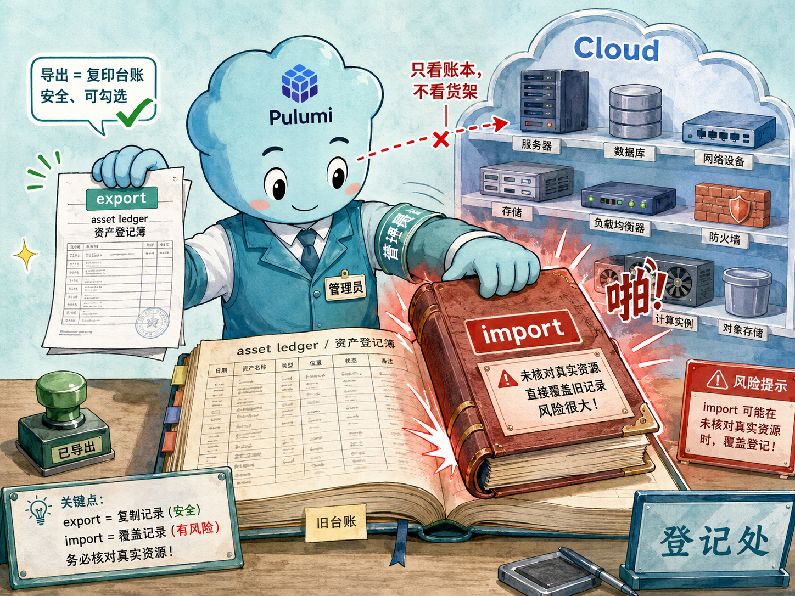

# Stack 详解

## 本章定位

上一章我们把 Project、Stack、Config、State 放在一起建立了整体心智模型。本章单独放大 Stack：它不是一个普通标签，而是 Pulumi 管理环境边界、配置边界、状态边界和输出契约的核心单位。

如果用一句话概括：**Stack 是 Pulumi Program 的一次独立部署实例**。同一份代码可以部署成 `dev`、`staging`、`prod`，每个 Stack 都有自己的配置、状态、输出和生命周期。

## 官方映射

- 官方概念页：[Stacks](https://www.pulumi.com/docs/iac/concepts/stacks/)
- 相关页面：[Project file reference](https://www.pulumi.com/docs/iac/concepts/projects/project-file/)、[Stack settings file reference](https://www.pulumi.com/docs/iac/concepts/projects/stack-settings-file/)、[State and backends](https://www.pulumi.com/docs/iac/concepts/state-and-backends/)

## 2A.1 Stack 到底隔离了什么

Stack 常被翻译成“堆栈”，但初学时可以先把它理解成“环境实例”。同一个 Project 可以有很多 Stack：

- `dev`：开发环境，允许快速试错。
- `staging`：预发布环境，用来验证发布结果。
- `prod`：生产环境，变更更谨慎。
- `feature-login-dev`：某个功能分支的临时环境。

它们共享同一份 Pulumi Program，但拥有各自独立的：

| 内容 | 属于谁 | 为什么重要 |
|------|--------|------------|
| Config | 某个 Stack | `dev` 和 `prod` 可以用不同区域、规格、负责人、密码 |
| State | 某个 Stack | Pulumi 知道这个环境已经创建过哪些资源 |
| Outputs | 某个 Stack | 下游系统可以读取对应环境的资源信息 |
| 操作历史 | 某个 Stack | 每个环境有自己的更新、销毁和审计记录 |

所以不要把 Stack 当成“命令行里当前选中的名字”这么简单。它是 Pulumi 判断“我现在正在操作哪个现实环境”的边界。

## 2A.2 创建、列出与选择 Stack

创建 Stack：

```bash
pulumi stack init staging
```

这会创建一个名为 `staging` 的空 Stack，并把它设为当前 active stack。Pulumi 会通过当前目录附近的 `Pulumi.yaml` 判断这个 Stack 属于哪个 Project。

列出 Stack：

```bash
pulumi stack ls
```

输出里带 `*` 的那一行就是 active stack。这个细节非常重要，因为下面这些命令都会作用在 active stack 上：

- `pulumi config set`
- `pulumi preview`
- `pulumi up`
- `pulumi destroy`

切换 Stack：

```bash
pulumi stack select prod
```

很多初学者遇到“我明明改了配置，为什么部署没变化”，根因都是 active stack 选错了。

## 2A.3 Stack 名称与完整引用格式

最简单的 Stack 名就是 `dev`、`prod` 这样的短名。Pulumi 也支持更完整的格式：

```text
<organization>/<project>/<stack>
```

例如：

```text
mycompany/platform/prod
```

在 Pulumi Cloud 中，`organization` 是你的账号或组织名。在本教程使用的本地后端（DIY backend）中，组织名位置固定写作 `organization`，例如：

```text
organization/stacks-azure-lab/dev
```

完整名称在 StackReference 里尤其重要，因为下游 Project 需要明确知道自己读取的是哪个 Project 的哪个 Stack。

## 2A.4 Stack 配置文件不是 Stack 本身

创建 Stack 的命令是：

```bash
pulumi stack init dev
```

但这个命令不一定马上创建 `Pulumi.dev.yaml`。通常只有当你开始设置配置时，Pulumi 才会创建或更新这个 Stack settings file：

```bash
pulumi config set owner dev-team
pulumi config set --secret adminPassword dev-password-123
```

这份文件保存的是当前 Stack 的配置和加密元数据，而 Stack 的完整状态不只在这里。状态还会保存在后端中（本教程是本地后端）。

一个典型配置文件像这样：

```yaml
config:
  stacks-azure-lab:namePrefix: stack-lab
  stacks-azure-lab:owner: dev-team
  azure-native:location: eastus
```

注意 `stacks-azure-lab:owner` 里的项目前缀。它来自 `Pulumi.yaml` 的 `name` 字段，用来避免配置键撞名。

## 2A.5 在程序里读取当前 Stack

Pulumi Program 可以读取当前 Stack 名。TypeScript 中是：

```ts
const stack = pulumi.getStack();
```

Python 中是：

```python
stack = pulumi.get_stack()
```

这很常见，比如用 Stack 名生成环境相关资源名：

```python
resource_group_name = f"{name_prefix}-{stack}-rg"
```

这也带来一个重要提醒：如果资源名依赖 Stack 名，那么重命名 Stack 后，下一次 `pulumi up` 可能计划替换资源。重命名前一定要先看 `pulumi preview`。

## 2A.6 Stack Outputs 与 Stack README

Stack 可以导出 Outputs：

```python
pulumi.export("resource_group", resource_group_name)
pulumi.export("handoff_card", f"Stack {stack} owns {resource_group_name}")
```

查询输出：

```bash
pulumi stack output resource_group
pulumi stack output --json
```

Outputs 适合放“部署完成后才知道、但别人需要用”的值，例如资源 ID、URL、DNS 名、Key Vault 名称。不要导出完整资源对象，因为它往往巨大、难读，也可能包含不该暴露的内部字段。

Pulumi Cloud 还支持一个特殊 Output：`readme`。如果 Stack 导出名为 `readme` 的 Markdown 字符串，Pulumi Cloud 会把它渲染成这个 Stack 的 README。这里先知道这个能力即可，本教程使用本地后端，不依赖 Pulumi Cloud UI。

## 2A.7 StackReference：跨 Stack 读取输出

StackReference 让一个 Stack 读取另一个 Stack 的 Outputs。它适合表达“下游需要知道上游结果，但不接管上游资源”的关系。

常见写法是：

```ts
const infra = new pulumi.StackReference("mycompany/infra/prod");
const vpcId = infra.requireOutput("vpcId");
```

读取方法有三种常见选择：

| 方法 | 行为 | 适用场景 |
|------|------|----------|
| `requireOutput` | 输出不存在就失败 | 推荐用于强依赖契约 |
| `getOutput` | 输出不存在时返回空值 | 输出可选且代码能处理缺失时 |
| `getOutputDetails` | 读取解析后的值和 secret 状态 | 需要区分普通值与 Secret 时 |

初学阶段优先使用 `requireOutput`。它能把拼写错误或契约缺失尽早暴露出来。

## 2A.8 更新、导出、销毁与删除 Stack

更新当前 Stack：

```bash
pulumi preview
pulumi up
```

查看当前 Stack 的资源、输出和元数据：

```bash
pulumi stack
```

导出状态用于观察或排障，相当于把这本“账本”复印一份出来看，安全无副作用：

```bash
pulumi stack export --file stack.json
```

导入则相反：它用一份 JSON 文件**整本覆盖** Pulumi 的 State 账本。

```bash
pulumi stack import --file stack.json
```

这里有一个容易被忽视、却很关键的前提：**Pulumi 只认这本账本，不会自己跑到云上挨家挨户核对真实资源。** 所以 import 改写的不是云上的真实资源，而是 Pulumi“以为现实长什么样”。



打个比方：State 就像一本 asset ledger（资产登记簿），Pulumi 是只照着账本办事的管理员。

- `export` 像把账本复印一份带走研究，怎么看都不影响现实。
- `import` 像直接给管理员换上一本新账本。他不会逐户核实，而是完全相信新账本上的每一行。

风险也正来自这里：

- 如果新账本写着“某资源还在”，但云上其实已被删除，Pulumi 之后就会基于错误认知做决策。
- 如果账本里漏写了某个资源，它就变成没人登记、也没人管理的 orphan resource（孤儿资源）。

所以生产环境中不要把 import 当成日常操作。它只适合少数需要手工修复 State 的场景，执行前务必**备份、评审、演练**。

销毁 Stack 管理的资源：

```bash
pulumi destroy
```

当一个 Stack 里的资源都已经销毁、这个环境也不再需要时，可以把这条 Stack 记录本身删掉：

```bash
pulumi stack rm dev
```

这里要分清两件事：`pulumi destroy` 处理的是**云上的真实资源**，而 `pulumi stack rm` 处理的是 **Pulumi 这一侧的 Stack 记录**——也就是这个 Stack 的 State、配置元数据和操作历史。换句话说，`destroy` 让现实里的资源消失，`stack rm` 让 Pulumi 里“曾经有过这个环境”的记录消失。两者职责不同，不能互相替代。

正因为如此，正常情况下 `pulumi stack rm` 会先检查这个 Stack 的 State 里是否还登记着资源。如果还有资源，它会拒绝删除并报错，提醒你“这个环境还没清理干净”。这是一道保护栏，避免你在资源还活着的时候就把账本丢掉。

Pulumi 也提供了 `pulumi stack rm --force` 来跳过这道检查、强行删除还登记着资源的 Stack。但请把它当成危险操作：一旦删掉记录，State 里登记的那些资源在云上很可能仍然存在，只是再也没有任何 Pulumi Stack 认领它们，于是变成无人管理、还在持续计费的 orphan resource（孤儿资源），日后只能手动到云控制台里清理。

顺序要记牢：**先 `pulumi destroy` 销毁资源，再 `pulumi stack rm` 删除 Stack 记录**。先清场、再撤记录，才能既不留孤儿资源，也不留多余的空 Stack。

## 2A.9 Stack 标签与适用边界

Pulumi Cloud 支持 Stack tags，可用来按 `environment=production`、`team=platform` 之类的标签管理大量 Stack。系统也会自动维护一些内置标签，例如 Project、Runtime、VCS 信息等。

本教程使用本地后端，不演示 Stack tags。你只需要知道：当团队 Stack 数量变多时，标签是 Pulumi Cloud 里管理和分组 Stack 的能力；自定义标签不要使用 `pulumi:`、`gitHub:`、`vcs:` 这些内置前缀。

## 2A.10 常见误区

| 误区 | 正确认知 |
|------|----------|
| `Pulumi.dev.yaml` 就是完整 Stack | 它只是 Stack settings file，完整状态在 backend 中 |
| 创建 Stack 一定会生成配置文件 | 只有设置配置后才通常会出现 `Pulumi.<stack>.yaml` |
| `pulumi up` 会自动选择 prod | `pulumi up` 只作用在当前 active stack |
| Stack 改名只是改显示名 | 如果程序用 Stack 名生成资源名，改名可能触发替换 |
| `stack rm` 等于销毁云资源 | `stack rm` 删除 Stack 记录；资源销毁要用 `pulumi destroy` |

## 动手实验

本章实验只配置 Azure 版，使用本地后端和 `miniblue` 模拟 Azure 风格资源。你会创建 `dev` 与 `prod` 两个 Stack，观察 active stack、配置文件、输出、状态导出，并安全演示空 Stack 的 rename / rm 流程。

<KillercodaEmbed src="https://killercoda.com/pulumi-tutorial/course/pulumi-tutorial/pulumi-stacks-azure" title="实验：Stack 详解（Azure / miniblue）" desc="使用 miniblue 模拟 Azure 风格资源，练习 Stack 创建、选择、配置隔离、Outputs、State export、空 Stack rename 与 stack rm。" />

## 本章交付物

- `dev` 与 `prod` 两个 Stack。
- 两份 Stack settings file：`Pulumi.dev.yaml` 与 `Pulumi.prod.yaml`。
- 由 `pulumi.get_stack()` / `pulumi.getStack()` 思路生成的环境化资源名。
- 可查询的 Stack Outputs 与 JSON 输出。
- 一份导出的 Stack State 快照。
- 一次空 Stack rename / rm 的安全演示。