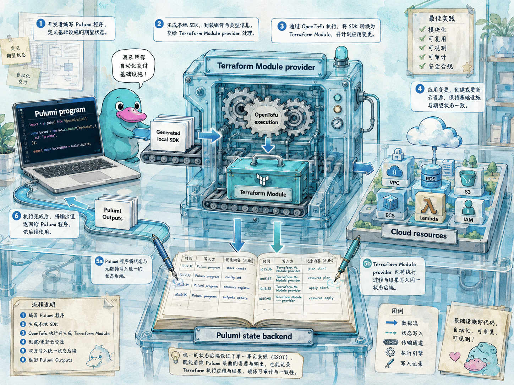
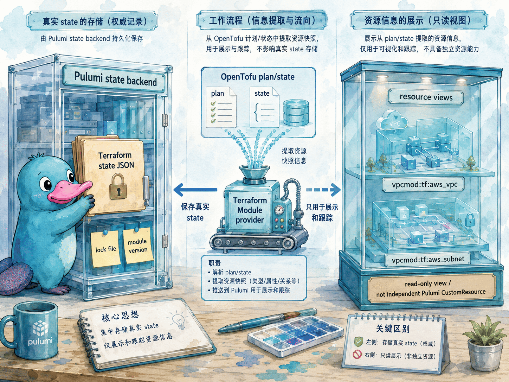

# 使用 Terraform Module

## 本章定位

前面的 [Provider 章节](providers.md) 已经讲过如何用 `pulumi package add terraform-provider` 把 Terraform/OpenTofu provider 变成 Pulumi 可用的资源包。[Pulumi Templates](templates.md) 讲的是新项目如何从标准脚手架开始。本章讨论另一种工程化复用方式：**在 Pulumi 程序中直接使用已有 Terraform Module**。

Terraform Module 适合承载已经被团队验证过的基础设施组合，例如网络、数据库、安全基线和监控配置。Pulumi 的 Terraform Module provider 让这些模块可以像普通 Pulumi Package 一样被加入项目：Pulumi 生成本地 SDK，程序通过 `new Module(...)` 传入模块变量，模块输出再以 Pulumi Output 的形式回到程序中。

本章聚焦 Pulumi OSS 能独立完成的能力：Terraform Registry 模块、本地 Terraform 模块、`pulumi package add terraform-module`、本地 SDK 生成、模块专属 provider 配置、Pulumi state 后端，以及使用 Terraform Module 时的限制。示例使用用户指定的两个 Registry 模块：AWS 侧使用 `terraform-aws-modules/vpc/aws`，Azure 侧使用 `Azure/avm-res-network-virtualnetwork/azurerm`。

## 官方映射

- [Use a Terraform Module in Pulumi](https://www.pulumi.com/docs/iac/guides/building-extending/using-existing-tools/use-terraform-module/)：Terraform Module provider 的工作方式、`pulumi package add terraform-module` 语法、本地模块、示例、provider 配置、排错和限制。
- [Local Packages](https://www.pulumi.com/docs/iac/guides/building-extending/packages/local-packages/)：本地生成 SDK 与参数化 package 的使用方式。
- [pulumi package add](https://www.pulumi.com/docs/iac/cli/commands/pulumi_package_add/)：添加 Pulumi Package 的 CLI 参考。
- [terraform-aws-modules/vpc/aws](https://registry.terraform.io/modules/terraform-aws-modules/vpc/aws/latest)：AWS VPC Terraform Module，示例使用写作时 latest 版本 6.6.1。
- [Azure/avm-res-network-virtualnetwork/azurerm](https://registry.terraform.io/modules/Azure/avm-res-network-virtualnetwork/azurerm/latest)：Azure Verified Module 的 Virtual Network 模块，示例使用写作时 latest 版本 0.19.0。

## 8.9 Terraform Module 解决的问题：复用已有模块资产

很多组织在采用 Pulumi 前，已经有一批 Terraform Module。它们可能沉淀了命名规则、网络拓扑、安全默认值、日志配置和审计标签。直接重写这些模块往往成本很高，而且容易在短期内产生两套行为相近但细节不同的实现。

Terraform Module provider 的价值在于：让 Terraform Module 先以模块为边界进入 Pulumi 项目。团队可以继续使用已有模块，同时用 Pulumi 管理 Stack、配置、输出、策略、Automation API 和通用编程语言能力。

它不等同于把模块“变成原生 Pulumi Component”。更准确地说，它是在 Pulumi 程序里嵌入一个 Terraform/OpenTofu 模块执行边界。对调用者来说，模块像一个 `Module` 资源；对模块内部来说，仍然按照 Terraform Module 的变量、输出和 provider 约定运行。



这条链路里有两个边界尤其重要：

| 边界 | 含义 |
|------|------|
| Pulumi 负责外层编排 | Stack、配置、输出、依赖关系和 state backend 仍由 Pulumi 管理 |
| OpenTofu 负责模块执行 | Terraform Module 的变量、输出、provider 配置和内部资源图由 OpenTofu 处理 |

因此，Terraform Module provider 适合复用已有模块；如果你需要对模块内部每个资源都应用 Pulumi resource options，或者希望平台团队完全掌控资源树结构，就应评估把这部分能力整理成 Pulumi Component 或 Pulumi Package。

## 8.10 工作方式：模块像 Package，内部仍由 OpenTofu 执行

官方文档把工作方式概括为四步：

| 步骤 | 说明 |
|------|------|
| 自动安装和管理 OpenTofu | Pulumi 使用开源的 Terraform 兼容实现执行模块 |
| 把 Pulumi 声明转成 Terraform 配置 | `new Module(...)` 的参数会映射成模块变量 |
| 通过 Pulumi 后端管理状态 | Terraform state 由模块 provider 写回 Pulumi state storage |
| 把模块输出暴露为 Pulumi Outputs | 其他 Pulumi 资源可以消费这些输出并形成依赖 |

这意味着模块输出可以继续参与 Pulumi 的数据流。例如 AWS VPC 模块输出 `vpc_id` 后，后续的 Pulumi 原生资源可以把它作为输入；Pulumi 会理解这条依赖。反过来，Pulumi 原生资源的输出也可以传给 Terraform Module 的变量。

但要记住，模块内部不是一组普通 Pulumi 子资源。Pulumi 可以知道模块这个资源，以及模块暴露的输入输出；模块内部每个 Terraform 资源的细节由 Terraform Module provider 和 OpenTofu 处理。这也是后面若干限制的来源。

### State 映射：不是一个普通大资源，也不是一组普通子资源

“状态写入 Pulumi 后端”这句话容易被误解。Terraform Module provider 的状态可以分成三层看：

| 层次 | 在 Pulumi 里看到什么 | 保存什么 | 能不能像普通 Pulumi 资源一样控制 |
|------|----------------------|----------|----------------------------------|
| Module 组件资源 | 类似 `vpcmod:index:Module` 的组件 | 模块调用边界、输入输出和父子关系 | 可以对整个模块设置普通资源选项 |
| 模块 state 资源 | provider 内部创建的 state custom resource | Terraform state JSON、lock file 和模块版本等元数据 | 不应直接依赖它的内部字段 |
| Resource views | 类似 `vpcmod:tf:aws_vpc`、`vpcmod:tf:aws_subnet` 的视图资源 | 从 Terraform plan/state 抽取出的资源地址、类型和属性快照 | 不能逐个设置 Pulumi resource options |

也就是说，Terraform Module 内部子资源的真实状态确实进入了 Pulumi state，但不是以“每个子资源都是一个完整 Pulumi CustomResource”的方式进入。provider 会把 OpenTofu/Terraform 生成的 state JSON 保存到模块的内部 state resource 中；内部 `__state` 字段会被标记为 secret，`__lock` 和 `__moduleVersion` 则作为普通元数据保存。Pulumi 后端因此成为这段 Terraform state 的存放位置，而不是另起一个独立 Terraform backend。

为了让用户能看见模块内部发生了什么，provider 还会把 Terraform plan/state 里的 managed resources 发布为 resource views。它们会出现在 preview、up、destroy 的资源计数和资源树中，也可能出现在 `pulumi stack export` 的资源列表里。view 的类型通常采用 `<生成包名>:tf:<Terraform 资源类型>` 这样的形式，名称通常来自 Terraform resource address，例如形如 module.tutorial-vpc.aws_vpc.this。

Resource views 的作用是“展示和跟踪”，不是把模块内部资源提升为完整 Pulumi 资源。更新、刷新、销毁时，真正执行操作的仍是 Terraform Module provider 调用 OpenTofu；Pulumi 不能跳进模块内部只对某一个 subnet、route table 或 security group 套用普通 resource options。



这也带来一个实践原则：**把 Terraform Module 当成一个有输出的封装边界来管理，不要把模块内部 state 字段当作业务接口来解析。** 业务代码应消费模块 outputs；排障时可以查看 state export 和 resource views，但不要把内部 `__state`、`__lock` 等字段写进脚本依赖。

## 8.11 把 Terraform Module 加入 Pulumi 项目

基本命令如下：

```bash
pulumi package add terraform-module <module-source> [<version>] <pulumi-package-name>
```

三个参数分别表示：

| 参数 | 说明 | 示例 |
|------|------|------|
| `<module-source>` | Registry 模块标识或本地模块路径 | `terraform-aws-modules/vpc/aws` |
| `[<version>]` | 可选版本约束 | `6.6.1` |
| `<pulumi-package-name>` | 生成的 Pulumi package 名称 | `vpcmod` |

生产项目建议显式写版本，而不是长期依赖 latest。Registry 的 latest 会随时间变化；固定版本能让 `preview`、代码评审和故障排查都有稳定参照。

以 AWS VPC 模块为例：

```bash
pulumi package add terraform-module terraform-aws-modules/vpc/aws 6.6.1 vpcmod
```

以 Azure AVM Virtual Network 模块为例：

```bash
pulumi package add terraform-module Azure/avm-res-network-virtualnetwork/azurerm 0.19.0 avmvnet
```

执行后，Pulumi 会更新项目文件，并在当前语言项目里生成本地 SDK。TypeScript 项目通常会得到类似 `@pulumi/vpcmod` 或 `@pulumi/avmvnet` 的 import 名称；准确名称以命令输出和生成后的依赖文件为准。

生成后的 `Pulumi.yaml` 会出现类似结构：

```yaml
packages:
  vpcmod:
    source: terraform-module
    version: 0.1.7
    parameters:
      - terraform-aws-modules/vpc/aws
      - 6.6.1
      - vpcmod
```

这里要分清两个版本：`parameters` 中的 `6.6.1` 是 Terraform Module 版本；`packages.vpcmod.version` 是 Pulumi Terraform Module provider 的 package 版本，由 `pulumi package add` 写入，通常不需要手工改动。

## 8.12 使用本地 Terraform Module

Registry 不是唯一来源。本地目录也可以作为模块来源：

```bash
pulumi package add terraform-module ./modules/network localnet
```

官方文档说明，包含 `.tf` 文件的目录就是有效模块；目录中可以有 `variables.tf` 和 `outputs.tf`。这很适合先验证内部模块，或者在一个 monorepo 中让 Pulumi 项目消费同仓库里的 Terraform Module。

本地模块要特别注意两点。第一，模块目录应当只包含模块自身需要的文件，不要把外层 Pulumi 项目的临时文件也放进去。第二，如果模块变量接收文件路径，应优先传绝对路径，原因见后面的排错小节。

## 8.13 AWS 示例：使用 terraform-aws-modules/vpc/aws

下面示例使用写作时 Registry latest 版本 6.6.1。这个模块的常见输入包括 `name`、`cidr`、`azs`、`public_subnets`、`private_subnets`、`enable_nat_gateway`、`enable_dns_hostnames`、`enable_dns_support` 和 `tags`；常见输出包括 `vpc_id`、`vpc_cidr_block`、`public_subnets`、`private_subnets`、`public_route_table_ids`、`private_route_table_ids` 等。

先加入模块：

```bash
pulumi package add terraform-module terraform-aws-modules/vpc/aws 6.6.1 vpcmod
```

TypeScript 程序可以这样写：

```ts
import * as pulumi from "@pulumi/pulumi";
import * as vpcmod from "@pulumi/vpcmod";

const config = new pulumi.Config();
const stack = pulumi.getStack();
const region = config.get("region") ?? "us-west-2";

const moduleProvider = new vpcmod.Provider("terraform-aws", {
	aws: {
		region,
	},
});

const network = new vpcmod.Module("network", {
	name: `tutorial-${stack}`,
	cidr: "10.0.0.0/16",
	azs: [`${region}a`, `${region}b`, `${region}c`],
	public_subnets: ["10.0.101.0/24", "10.0.102.0/24", "10.0.103.0/24"],
	private_subnets: ["10.0.1.0/24", "10.0.2.0/24", "10.0.3.0/24"],
	enable_nat_gateway: false,
	enable_dns_hostnames: true,
	enable_dns_support: true,
	tags: {
		Environment: stack,
		ManagedBy: "pulumi",
	},
}, { provider: moduleProvider });

export const vpcId = network.vpc_id;
export const privateSubnetIds = network.private_subnets;
export const publicSubnetIds = network.public_subnets;
```

这段代码有几个细节值得留意：

| 细节 | 原因 |
|------|------|
| 包名使用 `vpcmod` | 避免和普通变量名 `vpc` 混淆，命令参数决定生成包名 |
| 参数保持 Terraform 变量风格 | 生成 SDK 通常保留模块变量名，例如 `public_subnets` |
| provider 是模块包生成的 Provider | 它不是 `@pulumi/aws.Provider`，而是给 Terraform Module 内部 provider 使用 |
| 输出继续是 Pulumi Output | 可以被其他 Pulumi 资源消费，并让依赖关系自动形成 |

真实部署还需要 AWS 凭据。Terraform provider 会使用它自己的认证链；常见做法是在本机、CI 或 Automation API 进程中提供 `AWS_ACCESS_KEY_ID`、`AWS_SECRET_ACCESS_KEY`、`AWS_SESSION_TOKEN`、profile 或 OIDC 取得的临时凭据。

## 8.14 Azure 示例：使用 Azure AVM Virtual Network 模块

Azure 示例使用写作时 Registry latest 版本 0.19.0。这个模块用于管理 Azure Virtual Network、Subnet 和 Peering，并支持传统静态地址段与 Azure Virtual Network Manager IPAM。模块的关键输入包括 `location`、`parent_id`、`name`、`address_space` 或 `ipam_pools`、`subnets`、`tags` 等；常见输出包括 `resource_id`、`name`、`resource`、`subnets` 和 `address_spaces`。

需要注意，虽然 Registry 标识以 `azurerm` 作为 provider 名称，当前 0.19.0 根模块的元数据主要显示 `azapi`、`modtm`、`random` 等 provider 依赖。示例里的 Resource Group 可以用 Pulumi 原生资源、Azure CLI 或其他受控流程提前准备好；不要只根据模块名称假设一定要配置 `azurerm` provider。

先加入模块：

```bash
pulumi package add terraform-module Azure/avm-res-network-virtualnetwork/azurerm 0.19.0 avmvnet
```

一个最小的静态地址段示例如下：

```ts
import * as pulumi from "@pulumi/pulumi";
import * as avmvnet from "@pulumi/avmvnet";

const config = new pulumi.Config();
const stack = pulumi.getStack();

const location = config.get("location") ?? "eastus2";
const parentId = config.require("resourceGroupId");

const network = new avmvnet.Module("network", {
	location,
	parent_id: parentId,
	name: `vnet-${stack}`,
	address_space: ["10.20.0.0/16"],
	enable_telemetry: false,
	subnets: {
		web: {
			name: "snet-web",
			address_prefixes: ["10.20.1.0/24"],
		},
		app: {
			name: "snet-app",
			address_prefixes: ["10.20.2.0/24"],
		},
	},
	tags: {
		environment: stack,
		managedBy: "pulumi",
	},
});

export const virtualNetworkId = network.resource_id;
export const subnetMap = network.subnets;
```

`parent_id` 是 Resource Group 的完整 Azure Resource ID，例如：

```text
/subscriptions/00000000-0000-0000-0000-000000000000/resourceGroups/rg-demo-eastus2-001
```

如果使用 IPAM，模块文档要求虚拟网络使用 `ipam_pools`，而不是同时传 `address_space`。同一个虚拟网络最多引用一个 IPv4 pool 和一个 IPv6 pool；子网的 IPAM pool 必须是虚拟网络已经使用的 pool。下面只展示输入形状：

::: warning IPAM 区域限制
Azure AVM 模块文档列出了若干当前不支持 IPAM 的区域，例如 `chilecentral`、`jioindiawest`、`malaysiawest`、`qatarcentral`、`southafricawest`、`westindia` 和 `westus3`。真实项目应以 Azure 官方区域能力和模块当前版本说明为准。
:::

```ts
const ipamNetwork = new avmvnet.Module("ipam-network", {
	location,
	parent_id: parentId,
	name: `vnet-ipam-${stack}`,
	ipam_pools: [{
		id: config.require("ipamPoolId"),
		prefix_length: 24,
	}],
	subnets: {
		web: {
			name: "snet-web",
			ipam_pools: [{
				pool_id: config.require("ipamPoolId"),
				prefix_length: 26,
			}],
		},
	},
	enable_telemetry: false,
});
```

Azure 认证同样走 Terraform provider 自己的认证链。常见方式包括 Azure CLI 登录、Service Principal 环境变量、OIDC 或托管身份。模块内部还可能依赖 `azapi`、`random`、`modtm` 等 provider；是否需要显式 provider 配置，以当前模块版本文档和生成包的 Provider 参数为准。

## 8.15 Provider 配置：不要混淆模块 provider 与 Pulumi provider

Terraform Module 内部使用的是 Terraform provider。Pulumi 原生 provider 和模块 provider 可以并存，但不能假设它们自动共享配置。

例如下面这个 provider 是由生成包提供的：

```ts
const moduleProvider = new vpcmod.Provider("terraform-aws", {
	aws: {
		region: "us-west-2",
	},
});
```

它的作用范围是这个 Terraform Module package，而不是 `@pulumi/aws` 里的资源。如果同一个程序里既有 Terraform Module，又有 Pulumi 原生资源，常见结构是：

```ts
const network = new vpcmod.Module("network", args, { provider: moduleProvider });

// 后续可以把 network.vpc_id 传给 Pulumi 原生资源。
```

设计时建议把 provider 配置放在一处：区域、订阅、租户、profile、assume role 和 endpoint 等值应当来自 Stack 配置或运行环境，而不是散落在多个模块调用里。这样同一个 Stack 的云账号边界更容易审查。

## 8.16 与 Any Terraform Provider 的区别

Pulumi 同时支持 `terraform-provider` 和 `terraform-module`，它们解决的问题不同：

| 能力 | 命令 | 得到什么 | 适合场景 |
|------|------|----------|----------|
| Any Terraform Provider | `pulumi package add terraform-provider ...` | 某个 Terraform/OpenTofu provider 的资源类型 | 没有官方 Pulumi provider，但想直接创建单个资源类型 |
| Terraform Module | `pulumi package add terraform-module ...` | 某个 Terraform Module 的 `Module` 资源和输出 | 想复用已有模块封装的一组资源 |

如果只是缺少某个 provider 的 Pulumi 包，优先看 `terraform-provider`。如果已有一个经过验证的网络模块、数据库模块或安全基线模块，才考虑 `terraform-module`。

两者也可以组合。例如用 Terraform Module 创建网络，再用 Pulumi 原生资源创建应用侧资源；或者用 Any Terraform Provider 补充一个原生 provider 暂时没有覆盖的资源类型。组合时要把状态、provider 配置和输出依赖关系写清楚，避免让同一个云资源被两套声明同时管理。

## 8.17 排错与限制

官方文档列出两个常见排错点。

第一个是文件路径。某些模块会接收文件路径，例如 Lambda 代码目录、证书文件或配置文件。由于 Terraform Module 执行时的工作目录不同，传相对路径可能指向错误位置。建议在 Pulumi 程序里转成绝对路径：

```ts
import * as process from "process";

const root = process.cwd();

const module = new lambda.Module("function", {
	source_path: `${root}/src/app.ts`,
});
```

第二个是输出类型。如果 Pulumi 对模块输出类型推断不准确，可以按 Terraform Module provider 的配置参考覆盖输出类型。遇到这种问题时，不要只在业务代码里强行转换；应优先修正生成 package 的类型配置，让所有调用者都得到一致 SDK。

当前官方文档还列出这些限制：

| 限制 | 为什么会这样 | 对工程实践的影响 |
|------|--------------|------------------|
| 不支持 `transforms` resource option | 模块内部资源由 OpenTofu 从 Terraform plan/state 中执行和展示，resource views 不是普通 Pulumi 资源注册流程 | 不能用 transform 给模块内部所有子网、路由表或安全组统一改输入 |
| 不支持 `pulumi up --target ...` 定向更新模块内部资源 | Pulumi 的可控边界是 Module 调用，内部资源地址由 Terraform Module provider 管理 | 不能只 target 模块里的某个 subnet；应预览并更新整个模块边界 |
| 不能保护模块内部单个资源 | `protect` 等资源选项只能作用在 Pulumi 可管理的资源边界上 | 可以把保护策略放在模块外层流程或云侧策略里，但不能只给模块内部某个资源加 `protect` |

这些限制决定了使用边界：Terraform Module 更像一个封装好的黑盒组件，而不是可随意插手内部资源图的 Pulumi 组件。模块边界越清楚，使用体验越稳定；如果团队经常需要调整模块内部资源选项，就说明这部分能力可能更适合改写为 Pulumi Component。

常见判断方式如下：

| 需求 | 更适合的选择 |
|------|--------------|
| 直接复用成熟 Terraform Module，按模块变量控制行为 | Terraform Module provider |
| 需要在 Pulumi 里逐个设置 parent、provider、protect、ignoreChanges 或 aliases | Pulumi Component |
| 需要把内部资源作为稳定跨语言 API 暴露给多个团队 | Pulumi Package |
| 只缺少某个 Terraform provider 的 Pulumi 包，不需要模块封装 | Any Terraform Provider |

## 8.18 使用清单

在项目中引入 Terraform Module 前，可以用这份清单自查：

| 检查项 | 建议 |
|--------|------|
| 模块来源 | 优先使用可信 Registry 模块、内部 Git 模块或本地模块目录 |
| 版本固定 | 显式写 Terraform Module 版本，避免长期依赖 latest |
| Provider 配置 | 确认模块需要哪些 Terraform provider，以及认证链从哪里取得凭据 |
| 输入边界 | 把网络 CIDR、区域、标签、开关等值放进 Stack 配置或受审查代码 |
| 输出消费 | 只依赖模块文档承诺的 outputs，不读取模块内部临时文件 |
| 文件路径 | 模块变量需要路径时使用绝对路径 |
| 状态归属 | 同一个云资源只交给一套声明管理，避免 Pulumi 原生资源和 Terraform Module 同时管理同一对象 |
| 限制确认 | 需要 transform、target 或单资源 protect 时，先评估是否适合使用 Terraform Module |
| 长期策略 | 频繁改动内部结构的模块，考虑整理成 Pulumi Component 或 Pulumi Package |

## 8.19 小结

Terraform Module provider 给 Pulumi 项目提供了一条实用的复用途径：已有 Terraform Module 可以通过 `pulumi package add terraform-module` 生成本地 SDK，在 Pulumi 程序中像 package 一样被调用，并把输出接回 Pulumi 的数据流和 state 后端。

它最适合稳定、边界清楚、已有使用经验的模块。对 AWS VPC、Azure Virtual Network 这类网络基线模块来说，这种方式可以让团队继续使用成熟模块，同时把外层环境配置、依赖编排、输出消费和自动化流程交给 Pulumi。真正需要精细控制内部资源生命周期时，则应回到 Pulumi Component 或 Package 的设计路径。

## 8.20 本章实验

本章提供 AWS 与 Azure 两套实验。两套实验都不需要真实云账号：AWS 版使用 MiniStack，Azure 版使用 MiniBlue。它们分别使用本章正文中的两个 Registry 模块，重点练习 package 生成、模块 provider 配置、模块输出和修改模块输入后的 preview/up 流程。

<KillercodaEmbed src="https://killercoda.com/pulumi-tutorial/course/pulumi-tutorial/pulumi-terraform-modules-aws" title="实验：使用 Terraform Module（AWS / MiniStack）" desc="用 terraform-aws-modules/vpc/aws 创建 VPC，观察 Terraform Module SDK 生成、MiniStack provider 配置、模块输出与输入变更。" />

<KillercodaEmbed src="https://killercoda.com/pulumi-tutorial/course/pulumi-tutorial/pulumi-terraform-modules-azure" title="实验：使用 Terraform Module（Azure / MiniBlue）" desc="用 Azure AVM Virtual Network 模块创建 VNet 与子网，观察 MiniBlue 上的资源、模块输出和子网配置变更。" />