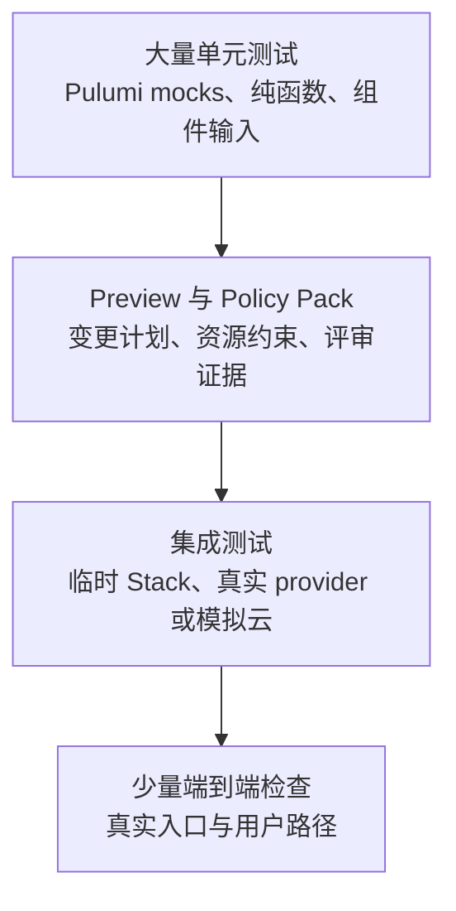

# 测试驱动开发与 CI/CD 实践

## 本章定位

Pulumi 程序是普通语言写成的基础设施代码。既然它是代码，就应当像应用代码一样被测试、被评审、被持续集成系统反复验证。本章把前面学过的 Project、Stack、Config、Output、State、Policy Pack 与 Automation API 串起来，建立一套以测试驱动开发为核心的交付流程。

这里的 TDD 不是把云资源真的创建很多次，而是先把“我们希望基础设施满足什么约束”写成测试。单元测试用 mocks 在内存中验证资源输入；preview 在评审前显示计划变更；集成测试用临时 Stack 验证真实生命周期；CI 把这些检查放到每一次 Pull Request 和主干更新中。

本章仍然只覆盖 Pulumi OSS 工具链可以独立完成的能力：本地或自管理 Backend、本地单元测试、本地 Policy Pack、Automation API 和通用 CI 系统。Pulumi Cloud 的 Review Stacks、Deployments、云端策略托管和集中审计不作为实验前提。

## 参考资料与映射

- [Testing Pulumi programs](https://www.pulumi.com/docs/iac/guides/testing/)：本章借用其中的 unit tests、property tests 和 integration tests 三分法，并结合是否创建真实资源、是否需要 CLI、运行速度和验证目标来组织实践。
- [Unit Testing Pulumi Programs](https://www.pulumi.com/docs/iac/guides/testing/unit/)：使用语言原生测试框架与 Pulumi mocks，在同一进程内替代引擎通信，验证资源输入和程序逻辑。
- [Integration Testing for Pulumi Programs](https://www.pulumi.com/docs/iac/guides/testing/integration/)：通过 CLI 或 Automation API 创建临时环境，验证部署结果，并在测试结束后销毁资源。
- [Pulumi Integration Testing Framework](https://www.pulumi.com/docs/iac/guides/testing/integration/framework/)：Pulumi 维护的 Go 集成测试框架，可驱动任意语言编写的 Pulumi 程序完成创建、更新、验证和销毁。
- [Integration Testing with Automation API](https://www.pulumi.com/docs/iac/guides/testing/integration/automation-api/)：用 Automation API 在熟悉的测试框架中控制 Stack 生命周期、读取部署状态和执行运行期检查。
- [流水线的安全问题](https://lonegunmanb.github.io/dao-of-terraform-modules/%E5%A4%A7%E8%A7%84%E6%A8%A1Terraform%E6%A8%A1%E5%9D%97%E6%B2%BB%E7%90%86/%E6%B5%81%E6%B0%B4%E7%BA%BF%E7%9A%84%E5%AE%89%E5%85%A8%E9%97%AE%E9%A2%98.html)：借鉴其中对 IaC 测试流水线攻击面、凭据边界、GitHub Actions Environments、OIDC、测试账号分层和 Action 供应链风险的分析。

## 11.1 基础设施测试金字塔

本章把 Pulumi 程序测试分为 unit tests、property tests 和 integration tests 三类。把它们放进日常工程流程时，可以按反馈速度和验证范围分层：



这不是要求每个项目都把四层一次建满。TDD 的实用原则是：先用最便宜的测试描述约束，只有当更便宜的测试无法回答问题时，才上升到更慢、更接近真实环境的测试。

| 层级 | 主要问题 | 是否创建真实资源 | 反馈速度 | 适合放在哪里 |
|------|----------|------------------|----------|--------------|
| 单元测试 | 程序是否把正确输入交给资源 | 否 | 毫秒到秒 | 本地编辑、pre-commit、PR |
| Preview | 计划变更是否符合预期 | 否 | 秒到分钟 | PR、审批前 |
| Policy Pack | 资源是否违反组织规则 | 通常不需要 | 秒到分钟 | PR、preview、up |
| 集成测试 | Stack 能否创建、更新、验证、销毁 | 是 | 分钟级 | PR 重点路径、夜间任务、发布前 |
| 端到端检查 | 基础设施承载的应用是否可用 | 是 | 分钟级或更久 | 发布前、冒烟测试 |

Pulumi 的优势在于这些层级可以共享同一份语言生态。TypeScript 项目可以用 Mocha、Jest、Vitest、node:test 或 Chai；Python 项目可以用 pytest；Go 项目可以用 testing 包。Pulumi 不强制测试框架，关键在于选择合适的边界。

这里说的 property tests，指的是把 Pulumi Policy as Code 用作测试。它们不是黑盒访问外部端点，而是在 Pulumi CLI 执行过程中检查资源属性；与 mock 单元测试相比，它们可以看到 provider 在真实执行中返回的输出值；与集成测试相比，它们更关注“资源是否满足不变量”，而不是“系统是否对外正常响应”。上一章已经完成本地 Policy Pack 的实践，本章只说明它如何接入 preview 和 CI。

单元测试不需要 Pulumi CLI，因为 mocks 会在同一进程内响应资源注册和函数调用。property tests、preview 和集成测试需要 CLI，因为它们要让 engine 与 provider 参与计划、更新或策略检查。

## 11.2 TDD 在 Pulumi 中怎么做

应用代码的 TDD 常被概括为“红灯、绿灯、重构”。Pulumi 程序也可以使用同样节奏，只是测试对象从函数返回值变成了资源输入、Stack 输出和部署生命周期。

| 阶段 | Pulumi 项目里的动作 | 常见命令 |
|------|--------------------|----------|
| 红灯 | 先写一个失败的资源约束测试 | `npm run test:unit` |
| 绿灯 | 修改 Pulumi 程序，让测试通过 | `npm run test:unit` |
| 重构 | 提取组件、整理配置、保持测试通过 | `npm run test:unit && pulumi preview` |
| 接近真实环境 | 用临时 Stack 运行集成测试 | `npm run test:integration` |

在基础设施代码中，TDD 最适合描述这些约束：

- 命名规则：资源名前缀、长度、环境后缀是否正确。
- 标签规则：owner、service、environment 等标签是否稳定存在。
- 安全输入：端口、CIDR、加密开关、公开访问配置是否符合规则。
- 依赖关系：资源是否通过 Output 建立了真实依赖，而不是复制字符串。
- 输出契约：平台、应用或后续 Stack 依赖的输出是否存在。
- 配置解析：缺失配置是否快速失败，默认值是否只用于非关键设置。

不适合只靠单元测试回答的问题也要明确：云 API 是否真的接受这些属性、资源创建后运行是否正常、provider 返回的计算属性是否符合期望。这些问题应交给 preview、Policy Pack 或集成测试。

## 11.3 单元测试：用 mocks 替代引擎通信

Pulumi 单元测试的核心是 `pulumi.runtime.setMocks`。普通部署时，Pulumi 程序会与 Pulumi CLI、engine 和 provider plugin 协作；单元测试会切断这条外部通道，让 mock 在当前进程中响应资源注册和函数调用。

mocks 有两个很适合 TDD 的特点：它们不会创建真实资源，因此速度很快；它们返回的是你在测试里定义的假数据，因此结果可以保持确定。一个 TypeScript 单元测试通常长这样：

```ts
import * as pulumi from "@pulumi/pulumi";
import { strict as assert } from "node:assert";
import "mocha";

pulumi.runtime.setMocks({
	newResource(args: pulumi.runtime.MockResourceArgs) {
		return {
			id: `${args.name}_id`,
			state: {
				...args.inputs,
				id: `${args.inputs.prefix ?? args.name}-alpha-beta-gamma`,
			},
		};
	},
	call(args: pulumi.runtime.MockCallArgs) {
		return args.inputs;
	},
}, "project", "dev", false);

function outputOf<T>(value: pulumi.Output<T>): Promise<T> {
	return new Promise((resolve) => value.apply(resolve));
}

describe("naming contract", () => {
	let infra: typeof import("../index");

	before(async () => {
		infra = await import("../index");
	});

	it("uses three words in generated names", async () => {
		assert.equal(await outputOf(infra.pet.length), 3);
	});
});
```

同一件事在其他语言里写法不同，但结构相同：先进入测试运行时并设置 mocks，再创建或导入被测 Pulumi 程序，最后用语言自己的测试框架断言 Output 值。

Python 版本常见于 `pytest` 或 `unittest` 项目。真实项目里可以把 `RandomPet` 的创建放在被测模块中；测试文件只需要在导入模块前设置 mocks。

```python
import pulumi
import pulumi_random as random


class MyMocks(pulumi.runtime.Mocks):
	def new_resource(self, args: pulumi.runtime.MockResourceArgs):
		outputs = {
			**args.inputs,
			"id": f"{args.inputs.get('prefix', args.name)}-alpha-beta-gamma",
		}
		return [args.name + "_id", outputs]

	def call(self, args: pulumi.runtime.MockCallArgs):
		return args.inputs


pulumi.runtime.set_mocks(MyMocks(), project="project", stack="dev", preview=False)


@pulumi.runtime.test
def test_uses_three_words():
	pet = random.RandomPet("service-name",
		prefix="testing",
		length=3,
		separator="-",
	)

	return pet.length.apply(lambda length: assert_equal(length, 3))


def assert_equal(actual, expected):
	assert actual == expected
```

Go 版本通常直接在 `go test` 中运行 Pulumi 程序片段。`pulumi.WithMocks` 会把这次 `pulumi.RunErr` 放进 mock runtime。

```go
package main

import (
	"fmt"
	"sync"
	"testing"

	"github.com/pulumi/pulumi-random/sdk/v4/go/random"
	"github.com/pulumi/pulumi/sdk/v3/go/common/resource"
	"github.com/pulumi/pulumi/sdk/v3/go/pulumi"
	"github.com/stretchr/testify/assert"
)

type mocks struct{}

func (mocks) NewResource(args pulumi.MockResourceArgs) (string, resource.PropertyMap, error) {
	outputs := args.Inputs.Mappable()
	outputs["id"] = fmt.Sprintf("%s-alpha-beta-gamma", outputs["prefix"])
	return args.Name + "_id", resource.NewPropertyMapFromMap(outputs), nil
}

func (mocks) Call(args pulumi.MockCallArgs) (resource.PropertyMap, error) {
	return args.Args, nil
}

func TestNamingContract(t *testing.T) {
	err := pulumi.RunErr(func(ctx *pulumi.Context) error {
		pet, err := random.NewRandomPet(ctx, "service-name", &random.RandomPetArgs{
			Prefix:    pulumi.String("testing"),
			Length:    pulumi.Int(3),
			Separator: pulumi.String("-"),
		})
		assert.NoError(t, err)

		var wg sync.WaitGroup
		wg.Add(1)
		pulumi.All(pet.Length, pet.Separator).ApplyT(func(values []any) error {
			assert.Equal(t, 3, values[0].(int))
			assert.Equal(t, "-", values[1].(string))
			wg.Done()
			return nil
		})
		wg.Wait()
		return nil
	}, pulumi.WithMocks("project", "dev", mocks{}))

	assert.NoError(t, err)
}
```

C# 版本通常把要测试的资源放进一个 `Stack` 类型，再用 `Deployment.TestAsync` 运行。下面示例使用 NUnit；断言库可以换成团队已有的选择。

```csharp
using System.Collections.Immutable;
using System.Linq;
using System.Threading.Tasks;
using NUnit.Framework;
using Pulumi;
using Pulumi.Testing;
using Random = Pulumi.Random;

class NamingStack : Stack
{
	public Random.RandomPet Pet { get; }

	public NamingStack()
	{
		Pet = new Random.RandomPet("service-name", new Random.RandomPetArgs
		{
			Prefix = "testing",
			Length = 3,
			Separator = "-",
		});
	}
}

class MyMocks : IMocks
{
	public Task<(string? id, object state)> NewResourceAsync(MockResourceArgs args)
	{
		var outputs = ImmutableDictionary.CreateBuilder<string, object>();
		outputs.AddRange(args.Inputs);
		outputs["id"] = $"{args.Inputs["prefix"]}-alpha-beta-gamma";

		args.Id ??= $"{args.Name}_id";
		return Task.FromResult<(string? id, object state)>((args.Id, outputs.ToImmutable()));
	}

	public Task<object> CallAsync(MockCallArgs args) => Task.FromResult((object)args.Args);
}

public static class OutputExtensions
{
	public static Task<T> GetValueAsync<T>(this Output<T> output)
	{
		var source = new TaskCompletionSource<T>();
		output.Apply(value =>
		{
			source.SetResult(value);
			return value;
		});
		return source.Task;
	}
}

[TestFixture]
public class NamingTests
{
	[Test]
	public async Task UsesThreeWords()
	{
		var resources = await Deployment.TestAsync<NamingStack>(new MyMocks(), new TestOptions { IsPreview = false });
		var pet = resources.OfType<Random.RandomPet>().Single();

		Assert.That(await pet.Length.GetValueAsync(), Is.EqualTo(3));
		Assert.That(await pet.Separator.GetValueAsync(), Is.EqualTo("-"));
	}
}
```

Java 版本通常把 Pulumi 程序主体暴露成一个可传给 `PulumiTest` 的方法。测试完成后要清理测试运行时状态。

```java
import com.pulumi.Context;
import com.pulumi.Pulumi;
import com.pulumi.random.RandomPet;
import com.pulumi.random.RandomPetArgs;
import com.pulumi.test.Mocks;
import com.pulumi.test.PulumiTest;
import org.junit.jupiter.api.AfterAll;
import org.junit.jupiter.api.Test;

import java.util.Optional;
import java.util.concurrent.CompletableFuture;

import static com.pulumi.test.PulumiTest.extractValue;
import static org.assertj.core.api.Assertions.assertThat;

class NamingProgram {
	public static void main(String[] args) {
		Pulumi.run(NamingProgram::stack);
	}

	static void stack(Context ctx) {
		new RandomPet("service-name", RandomPetArgs.builder()
				.prefix("testing")
				.length(3)
				.separator("-")
				.build());
	}
}

class NamingMocks implements Mocks {
	@Override
	public CompletableFuture<ResourceResult> newResourceAsync(ResourceArgs args) {
		return CompletableFuture.completedFuture(
				ResourceResult.of(Optional.of(args.name + "_id"), args.inputs)
		);
	}
}

class NamingTests {
	@AfterAll
	static void cleanup() {
		PulumiTest.cleanup();
	}

	@Test
	void usesThreeWords() {
		var result = PulumiTest.withMocks(new NamingMocks()).runTest(NamingProgram::stack);
		var pet = result.resources().stream()
				.filter(resource -> resource instanceof RandomPet)
				.map(resource -> (RandomPet) resource)
				.findFirst()
				.orElseThrow();

		assertThat(extractValue(pet.length())).isEqualTo(3);
		assertThat(extractValue(pet.separator())).isEqualTo("-");
	}
}
```

这里有三个容易忽略的细节。

第一，必须先设置 mocks，再导入 Pulumi 程序。Pulumi 程序在导入时就会创建资源对象；如果顺序反了，资源注册已经发生，mock 就来不及接管。

第二，很多资源属性是 `Output<T>`。即使测试里没有真实部署，Pulumi SDK 仍然保留异步输出模型，所以断言时要用 `apply`、测试框架的异步能力，或项目里封装一个小的输出解析工具。

第三，mock 返回的 provider 计算属性需要你显式补齐。输入属性来自程序本身，通常可以从 `args.inputs` 展开；但 `arn`、`publicIp`、`name`、`id` 这类 provider 生成的输出，在 mock 测试里不会凭空出现。测试依赖它们时，应在 `newResource` 或 `call` 中返回。

### StackReference 与 provider functions

如果程序读取其他 Stack 的输出，mock 会收到类型为 `pulumi:pulumi:StackReference` 的资源注册请求。你可以在 `newResource` 中返回 `outputs`，模拟被引用 Stack 的输出：

```ts
if (args.type === "pulumi:pulumi:StackReference") {
	return {
		id: `${args.name}_id`,
		state: {
			...args.inputs,
			outputs: {
				vpcId: "vpc-12345678",
				subnetIds: ["subnet-1", "subnet-2"],
			},
		},
	};
}
```

provider functions 则从 `call` 中返回。例如 AWS 的 `getAmi`、Azure 的查询函数、Kubernetes 的读取函数，都可以根据 token 返回测试需要的值。

### mocks 的边界

mocks 不是完整 Pulumi engine。lifecycle hooks 和 resource transforms 在 mock 测试中不会真正执行。遇到这类逻辑时，建议把规则提取成普通函数单独测试；需要验证完整注册和部署效果时，再使用集成测试。

因此，单元测试最适合回答“程序是否声明了正确资源输入”。它不应该伪装成真实云测试，也不应该承担所有质量检查。

## 11.4 Preview 与 Policy Pack：把评审前移

单元测试通过之后，下一道关口通常是 `pulumi preview`。preview 不创建资源，但会执行 Pulumi 程序、解析配置、计算依赖图，并给出将要创建、更新、替换或删除的资源计划。

在 PR 中运行 preview 的价值不只是“看看能不能跑”。它能把基础设施变更变成可评审材料：

- 是否出现了意外替换。
- 是否删除了不该删除的资源。
- 是否新增了高风险资源类型。
- 是否因为配置缺失导致程序提前失败。
- 是否触发本地 Policy Pack 的 mandatory 规则。

本教程上一章已经讲过本地 Policy Pack。把它接到 preview 中，命令形式通常是：

```bash
pulumi preview --policy-pack ../policy-pack
```

如果一个规则只依赖资源输入，preview 阶段就能给出反馈；如果规则需要 provider 返回的真实输出，可能要等到 update 阶段才具备足够信息。生产项目里应优先把常见规则设计成资源级策略，让 PR 尽早发现问题。

## 11.5 集成测试：验证生命周期和真实行为

集成测试会部署一个临时 Stack，读取输出或状态，然后执行外部检查，最后销毁资源。在本章语境里，这是一种从外部验证 Pulumi 程序的方式：测试不关心内部实现，只关心部署结果是否满足契约。

集成测试能回答单元测试无法回答的问题：

- Pulumi 程序语法和运行时是否完整可执行。
- Stack 配置和 secrets 是否能被正确读取。
- provider 是否能成功创建目标资源。
- 输出是否包含调用方需要的 URL、名称、ID 或连接信息。
- 资源创建后是否真的可访问或可调用。
- 资源是否能被更新、销毁并从状态中移除。

本章整理出三种常见做法：

| 做法 | 优点 | 约束 |
|------|------|------|
| Go integration framework | 专门为 Pulumi 生命周期测试设计，可测试任意语言的 Pulumi 程序 | 测试代码必须写 Go |
| Automation API | 可用熟悉的语言和测试框架控制 Stack 生命周期 | 不支持 YAML 程序作为 Automation API 语言入口 |
| shell 脚本 | 简单直接，任何 CI 都能运行 | 错误处理、状态读取和资源断言更手工 |

本教程实验选择 Automation API，因为它与本书的 TypeScript 主线一致，并且能清楚展示 create/select、preview、up、exportStack、outputs 和 destroy 的完整流程。

一个最小集成测试骨架如下：

```ts
import * as automation from "@pulumi/pulumi/automation";
import { strict as assert } from "node:assert";
import "mocha";

describe("integration", function () {
	this.timeout(180_000);

	let stack: automation.Stack | undefined;
	const stackName = `it-${Date.now()}`;

	after(async () => {
		if (!stack) return;
		await stack.destroy();
		await stack.workspace.removeStack(stackName);
	});

	it("deploys and exposes outputs", async () => {
		stack = await automation.LocalWorkspace.createOrSelectStack({
			stackName,
			workDir: process.cwd(),
		}, {
			envVars: {
				PULUMI_CONFIG_PASSPHRASE: "",
				AWS_ACCESS_KEY_ID: "test",
				AWS_SECRET_ACCESS_KEY: "test",
				AWS_REGION: "us-east-1",
			},
		});

		await stack.setConfig("prefix", { value: "it" });
		await stack.preview();

		const result = await stack.up();
		assert.equal(result.outputs.bucketName.value, "it-artifact-bucket");

		const state = await stack.exportStack();
		assert.ok(state.deployment.resources.some((resource) => resource.type === "aws:s3/bucket:Bucket"));
	});
});
```

这类测试一定要认真处理清理逻辑。即使断言失败，也应尽量在 `after`、`finally` 或 CI 的清理阶段执行 `destroy`。真实云环境还要考虑费用、配额、并发、凭据最小权限和临时 Stack 命名冲突；本章实验使用 MiniStack 和 miniblue，因此不会产生真实云费用。

## 11.6 CI/CD：让测试成为合并条件

Pulumi 项目的 CI 通常分成两条路径：Pull Request 负责验证，主干负责受控更新。GitHub Actions 的工作流文件放在 `.github/workflows/` 下，触发条件可以是 pull request、push、tag 或手工触发。

在 GitHub Actions 中运行 Pulumi，常见组件可以分成几类：

| 方式 | 用途 | 本章取舍 |
|------|------|----------|
| `pulumi/actions` | 安装 Pulumi CLI，并执行 preview、up、destroy 等命令 | 推荐用于主要 Pulumi 步骤 |
| `pulumi/setup-pulumi` | 只安装 Pulumi CLI，后续步骤自己调用 CLI | 适合先做 login、stack init、config set 等准备 |
| `pulumi/auth-actions` | 用 GitHub OIDC 换取 Pulumi Cloud token | Pulumi Cloud 能力，本章不作为实验前提 |
| `pulumi/esc-action` | 从 Pulumi ESC 注入凭据和配置 | Pulumi Cloud / ESC 能力，本章不作为实验前提 |

本教程聚焦 OSS，所以示例仍使用本地 backend。真实团队应把它替换成自管理 backend，或在使用 Pulumi Cloud 时通过访问令牌、OIDC、ESC 等机制提供身份与凭据。无论使用哪一种 backend，PR 工作流都应先运行单元测试，再运行 preview，让评审者看到基础设施计划变更。

```yaml
name: Pulumi preview

on:
  pull_request:

permissions:
  contents: read

concurrency:
  group: pulumi-pr-${{ github.event.pull_request.number }}
  cancel-in-progress: true

jobs:
  preview:
    runs-on: ubuntu-latest
    env:
      PULUMI_CONFIG_PASSPHRASE: ""
    steps:
      - uses: actions/checkout@v4
      - uses: actions/setup-node@v4
        with:
          node-version: 20
          cache: npm
      - run: npm ci
      - run: npm run test:unit
      - uses: pulumi/setup-pulumi@v2
      - run: pulumi login --local
      - run: pulumi stack select dev || pulumi stack init dev
      - run: pulumi config set prefix ci
      - uses: pulumi/actions@v7
        with:
          command: preview
          stack-name: dev
          work-dir: .
```

这个工作流有几个细节值得注意。

- `actions/setup-node` 负责语言运行时，`pulumi/setup-pulumi` 负责 CLI。
- 本地 backend 需要先执行 `pulumi login --local`，自管理 backend 则应登录对应的 backend URL。
- `pulumi/actions` 是真正执行 preview 的步骤，`stack-name` 和 `work-dir` 要与项目结构匹配。
- PR preview 的 concurrency 建议按 Pull Request 编号分组，并取消旧提交上的过期运行。

如果使用 Pulumi Cloud，可以让 preview 直接把结果写回 Pull Request。最轻量的方式是在 action 上加 `comment-on-pr` 和 `github-token`；更完整的方式是安装 Pulumi GitHub App，让 Cloud 负责生成更丰富的变更摘要。本教程实验不依赖这些能力。

```yaml
- uses: pulumi/actions@v7
  with:
    command: preview
    stack-name: dev
    work-dir: .
    comment-on-pr: true
    github-token: ${{ secrets.GITHUB_TOKEN }}
```

push 触发的部署没有 Pull Request 可以评论时，可以把结果写进 workflow summary。两个选项也可以一起使用。

```yaml
- uses: pulumi/actions@v7
  with:
    command: up
    stack-name: staging
    work-dir: .
    comment-on-summary: true
```

主干更新应使用独立工作流。和 PR preview 不同，部署任务通常不应取消正在运行的旧任务，否则可能在一次更新中途终止。更稳妥的做法是把部署放进共享 concurrency 组，让同一套基础设施更新排队执行。

```yaml
name: Pulumi deploy

on:
  push:
    branches: [main]
    tags:
      - "release-*"

permissions:
  contents: read

concurrency:
  group: pulumi-deploy

jobs:
  deploy:
    runs-on: ubuntu-latest
    env:
      PULUMI_CONFIG_PASSPHRASE: ""
    steps:
      - uses: actions/checkout@v4
      - uses: actions/setup-node@v4
        with:
          node-version: 20
          cache: npm
      - run: npm ci
      - uses: pulumi/setup-pulumi@v2
      - run: pulumi login --local
      - name: Deploy staging
        if: github.ref == 'refs/heads/main'
        uses: pulumi/actions@v7
        with:
          command: up
          stack-name: staging
          work-dir: .
      - name: Deploy production
        if: startsWith(github.ref, 'refs/tags/release-')
        uses: pulumi/actions@v7
        with:
          command: up
          stack-name: production
          work-dir: .
```

`pulumi/actions` 的 up 命令按非交互方式运行，不会再等待人工输入 yes。因此生产环境通常还要配合 GitHub Environments、受保护分支、发布标签、审批规则和变更窗口使用。

如果后续步骤要使用 Stack 输出，可以给 Pulumi 步骤设置 `id`。每个非机密输出会变成对应的 step output，例如 `steps.pulumi.outputs.url`。输出里可能包含敏感信息时，应优先使用 secret 输出，并在 action 上打开 `suppress-outputs`，避免值出现在日志中。

```yaml
- id: pulumi
  uses: pulumi/actions@v7
  with:
    command: up
    stack-name: staging
    work-dir: .
- run: echo "Deployed URL is ${{ steps.pulumi.outputs.url }}"
```

如果某个输出不应该出现在日志里，就不要在后续步骤 echo 它；必要时再加 `suppress-outputs: true`。

为了加快重复运行，可以缓存 Pulumi 插件和策略包。缓存键应包含语言依赖文件的 hash，例如 Node.js 项目可使用 `package-lock.json`，Python 项目可使用 `requirements.txt`，Go 项目可使用 `go.sum`。

```yaml
- name: Cache Pulumi plugins and policy packs
  uses: actions/cache@v4
  with:
    path: |
      ~/.pulumi/plugins
      ~/.pulumi/policies
    key: ${{ runner.os }}-pulumi-${{ hashFiles('package-lock.json') }}
    restore-keys: |
      ${{ runner.os }}-pulumi-
```

本地调试 workflow 时，可以使用 `act`。它会读取 `.github/workflows/` 下的文件，用 Docker 模拟 GitHub Actions runner 执行步骤。它不能替代真正的 GitHub Actions，尤其不能完整模拟 GitHub 权限、Pull Request 评论、OIDC、Environments、云端缓存、concurrency 约束和组织级 secrets；但用来检查 workflow 编排、依赖安装和本地 backend preview 非常合适。需要 secrets 的 workflow 应通过 act 的 secret 参数或 secret 文件显式传入测试值，不要把真实密钥写进仓库。

### IaC 测试流水线的安全边界

IaC 测试和普通应用测试最大的差异，是测试代码可能拿到云账号权限。只要流水线运行 `pulumi preview` 或 `pulumi up` 并连接真实云环境，提交到仓库里的程序代码、脚本、依赖安装步骤和 provider 插件调用，就都有机会影响云资源。因此，流水线设计时要先把检查分成两类：

| 检查类型 | 是否需要云凭据 | 适合自动运行的范围 |
|----------|----------------|--------------------|
| 无凭据检查 | 否 | fork PR、普通 PR、每次 push |
| 敏感检查 | 是 | 维护者批准后、受保护分支、发布标签 |

无凭据检查包括单元测试、mock 测试、格式检查、类型检查、静态扫描、本地 Policy Pack 语法检查，以及本章实验这种只连接本地模拟器的 preview。敏感检查包括连接真实 AWS、Azure 或其他云环境的 preview、up、集成测试和端到端测试。开源项目尤其要避免在未审查的 Pull Request 中把真实云凭据暴露给待测代码。

常见攻击面包括这些：

- 恶意 Pull Request 修改 Pulumi 程序、测试脚本或 package scripts，在 CI 中读取环境变量或调用云 API。
- 修改 `.github/workflows/`，放宽触发条件、扩大 token 权限，或把敏感步骤移到未审批路径。
- 引入不可信 GitHub Action、npm 包、Pulumi provider 或脚本下载地址，借供应链执行恶意代码。
- 在测试中创建不受 Pulumi state 管理的云资源，例如通过本地命令直接调用云 CLI，从而绕过 destroy。
- 在真实测试账号中创建高权限身份、访问密钥、长时间运行的计算资源或无法由普通清理任务删除的对象。

对应的防护策略应当前置到流水线设计中：

- fork PR 只运行无凭据检查；需要真实云凭据的任务必须进入受保护分支、GitHub Environment 或维护者批准后的工作流。
- 不要误以为 GitHub Environment 会阻止未受信任代码执行。它保护的是环境级 secrets 和受保护部署；fork PR 仍应只运行不接触真实凭据的检查。
- 不要用 `pull_request_target` 运行未受信任代码并传入 secrets；如果必须使用，只能执行不 checkout PR 内容的元数据检查。
- 使用 OIDC 获取短期云凭据，避免把长期访问密钥保存为仓库 secret；凭据绑定仓库、分支、Environment 和最小权限角色。
- 不要把“私有 runner pool”误当成安全边界。即使这些 runner 是内网 VM，并通过 AWS Instance Profile 或 Azure Managed Identity 获得云权限，fork PR 里的恶意代码仍然可以被调度到这些 VM 上运行，然后直接访问 metadata service 获取临时凭据，或调用本机可访问的内网服务。私有 runner 只能提升网络隔离和执行能力，不能让未受信任代码接触有云身份的机器。
- 为测试准备低权限数据面账号，只允许创建白名单资源、限制区域和配额，并禁止创建 IAM、Service Principal、角色分配、GPU/大规格计算等高风险资源。
- 使用独立控制面账号或安全团队权限做审计、异常资源扫描和强制清理；控制面凭据不要进入测试流水线。
- 通过 GitHub Environments 为敏感 job 配置审批人、环境级 secrets 和部署保护规则。
- 对 `.github/workflows/`、Pulumi 程序入口、依赖锁文件和策略包目录设置 CODEOWNERS 或强制评审。
- 如果 CI 使用自管理 backend，例如 S3、Azure Blob 或其他对象存储，backend 凭据和登录 URL 也属于敏感信息，不能被步骤日志、调试输出或失败转储泄露。
- Policy Pack 本身也是会被执行的代码。生产 CI 中不要让未审查 PR 随意修改策略包路径；可以把策略包放在受保护目录或独立仓库，并固定版本来源。
- 优先使用 GitHub、Pulumi 或可信组织维护的 Action；对第三方 Action 使用提交 SHA 固定版本，并用 Dependabot 或同类工具跟踪安全更新。
- 禁止在日志中输出 secrets、Stack secret outputs 和云凭据；必要时使用 `suppress-outputs`，并把敏感值放进 secret 配置或云原生密钥系统。

生产项目中还应固定这些约束：

- CI 中不要复用工程师个人的本地 backend 目录，应使用团队共享且有备份的 backend。
- 每个环境只允许一个更新任务运行，避免两个 pipeline 同时改同一个 Stack。
- preview 输出应作为评审材料保存，失败日志应能追溯到具体提交。
- secrets 不应出现在仓库、日志或普通输出中。
- 主干更新失败后，先 `pulumi refresh` 核对真实状态，再决定是修复代码继续更新，还是回到上一个已验证提交重新执行。
- 临时 Stack 要有命名规则、保留期限和清理任务。

## 11.7 从测试结果反推代码结构

如果 Pulumi 程序很难测试，通常不是测试框架的问题，而是代码边界不清晰。下面这些重构方向很实用：

| 症状 | 调整方向 |
|------|----------|
| 测试需要导入整个大型 Stack | 把资源组合封装成 ComponentResource 或普通工厂函数 |
| mocks 里要复制大量云返回值 | 单元测试只断关键输入，把真实输出放到集成测试验证 |
| 配置错误要到部署中后段才出现 | 用 `require` 和结构化配置解析在程序开始处失败 |
| 多环境差异散落在资源定义中 | 把配置解析集中到一个 settings 对象 |
| CI 中 Stack 名称互相覆盖 | 为 PR、分支和集成测试使用独立 Stack 名 |
| 集成测试经常遗留资源 | 在测试框架的清理阶段统一执行 destroy 和 Stack 删除 |

TDD 的真正收益不是多写几个断言，而是促使基础设施代码更小、更可组合、更容易评审。资源定义越像一个有输入和输出契约的模块，测试就越自然。

## 11.8 本章实验：两套模拟云 TDD 闭环

本章实验使用 TypeScript、本地 Backend 和真实 Pulumi provider，但不连接真实云账号。AWS 版使用 MiniStack 模拟 S3，Azure 版使用 miniblue 模拟 Resource Group 与 Virtual Network。你会按 TDD 顺序完成：

1. 先写一个失败的 Pulumi mock 单元测试。
2. 修改资源输入，让单元测试变绿。
3. 用 Automation API 创建临时 Stack，执行 preview、up、状态断言和 destroy，并观察真实 provider 如何与模拟环境交互。
4. 生成基于 `pulumi/actions` 的 Pull Request preview 工作流。
5. 用 `act` 在本地模拟 GitHub Actions，并串起一次完整验证流程。

<KillercodaEmbed src="https://killercoda.com/pulumi-tutorial/course/pulumi-tutorial/pulumi-testing-cicd" title="实验：测试驱动开发与 CI/CD（AWS / MiniStack）" desc="使用 @pulumi/aws 对接 MiniStack，以 S3 Bucket 为例编写 Pulumi mock 单元测试、用 Automation API 部署临时 Stack，并用 pulumi/actions 与 act 模拟 PR Preview。" />

<KillercodaEmbed src="https://killercoda.com/pulumi-tutorial/course/pulumi-tutorial/pulumi-testing-cicd-azure" title="实验：测试驱动开发与 CI/CD（Azure / miniblue）" desc="使用 @pulumi/azure 对接 miniblue，以 Resource Group 与 Virtual Network 为例编写 Pulumi mock 单元测试、用 Automation API 部署临时 Stack，并用 pulumi/actions 与 act 模拟 PR Preview。" />

## 11.9 检查清单

- 单元测试是否先于实现描述了关键资源约束。
- Pulumi 程序是否在 mocks 设置之后才被测试导入。
- `Output<T>` 断言是否使用异步测试能力处理。
- mock 是否只补充测试真正依赖的 provider 输出。
- preview 是否在 PR 中运行，并保存为评审材料。
- 本地 Policy Pack 是否接入 preview 或 up。
- 集成测试是否使用独立临时 Stack。
- 集成测试失败后是否仍会执行 destroy。
- CI 是否限制同一 Stack 的并发更新。
- 生产凭据、secrets 和 Backend 配置是否由 CI 安全注入。
- 未受信任的 Pull Request 是否只运行无凭据检查。
- 需要真实云凭据的 job 是否使用 OIDC、最小权限身份和 GitHub Environment 审批。
- 第三方 Actions、包依赖和 provider 版本是否固定并定期审查。
- 自管理 backend 凭据、Policy Pack 和 workflow 文件是否纳入同等严格的评审边界。
